# QtPsd Similarity Test Results (ag-psd)

Generated on: 2026-02-10T19:14:40

## Summary Statistics

| Metric | Photoshop vs QPsdView | Photoshop vs Image Data | Image Data vs QPsdView |
|--------|-----------------------|-------------------------|------------------------|
| Total Tests | 145 | 145 | 162 |
| Passed Tests (>50%) | 114 (78.6%) | 116 (80.0%) | 105 (64.8%) |
| Average Similarity | 82.13% | 80.20% | 68.08% |
| Minimum Similarity | 0.00% | 0.00% | 0.00% |
| Maximum Similarity | 100.00% | 100.00% | 100.00% |

**Note:** 17 tests had no Photoshop reference image for comparison.

## Section 1: Photoshop vs QPsdView

| File | Size | Similarity | Status | Photoshop | QPsdView | Difference |
|------|------|------------|--------|-----------|----------|------------|
| [read/fill-opacity/src.psd](https://github.com/Agamnentzar/ag-psd/tree/master/test/read/fill-opacity/src.psd) | 970 B | 0.00%  | ❌ FAILED |  |  |  |
| [write/empty/expected.psd](https://github.com/Agamnentzar/ag-psd/tree/master/test/write/empty/expected.psd) | 6.4 KB | 100.00%  | ✅ PERFECT |  |  |  |
| [write/layer-name/expected.psd](https://github.com/Agamnentzar/ag-psd/tree/master/test/write/layer-name/expected.psd) | 6.4 KB | 100.00%  | ✅ PERFECT |  |  |  |
| [write/long-name/expected.psd](https://github.com/Agamnentzar/ag-psd/tree/master/test/write/long-name/expected.psd) | 8.1 KB | 100.00%  | ✅ PERFECT |  |  |  |
| [write/write-text/expected.psd](https://github.com/Agamnentzar/ag-psd/tree/master/test/write/write-text/expected.psd) | 11.0 KB | 45.90%  | ❌ FAILED |  |  |  |
| [write/write-text2/expected.psd](https://github.com/Agamnentzar/ag-psd/tree/master/test/write/write-text2/expected.psd) | 11.4 KB | 35.02%  | ❌ FAILED |  |  |  |
| [write/auto-lead/expected.psd](https://github.com/Agamnentzar/ag-psd/tree/master/test/write/auto-lead/expected.psd) | 12.1 KB | 100.00%  | ✅ PERFECT |  |  |  |
| [write/layer-offsets/expected.psd](https://github.com/Agamnentzar/ag-psd/tree/master/test/write/layer-offsets/expected.psd) | 17.6 KB | 100.00%  | ✅ PERFECT |  |  |  |
| [write/group-blend/expected.psd](https://github.com/Agamnentzar/ag-psd/tree/master/test/write/group-blend/expected.psd) | 17.9 KB | 100.00%  | ✅ PERFECT |  |  |  |
| [write/vector/expected.psd](https://github.com/Agamnentzar/ag-psd/tree/master/test/write/vector/expected.psd) | 18.3 KB | 75.95%  | ⚠️ LOW |  | [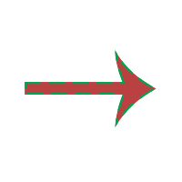](images/psdview/ag-psd/write/vector/expected.png) |  |
| [read/bitmap-rle/src.psd](https://github.com/Agamnentzar/ag-psd/tree/master/test/read/bitmap-rle/src.psd) | 19.4 KB | 100.00%  | ✅ PERFECT |  |  |  |
| [read/layer-offsets-read/src.psd](https://github.com/Agamnentzar/ag-psd/tree/master/test/read/layer-offsets-read/src.psd) | 19.6 KB | 100.00%  | ✅ PERFECT |  |  |  |
| [read/section/src.psd](https://github.com/Agamnentzar/ag-psd/tree/master/test/read/section/src.psd) | 19.7 KB | 100.00%  | ✅ PERFECT |  |  |  |
| [read/just-bg/src.psd](https://github.com/Agamnentzar/ag-psd/tree/master/test/read/just-bg/src.psd) | 21.4 KB | 100.00%  | ✅ PERFECT |  |  |  |
| [read/count/src.psd](https://github.com/Agamnentzar/ag-psd/tree/master/test/read/count/src.psd) | 22.3 KB | 100.00%  | ✅ PERFECT |  |  |  |
| [read/layer-larger-than-drawing/src.psd](https://github.com/Agamnentzar/ag-psd/tree/master/test/read/layer-larger-than-drawing/src.psd) | 23.2 KB | 100.00%  | ✅ PERFECT |  |  |  |
| [write/circle/expected.psd](https://github.com/Agamnentzar/ag-psd/tree/master/test/write/circle/expected.psd) | 24.6 KB | 99.97%  | ✅ PERFECT |  |  |  |
| [read-write/vector-and-mask/expected.psd](https://github.com/Agamnentzar/ag-psd/tree/master/test/read-write/vector-and-mask/expected.psd) | 25.2 KB | 100.00%  | ✅ PERFECT |  |  |  |
| [read/nested/src.psd](https://github.com/Agamnentzar/ag-psd/tree/master/test/read/nested/src.psd) | 25.4 KB | 100.00%  | ✅ PERFECT |  |  |  |
| [read-write/stroke/expected.psd](https://github.com/Agamnentzar/ag-psd/tree/master/test/read-write/stroke/expected.psd) | 25.5 KB | 90.21%  | ✅ GOOD |  |  |  |
| [write/layer-mask/expected.psd](https://github.com/Agamnentzar/ag-psd/tree/master/test/write/layer-mask/expected.psd) | 25.6 KB | 100.00%  | ✅ PERFECT |  |  |  |
| [read/pass-through/src.psd](https://github.com/Agamnentzar/ag-psd/tree/master/test/read/pass-through/src.psd) | 26.3 KB | 100.00%  | ✅ PERFECT |  |  |  |
| [layer-mask/src.psd](https://github.com/Agamnentzar/ag-psd/tree/master/test/layer-mask/src.psd) | 26.7 KB | 100.00%  | ✅ PERFECT |  |  |  |
| [read-write/winding-non-zero/expected.psd](https://github.com/Agamnentzar/ag-psd/tree/master/test/read-write/winding-non-zero/expected.psd) | 26.9 KB | 99.15%  | ✅ PERFECT |  |  |  |
| [read-write/vector-and-mask/src.psd](https://github.com/Agamnentzar/ag-psd/tree/master/test/read-write/vector-and-mask/src.psd) | 27.0 KB | 100.00%  | ✅ PERFECT |  |  |  |
| [read/section-2/src.psd](https://github.com/Agamnentzar/ag-psd/tree/master/test/read/section-2/src.psd) | 27.8 KB | 100.00%  | ✅ PERFECT |  |  |  |
| [read/cat/src.psd](https://github.com/Agamnentzar/ag-psd/tree/master/test/read/cat/src.psd) | 29.5 KB | 100.00%  | ✅ PERFECT |  |  |  |
| [read-write/animation-effects/expected.psd](https://github.com/Agamnentzar/ag-psd/tree/master/test/read-write/animation-effects/expected.psd) | 30.3 KB | 27.06%  | ❌ FAILED |  |  |  |
| [read/vector-layer/src.psd](https://github.com/Agamnentzar/ag-psd/tree/master/test/read/vector-layer/src.psd) | 30.4 KB | 100.00%  | ✅ PERFECT |  |  |  |
| [read-write/stroke/src.psd](https://github.com/Agamnentzar/ag-psd/tree/master/test/read-write/stroke/src.psd) | 30.4 KB | 90.21%  | ✅ GOOD |  |  |  |
| [read-write/animation-offset/expected.psd](https://github.com/Agamnentzar/ag-psd/tree/master/test/read-write/animation-offset/expected.psd) | 31.0 KB | 100.00%  | ✅ PERFECT |  |  |  |
| [read-write/layer-comps/expected.psd](https://github.com/Agamnentzar/ag-psd/tree/master/test/read-write/layer-comps/expected.psd) | 31.1 KB | 100.00%  | ✅ PERFECT |  |  |  |
| [read-write/winding-non-zero/src.psd](https://github.com/Agamnentzar/ag-psd/tree/master/test/read-write/winding-non-zero/src.psd) | 31.1 KB | 99.15%  | ✅ PERFECT |  |  |  |
| [read/winding-non-zero/src.psd](https://github.com/Agamnentzar/ag-psd/tree/master/test/read/winding-non-zero/src.psd) | 31.1 KB | 99.15%  | ✅ PERFECT |  |  |  |
| [read-write/boolean/expected.psd](https://github.com/Agamnentzar/ag-psd/tree/master/test/read-write/boolean/expected.psd) | 31.9 KB | 99.99%  | ✅ PERFECT |  |  |  |
| [read/winding-even-odd/src.psd](https://github.com/Agamnentzar/ag-psd/tree/master/test/read/winding-even-odd/src.psd) | 32.9 KB | 98.82%  | ✅ GOOD |  |  |  |
| [read-write/boolean/src.psd](https://github.com/Agamnentzar/ag-psd/tree/master/test/read-write/boolean/src.psd) | 33.8 KB | 99.99%  | ✅ PERFECT |  |  |  |
| [read-write/animation-effects/src.psd](https://github.com/Agamnentzar/ag-psd/tree/master/test/read-write/animation-effects/src.psd) | 34.8 KB | 27.06%  | ❌ FAILED |  |  |  |
| [read/animation-effects/src.psd](https://github.com/Agamnentzar/ag-psd/tree/master/test/read/animation-effects/src.psd) | 34.8 KB | 27.06%  | ❌ FAILED |  |  |  |
| [read/lantern/src.psd](https://github.com/Agamnentzar/ag-psd/tree/master/test/read/lantern/src.psd) | 35.0 KB | 100.00%  | ✅ PERFECT |  |  |  |
| [read/smart-object-png/expected.psd](https://github.com/Agamnentzar/ag-psd/tree/master/test/read/smart-object-png/expected.psd) | 35.1 KB | 100.00%  | ✅ PERFECT |  |  |  |
| [read/smart-object-png/src.psd](https://github.com/Agamnentzar/ag-psd/tree/master/test/read/smart-object-png/src.psd) | 35.1 KB | 100.00%  | ✅ PERFECT |  |  |  |
| [read-write/layer-comps/src.psd](https://github.com/Agamnentzar/ag-psd/tree/master/test/read-write/layer-comps/src.psd) | 35.2 KB | 100.00%  | ✅ PERFECT |  |  |  |
| [read/layer-comps/src.psd](https://github.com/Agamnentzar/ag-psd/tree/master/test/read/layer-comps/src.psd) | 35.2 KB | 100.00%  | ✅ PERFECT |  |  |  |
| [read-write/animation-offset/src.psd](https://github.com/Agamnentzar/ag-psd/tree/master/test/read-write/animation-offset/src.psd) | 35.2 KB | 100.00%  | ✅ PERFECT |  |  |  |
| [read/animation-offset/src.psd](https://github.com/Agamnentzar/ag-psd/tree/master/test/read/animation-offset/src.psd) | 35.2 KB | 100.00%  | ✅ PERFECT |  |  |  |
| [read/bitmap/src.psd](https://github.com/Agamnentzar/ag-psd/tree/master/test/read/bitmap/src.psd) | 37.8 KB | 100.00%  | ✅ PERFECT |  |  |  |
| [read-write/round/expected.psd](https://github.com/Agamnentzar/ag-psd/tree/master/test/read-write/round/expected.psd) | 38.6 KB | 99.97%  | ✅ PERFECT |  |  |  |
| [read-write/group-blend/expected.psd](https://github.com/Agamnentzar/ag-psd/tree/master/test/read-write/group-blend/expected.psd) | 39.0 KB | 100.00%  | ✅ PERFECT |  |  |  |
| [read-write/round/src.psd](https://github.com/Agamnentzar/ag-psd/tree/master/test/read-write/round/src.psd) | 40.3 KB | 99.97%  | ✅ PERFECT |  |  |  |
| [read/round/src.psd](https://github.com/Agamnentzar/ag-psd/tree/master/test/read/round/src.psd) | 40.3 KB | 99.97%  | ✅ PERFECT |  |  |  |
| [read/vector-complex/src.psd](https://github.com/Agamnentzar/ag-psd/tree/master/test/read/vector-complex/src.psd) | 41.1 KB | 76.77%  | ⚠️ LOW |  |  |  |
| [write/vector/src.psd](https://github.com/Agamnentzar/ag-psd/tree/master/test/write/vector/src.psd) | 41.1 KB | 76.77%  | ⚠️ LOW |  |  |  |
| [read/text-layer/src.psd](https://github.com/Agamnentzar/ag-psd/tree/master/test/read/text-layer/src.psd) | 42.1 KB | 34.42%  | ❌ FAILED |  |  |  |
| [read-write/masks/expected.psd](https://github.com/Agamnentzar/ag-psd/tree/master/test/read-write/masks/expected.psd) | 42.6 KB | 98.75%  | ✅ GOOD |  |  |  |
| [read-write/gradient-mode/expected.psd](https://github.com/Agamnentzar/ag-psd/tree/master/test/read-write/gradient-mode/expected.psd) | 43.7 KB | 95.11%  | ✅ GOOD |  |  |  |
| [read-write/text/expected.psd](https://github.com/Agamnentzar/ag-psd/tree/master/test/read-write/text/expected.psd) | 43.8 KB | 35.43%  | ❌ FAILED |  |  |  |
| [read-write/group-blend/src.psd](https://github.com/Agamnentzar/ag-psd/tree/master/test/read-write/group-blend/src.psd) | 44.5 KB | 100.00%  | ✅ PERFECT |  |  |  |
| [read-write/gradient-mode/src.psd](https://github.com/Agamnentzar/ag-psd/tree/master/test/read-write/gradient-mode/src.psd) | 45.7 KB | 95.11%  | ✅ GOOD |  |  |  |
| [read/alpha-composite/src.psd](https://github.com/Agamnentzar/ag-psd/tree/master/test/read/alpha-composite/src.psd) | 45.8 KB | 99.94%  | ✅ PERFECT |  |  |  |
| [read-write/text-box/expected.psd](https://github.com/Agamnentzar/ag-psd/tree/master/test/read-write/text-box/expected.psd) | 47.5 KB | 38.27%  | ❌ FAILED |  | [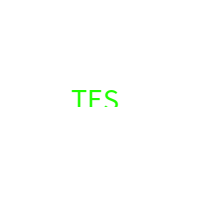](images/psdview/ag-psd/read-write/text-box/expected.png) |  |
| [read-write/text/src.psd](https://github.com/Agamnentzar/ag-psd/tree/master/test/read-write/text/src.psd) | 48.2 KB | 35.43%  | ❌ FAILED |  |  |  |
| [read/text-path/src.psd](https://github.com/Agamnentzar/ag-psd/tree/master/test/read/text-path/src.psd) | 48.3 KB | 28.05%  | ❌ FAILED |  |  |  |
| [text-simple.psd](https://github.com/Agamnentzar/ag-psd/tree/master/test/text-simple.psd) | 48.9 KB | 45.18%  | ❌ FAILED |  |  |  |
| [read/layer-mask/src.psd](https://github.com/Agamnentzar/ag-psd/tree/master/test/read/layer-mask/src.psd) | 49.0 KB | 100.00%  | ✅ PERFECT |  |  |  |
| [read/text-alternatives/src.psd](https://github.com/Agamnentzar/ag-psd/tree/master/test/read/text-alternatives/src.psd) | 50.2 KB | 47.94%  | ❌ FAILED |  |  |  |
| [read-write/text-box/src.psd](https://github.com/Agamnentzar/ag-psd/tree/master/test/read-write/text-box/src.psd) | 51.9 KB | 38.27%  | ❌ FAILED |  |  |  |
| [read/text-simple/src.psd](https://github.com/Agamnentzar/ag-psd/tree/master/test/read/text-simple/src.psd) | 55.7 KB | 70.60%  | ⚠️ LOW |  |  |  |
| [read/text-carriage-return/src.psd](https://github.com/Agamnentzar/ag-psd/tree/master/test/read/text-carriage-return/src.psd) | 56.0 KB | 5.61%  | ❌ FAILED |  |  |  |
| [test.psd](https://github.com/Agamnentzar/ag-psd/tree/master/test/test.psd) | 57.3 KB | 99.98%  | ✅ PERFECT |  |  |  |
| [read-write/masks/src.psd](https://github.com/Agamnentzar/ag-psd/tree/master/test/read-write/masks/src.psd) | 57.4 KB | 98.73%  | ✅ GOOD |  |  |  |
| [text-test.psd](https://github.com/Agamnentzar/ag-psd/tree/master/test/text-test.psd) | 62.7 KB | 47.96%  | ❌ FAILED |  |  |  |
| [write/simple-compress/expected.psd](https://github.com/Agamnentzar/ag-psd/tree/master/test/write/simple-compress/expected.psd) | 63.5 KB | 100.00%  | ✅ PERFECT |  |  |  |
| [read/pattern/src.psd](https://github.com/Agamnentzar/ag-psd/tree/master/test/read/pattern/src.psd) | 64.8 KB | 6.08%  | ❌ FAILED |  |  |  |
| [read/guides/src.psd](https://github.com/Agamnentzar/ag-psd/tree/master/test/read/guides/src.psd) | 65.7 KB | 100.00%  | ✅ PERFECT |  |  |  |
| [read-write/annotations/expected.psd](https://github.com/Agamnentzar/ag-psd/tree/master/test/read-write/annotations/expected.psd) | 71.9 KB | 100.00%  | ✅ PERFECT |  |  |  |
| [read/text-paragraph-align/src.psd](https://github.com/Agamnentzar/ag-psd/tree/master/test/read/text-paragraph-align/src.psd) | 72.2 KB | 34.47%  | ❌ FAILED |  | [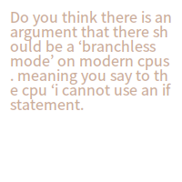](images/psdview/ag-psd/read/text-paragraph-align/src.png) |  |
| [vector-test.psd](https://github.com/Agamnentzar/ag-psd/tree/master/test/vector-test.psd) | 75.8 KB | 97.14%  | ✅ GOOD |  | [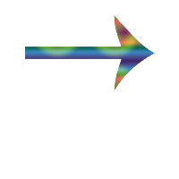](images/psdview/ag-psd/vector-test.png) |  |
| [read-write/annotations/src.psd](https://github.com/Agamnentzar/ag-psd/tree/master/test/read-write/annotations/src.psd) | 76.8 KB | 100.00%  | ✅ PERFECT |  |  |  |
| [write/groups/original.psd](https://github.com/Agamnentzar/ag-psd/tree/master/test/write/groups/original.psd) | 79.4 KB | 100.00%  | ✅ PERFECT |  |  |  |
| [write/simple/expected.psd](https://github.com/Agamnentzar/ag-psd/tree/master/test/write/simple/expected.psd) | 79.5 KB | 100.00%  | ✅ PERFECT |  |  |  |
| [write/layer-color/expected.psd](https://github.com/Agamnentzar/ag-psd/tree/master/test/write/layer-color/expected.psd) | 79.5 KB | 100.00%  | ✅ PERFECT |  |  |  |
| [read/text-simple2/src.psd](https://github.com/Agamnentzar/ag-psd/tree/master/test/read/text-simple2/src.psd) | 83.4 KB | 24.93%  | ❌ FAILED |  |  |  |
| [read/blend-mode/src.psd](https://github.com/Agamnentzar/ag-psd/tree/master/test/read/blend-mode/src.psd) | 83.5 KB | 68.82%  | ⚠️ LOW |  |  |  |
| [write/effects/expected.psd](https://github.com/Agamnentzar/ag-psd/tree/master/test/write/effects/expected.psd) | 85.8 KB | 54.31%  | ⚠️ LOW |  | [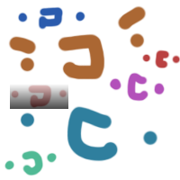](images/psdview/ag-psd/write/effects/expected.png) |  |
| [read/text-complex/src.psd](https://github.com/Agamnentzar/ag-psd/tree/master/test/read/text-complex/src.psd) | 85.9 KB | 26.91%  | ❌ FAILED |  |  |  |
| [write/groups/expected.psd](https://github.com/Agamnentzar/ag-psd/tree/master/test/write/groups/expected.psd) | 95.0 KB | 100.00%  | ✅ PERFECT |  |  |  |
| [read-write/effects/expected.psd](https://github.com/Agamnentzar/ag-psd/tree/master/test/read-write/effects/expected.psd) | 98.2 KB | 55.79%  | ⚠️ LOW |  |  |  |
| [write/complex/expected.psd](https://github.com/Agamnentzar/ag-psd/tree/master/test/write/complex/expected.psd) | 99.7 KB | 99.67%  | ✅ PERFECT |  |  |  |
| [read/effects/src.psd](https://github.com/Agamnentzar/ag-psd/tree/master/test/read/effects/src.psd) | 101.5 KB | 54.23%  | ⚠️ LOW |  |  |  |
| [read-write/animation-frame/expected.psd](https://github.com/Agamnentzar/ag-psd/tree/master/test/read-write/animation-frame/expected.psd) | 106.4 KB | 100.00%  | ✅ PERFECT |  |  |  |
| [read-write/gradient/expected.psd](https://github.com/Agamnentzar/ag-psd/tree/master/test/read-write/gradient/expected.psd) | 106.6 KB | 14.59%  | ❌ FAILED |  |  |  |
| [read-write/effects/src.psd](https://github.com/Agamnentzar/ag-psd/tree/master/test/read-write/effects/src.psd) | 106.9 KB | 55.79%  | ⚠️ LOW |  |  |  |
| [read/key-origin-shape-bbox/src.psd](https://github.com/Agamnentzar/ag-psd/tree/master/test/read/key-origin-shape-bbox/src.psd) | 109.4 KB | 99.66%  | ✅ PERFECT |  |  |  |
| [read/sai/src.psd](https://github.com/Agamnentzar/ag-psd/tree/master/test/read/sai/src.psd) | 110.9 KB | 100.00%  | ✅ PERFECT |  |  |  |
| [read-write/gradient/src.psd](https://github.com/Agamnentzar/ag-psd/tree/master/test/read-write/gradient/src.psd) | 110.9 KB | 14.59%  | ❌ FAILED |  |  |  |
| [read/gradient/src.psd](https://github.com/Agamnentzar/ag-psd/tree/master/test/read/gradient/src.psd) | 110.9 KB | 14.64%  | ❌ FAILED |  |  |  |
| [read-write/shapes/expected.psd](https://github.com/Agamnentzar/ag-psd/tree/master/test/read-write/shapes/expected.psd) | 112.1 KB | 98.25%  | ✅ GOOD |  |  |  |
| [write/no-background/expected.psd](https://github.com/Agamnentzar/ag-psd/tree/master/test/write/no-background/expected.psd) | 114.4 KB | 100.00%  | ✅ PERFECT |  |  |  |
| [read-write/shapes/src.psd](https://github.com/Agamnentzar/ag-psd/tree/master/test/read-write/shapes/src.psd) | 121.3 KB | 98.25%  | ✅ GOOD |  |  |  |
| [read-write/animation-frame/src.psd](https://github.com/Agamnentzar/ag-psd/tree/master/test/read-write/animation-frame/src.psd) | 122.0 KB | 100.00%  | ✅ PERFECT |  |  |  |
| [read/animation-frame/src.psd](https://github.com/Agamnentzar/ag-psd/tree/master/test/read/animation-frame/src.psd) | 122.0 KB | 100.00%  | ✅ PERFECT |  |  |  |
| [read-write/strokes/expected.psd](https://github.com/Agamnentzar/ag-psd/tree/master/test/read-write/strokes/expected.psd) | 130.0 KB | 48.76%  | ❌ FAILED |  |  |  |
| [read/grayscale/src.psd](https://github.com/Agamnentzar/ag-psd/tree/master/test/read/grayscale/src.psd) | 130.6 KB | 100.00%  | ✅ PERFECT |  |  |  |
| [read-write/float-color/expected.psd](https://github.com/Agamnentzar/ag-psd/tree/master/test/read-write/float-color/expected.psd) | 140.5 KB | 98.68%  | ✅ GOOD |  |  |  |
| [read-write/strokes/src.psd](https://github.com/Agamnentzar/ag-psd/tree/master/test/read-write/strokes/src.psd) | 142.3 KB | 48.76%  | ❌ FAILED |  |  |  |
| [read-write/float-color/src.psd](https://github.com/Agamnentzar/ag-psd/tree/master/test/read-write/float-color/src.psd) | 145.9 KB | 98.68%  | ✅ GOOD |  |  |  |
| [multiple-strokes-test.psd](https://github.com/Agamnentzar/ag-psd/tree/master/test/multiple-strokes-test.psd) | 159.2 KB | 35.34%  | ❌ FAILED |  |  |  |
| [read/mesh-transform/src.psd](https://github.com/Agamnentzar/ag-psd/tree/master/test/read/mesh-transform/src.psd) | 179.0 KB | 100.00%  | ✅ PERFECT |  |  |  |
| [read/grayscale-alpha/src.psd](https://github.com/Agamnentzar/ag-psd/tree/master/test/read/grayscale-alpha/src.psd) | 186.1 KB | 100.00%  | ✅ PERFECT |  | [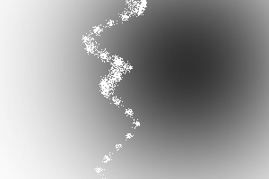](images/psdview/ag-psd/read/grayscale-alpha/src.png) |  |
| [read/layers/src.psd](https://github.com/Agamnentzar/ag-psd/tree/master/test/read/layers/src.psd) | 189.9 KB | 100.00%  | ✅ PERFECT |  |  |  |
| [read-write/adjustments/expected.psd](https://github.com/Agamnentzar/ag-psd/tree/master/test/read-write/adjustments/expected.psd) | 209.5 KB | 97.73%  | ✅ GOOD |  |  |  |
| [read-write/vectors/expected.psd](https://github.com/Agamnentzar/ag-psd/tree/master/test/read-write/vectors/expected.psd) | 211.0 KB | 99.82%  | ✅ PERFECT |  |  |  |
| [read-write/vectors/src.psd](https://github.com/Agamnentzar/ag-psd/tree/master/test/read-write/vectors/src.psd) | 217.1 KB | 98.74%  | ✅ GOOD |  |  |  |
| [read/groups/src.psd](https://github.com/Agamnentzar/ag-psd/tree/master/test/read/groups/src.psd) | 221.3 KB | 100.00%  | ✅ PERFECT |  |  |  |
| [read-write/adjustments/src.psd](https://github.com/Agamnentzar/ag-psd/tree/master/test/read-write/adjustments/src.psd) | 224.0 KB | 97.73%  | ✅ GOOD |  |  |  |
| [read/adjustment-layers/src.psd](https://github.com/Agamnentzar/ag-psd/tree/master/test/read/adjustment-layers/src.psd) | 224.0 KB | 97.73%  | ✅ GOOD |  |  |  |
| [read/background/src.psd](https://github.com/Agamnentzar/ag-psd/tree/master/test/read/background/src.psd) | 240.2 KB | 100.00%  | ✅ PERFECT |  |  |  |
| [write/float-size/expected.psd](https://github.com/Agamnentzar/ag-psd/tree/master/test/write/float-size/expected.psd) | 246.4 KB | 100.00%  | ✅ PERFECT |  |  |  |
| [timeline.psd](https://github.com/Agamnentzar/ag-psd/tree/master/test/timeline.psd) | 248.1 KB | 100.00%  | ✅ PERFECT |  |  |  |
| [read/alias/src.psd](https://github.com/Agamnentzar/ag-psd/tree/master/test/read/alias/src.psd) | 257.9 KB | 14.64%  | ❌ FAILED |  | [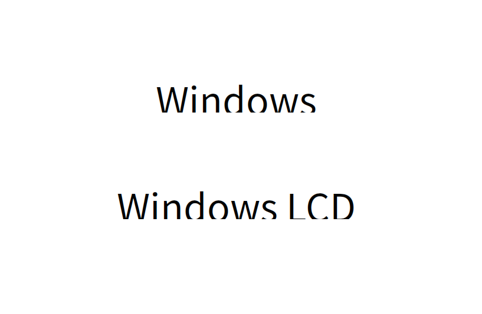](images/psdview/ag-psd/read/alias/src.png) |  |
| [write/smart-object/expected.psd](https://github.com/Agamnentzar/ag-psd/tree/master/test/write/smart-object/expected.psd) | 269.6 KB | 100.00%  | ✅ PERFECT |  |  |  |
| [read-write/smart/expected.psd](https://github.com/Agamnentzar/ag-psd/tree/master/test/read-write/smart/expected.psd) | 288.9 KB | 100.00%  | ✅ PERFECT |  |  |  |
| [read-write/artboards/expected.psd](https://github.com/Agamnentzar/ag-psd/tree/master/test/read-write/artboards/expected.psd) | 295.1 KB | 98.16%  | ✅ GOOD |  |  |  |
| [read-write/smart/src.psd](https://github.com/Agamnentzar/ag-psd/tree/master/test/read-write/smart/src.psd) | 295.4 KB | 100.00%  | ✅ PERFECT |  |  |  |
| [read/smart-object/src.psd](https://github.com/Agamnentzar/ag-psd/tree/master/test/read/smart-object/src.psd) | 295.4 KB | 100.00%  | ✅ PERFECT |  |  |  |
| [read/text-bug/src.psd](https://github.com/Agamnentzar/ag-psd/tree/master/test/read/text-bug/src.psd) | 306.0 KB | 99.97%  | ✅ PERFECT |  |  |  |
| [read-write/artboards/src.psd](https://github.com/Agamnentzar/ag-psd/tree/master/test/read-write/artboards/src.psd) | 316.1 KB | 98.16%  | ✅ GOOD |  |  |  |
| [read/artboards/src.psd](https://github.com/Agamnentzar/ag-psd/tree/master/test/read/artboards/src.psd) | 316.1 KB | 98.16%  | ✅ GOOD |  |  |  |
| [read-write/smart-filters-2/expected.psd](https://github.com/Agamnentzar/ag-psd/tree/master/test/read-write/smart-filters-2/expected.psd) | 327.7 KB | 100.00%  | ✅ PERFECT |  |  |  |
| [read-write/smart-filters-2/src.psd](https://github.com/Agamnentzar/ag-psd/tree/master/test/read-write/smart-filters-2/src.psd) | 333.0 KB | 100.00%  | ✅ PERFECT |  |  |  |
| [read/placed-transform/src.psd](https://github.com/Agamnentzar/ag-psd/tree/master/test/read/placed-transform/src.psd) | 344.3 KB | 100.00%  | ✅ PERFECT |  |  |  |
| [read-write/werps/src.psd](https://github.com/Agamnentzar/ag-psd/tree/master/test/read-write/werps/src.psd) | 657.2 KB | 100.00%  | ✅ PERFECT |  |  |  |
| [read/cmyk/src.psd](https://github.com/Agamnentzar/ag-psd/tree/master/test/read/cmyk/src.psd) | 718.9 KB | 99.31%  | ✅ PERFECT |  | [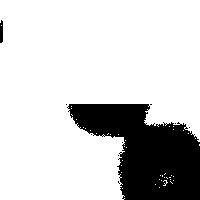](images/psdview/ag-psd/read/cmyk/src.png) |  |
| [read/rle-fail/src.psd](https://github.com/Agamnentzar/ag-psd/tree/master/test/read/rle-fail/src.psd) | 1.1 MB | 100.00%  | ✅ PERFECT |  |  |  |
| [read/32bits/src.psd](https://github.com/Agamnentzar/ag-psd/tree/master/test/read/32bits/src.psd) | 1.2 MB | 0.22%  | ❌ FAILED |  |  |  |
| [read-write/cyllinder-warp/expected.psd](https://github.com/Agamnentzar/ag-psd/tree/master/test/read-write/cyllinder-warp/expected.psd) | 1.4 MB | 100.00%  | ✅ PERFECT |  |  |  |
| [read-write/cyllinder-warp/src.psd](https://github.com/Agamnentzar/ag-psd/tree/master/test/read-write/cyllinder-warp/src.psd) | 1.4 MB | 100.00%  | ✅ PERFECT |  |  |  |
| [read/cyllinder-warp/src.psd](https://github.com/Agamnentzar/ag-psd/tree/master/test/read/cyllinder-warp/src.psd) | 1.4 MB | 100.00%  | ✅ PERFECT |  |  |  |
| [read-write/animation-timeline/expected.psd](https://github.com/Agamnentzar/ag-psd/tree/master/test/read-write/animation-timeline/expected.psd) | 2.2 MB | 25.95%  | ❌ FAILED |  | [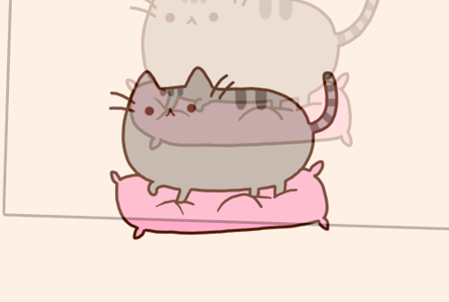](images/psdview/ag-psd/read-write/animation-timeline/expected.png) |  |
| [read-write/animation-timeline/src.psd](https://github.com/Agamnentzar/ag-psd/tree/master/test/read-write/animation-timeline/src.psd) | 2.2 MB | 25.95%  | ❌ FAILED |  |  |  |
| [read/animation-timeline/src.psd](https://github.com/Agamnentzar/ag-psd/tree/master/test/read/animation-timeline/src.psd) | 2.2 MB | 25.95%  | ❌ FAILED |  |  |  |
| [read-write/smart-filters/expected.psd](https://github.com/Agamnentzar/ag-psd/tree/master/test/read-write/smart-filters/expected.psd) | 8.0 MB | 100.00%  | ✅ PERFECT |  |  |  |
| [read-write/smart-filters/src.psd](https://github.com/Agamnentzar/ag-psd/tree/master/test/read-write/smart-filters/src.psd) | 8.0 MB | 100.00%  | ✅ PERFECT |  |  |  |
| [read/16bits/src.psd](https://github.com/Agamnentzar/ag-psd/tree/master/test/read/16bits/src.psd) | 13.5 MB | 99.84%  | ✅ PERFECT |  |  |  |

## Section 2: Photoshop vs Image Data

| File | Size | Similarity | Status | Photoshop | Image Data | Difference |
|------|------|------------|--------|-----------|------------|------------|
| [read/fill-opacity/src.psd](https://github.com/Agamnentzar/ag-psd/tree/master/test/read/fill-opacity/src.psd) | 970 B | 94.43%  | ✅ GOOD |  |  |  |
| [write/empty/expected.psd](https://github.com/Agamnentzar/ag-psd/tree/master/test/write/empty/expected.psd) | 6.4 KB | 100.00%  | ✅ PERFECT |  |  |  |
| [write/layer-name/expected.psd](https://github.com/Agamnentzar/ag-psd/tree/master/test/write/layer-name/expected.psd) | 6.4 KB | 100.00%  | ✅ PERFECT |  |  |  |
| [write/long-name/expected.psd](https://github.com/Agamnentzar/ag-psd/tree/master/test/write/long-name/expected.psd) | 8.1 KB | 100.00%  | ✅ PERFECT |  |  |  |
| [write/write-text/expected.psd](https://github.com/Agamnentzar/ag-psd/tree/master/test/write/write-text/expected.psd) | 11.0 KB | 97.96%  | ✅ GOOD |  |  |  |
| [write/write-text2/expected.psd](https://github.com/Agamnentzar/ag-psd/tree/master/test/write/write-text2/expected.psd) | 11.4 KB | 97.96%  | ✅ GOOD |  |  |  |
| [write/auto-lead/expected.psd](https://github.com/Agamnentzar/ag-psd/tree/master/test/write/auto-lead/expected.psd) | 12.1 KB | 100.00%  | ✅ PERFECT |  |  |  |
| [write/layer-offsets/expected.psd](https://github.com/Agamnentzar/ag-psd/tree/master/test/write/layer-offsets/expected.psd) | 17.6 KB | 100.00%  | ✅ PERFECT |  |  |  |
| [write/group-blend/expected.psd](https://github.com/Agamnentzar/ag-psd/tree/master/test/write/group-blend/expected.psd) | 17.9 KB | 0.00%  | ❌ FAILED |  |  |  |
| [write/vector/expected.psd](https://github.com/Agamnentzar/ag-psd/tree/master/test/write/vector/expected.psd) | 18.3 KB | 95.43%  | ✅ GOOD |  | [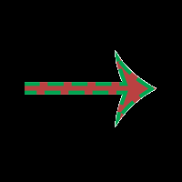](images/imagedata/ag-psd/write/vector/expected.png) |  |
| [read/bitmap-rle/src.psd](https://github.com/Agamnentzar/ag-psd/tree/master/test/read/bitmap-rle/src.psd) | 19.4 KB | 100.00%  | ✅ PERFECT |  |  |  |
| [read/layer-offsets-read/src.psd](https://github.com/Agamnentzar/ag-psd/tree/master/test/read/layer-offsets-read/src.psd) | 19.6 KB | 100.00%  | ✅ PERFECT |  |  |  |
| [read/section/src.psd](https://github.com/Agamnentzar/ag-psd/tree/master/test/read/section/src.psd) | 19.7 KB | 100.00%  | ✅ PERFECT |  |  |  |
| [read/just-bg/src.psd](https://github.com/Agamnentzar/ag-psd/tree/master/test/read/just-bg/src.psd) | 21.4 KB | 100.00%  | ✅ PERFECT |  |  |  |
| [read/count/src.psd](https://github.com/Agamnentzar/ag-psd/tree/master/test/read/count/src.psd) | 22.3 KB | 100.00%  | ✅ PERFECT |  |  |  |
| [read/layer-larger-than-drawing/src.psd](https://github.com/Agamnentzar/ag-psd/tree/master/test/read/layer-larger-than-drawing/src.psd) | 23.2 KB | 100.00%  | ✅ PERFECT |  |  |  |
| [write/circle/expected.psd](https://github.com/Agamnentzar/ag-psd/tree/master/test/write/circle/expected.psd) | 24.6 KB | 99.36%  | ✅ PERFECT |  | [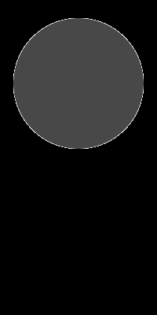](images/imagedata/ag-psd/write/circle/expected.png) | [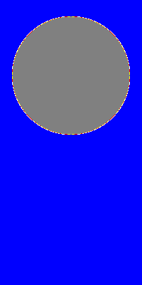](images/imagedata/ag-psd/write/circle/expected_diff.png) |
| [read-write/vector-and-mask/expected.psd](https://github.com/Agamnentzar/ag-psd/tree/master/test/read-write/vector-and-mask/expected.psd) | 25.2 KB | 100.00%  | ✅ PERFECT |  |  |  |
| [read/nested/src.psd](https://github.com/Agamnentzar/ag-psd/tree/master/test/read/nested/src.psd) | 25.4 KB | 100.00%  | ✅ PERFECT |  |  |  |
| [read-write/stroke/expected.psd](https://github.com/Agamnentzar/ag-psd/tree/master/test/read-write/stroke/expected.psd) | 25.5 KB | 5.01%  | ❌ FAILED |  |  |  |
| [write/layer-mask/expected.psd](https://github.com/Agamnentzar/ag-psd/tree/master/test/write/layer-mask/expected.psd) | 25.6 KB | 99.82%  | ✅ PERFECT |  |  |  |
| [read/pass-through/src.psd](https://github.com/Agamnentzar/ag-psd/tree/master/test/read/pass-through/src.psd) | 26.3 KB | 100.00%  | ✅ PERFECT |  |  |  |
| [layer-mask/src.psd](https://github.com/Agamnentzar/ag-psd/tree/master/test/layer-mask/src.psd) | 26.7 KB | 100.00%  | ✅ PERFECT |  |  |  |
| [read-write/winding-non-zero/expected.psd](https://github.com/Agamnentzar/ag-psd/tree/master/test/read-write/winding-non-zero/expected.psd) | 26.9 KB | 99.37%  | ✅ PERFECT |  |  |  |
| [read-write/vector-and-mask/src.psd](https://github.com/Agamnentzar/ag-psd/tree/master/test/read-write/vector-and-mask/src.psd) | 27.0 KB | 100.00%  | ✅ PERFECT |  |  |  |
| [read/section-2/src.psd](https://github.com/Agamnentzar/ag-psd/tree/master/test/read/section-2/src.psd) | 27.8 KB | 100.00%  | ✅ PERFECT |  |  |  |
| [read/cat/src.psd](https://github.com/Agamnentzar/ag-psd/tree/master/test/read/cat/src.psd) | 29.5 KB | 100.00%  | ✅ PERFECT |  |  |  |
| [read-write/animation-effects/expected.psd](https://github.com/Agamnentzar/ag-psd/tree/master/test/read-write/animation-effects/expected.psd) | 30.3 KB | 2.23%  | ❌ FAILED |  |  |  |
| [read/vector-layer/src.psd](https://github.com/Agamnentzar/ag-psd/tree/master/test/read/vector-layer/src.psd) | 30.4 KB | 100.00%  | ✅ PERFECT |  |  |  |
| [read-write/stroke/src.psd](https://github.com/Agamnentzar/ag-psd/tree/master/test/read-write/stroke/src.psd) | 30.4 KB | 5.01%  | ❌ FAILED |  |  |  |
| [read-write/animation-offset/expected.psd](https://github.com/Agamnentzar/ag-psd/tree/master/test/read-write/animation-offset/expected.psd) | 31.0 KB | 0.00%  | ❌ FAILED |  |  |  |
| [read-write/layer-comps/expected.psd](https://github.com/Agamnentzar/ag-psd/tree/master/test/read-write/layer-comps/expected.psd) | 31.1 KB | 0.00%  | ❌ FAILED |  |  |  |
| [read-write/winding-non-zero/src.psd](https://github.com/Agamnentzar/ag-psd/tree/master/test/read-write/winding-non-zero/src.psd) | 31.1 KB | 99.37%  | ✅ PERFECT |  |  |  |
| [read/winding-non-zero/src.psd](https://github.com/Agamnentzar/ag-psd/tree/master/test/read/winding-non-zero/src.psd) | 31.1 KB | 99.37%  | ✅ PERFECT |  |  |  |
| [read-write/boolean/expected.psd](https://github.com/Agamnentzar/ag-psd/tree/master/test/read-write/boolean/expected.psd) | 31.9 KB | 99.69%  | ✅ PERFECT |  |  | [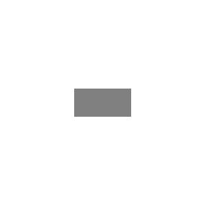](images/imagedata/ag-psd/read-write/boolean/expected_diff.png) |
| [read/winding-even-odd/src.psd](https://github.com/Agamnentzar/ag-psd/tree/master/test/read/winding-even-odd/src.psd) | 32.9 KB | 98.86%  | ✅ GOOD |  | [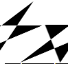](images/imagedata/ag-psd/read/winding-even-odd/src.png) | [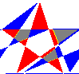](images/imagedata/ag-psd/read/winding-even-odd/src_diff.png) |
| [read-write/boolean/src.psd](https://github.com/Agamnentzar/ag-psd/tree/master/test/read-write/boolean/src.psd) | 33.8 KB | 99.69%  | ✅ PERFECT |  |  |  |
| [read-write/animation-effects/src.psd](https://github.com/Agamnentzar/ag-psd/tree/master/test/read-write/animation-effects/src.psd) | 34.8 KB | 2.23%  | ❌ FAILED |  |  |  |
| [read/animation-effects/src.psd](https://github.com/Agamnentzar/ag-psd/tree/master/test/read/animation-effects/src.psd) | 34.8 KB | 2.23%  | ❌ FAILED |  |  |  |
| [read/lantern/src.psd](https://github.com/Agamnentzar/ag-psd/tree/master/test/read/lantern/src.psd) | 35.0 KB | 0.00%  | ❌ FAILED |  |  |  |
| [read/smart-object-png/expected.psd](https://github.com/Agamnentzar/ag-psd/tree/master/test/read/smart-object-png/expected.psd) | 35.1 KB | 1.27%  | ❌ FAILED |  |  |  |
| [read/smart-object-png/src.psd](https://github.com/Agamnentzar/ag-psd/tree/master/test/read/smart-object-png/src.psd) | 35.1 KB | 1.27%  | ❌ FAILED |  |  |  |
| [read-write/layer-comps/src.psd](https://github.com/Agamnentzar/ag-psd/tree/master/test/read-write/layer-comps/src.psd) | 35.2 KB | 0.00%  | ❌ FAILED |  |  |  |
| [read/layer-comps/src.psd](https://github.com/Agamnentzar/ag-psd/tree/master/test/read/layer-comps/src.psd) | 35.2 KB | 0.00%  | ❌ FAILED |  |  |  |
| [read-write/animation-offset/src.psd](https://github.com/Agamnentzar/ag-psd/tree/master/test/read-write/animation-offset/src.psd) | 35.2 KB | 0.00%  | ❌ FAILED |  |  |  |
| [read/animation-offset/src.psd](https://github.com/Agamnentzar/ag-psd/tree/master/test/read/animation-offset/src.psd) | 35.2 KB | 0.00%  | ❌ FAILED |  |  |  |
| [read/bitmap/src.psd](https://github.com/Agamnentzar/ag-psd/tree/master/test/read/bitmap/src.psd) | 37.8 KB | 100.00%  | ✅ PERFECT |  |  |  |
| [read-write/round/expected.psd](https://github.com/Agamnentzar/ag-psd/tree/master/test/read-write/round/expected.psd) | 38.6 KB | 99.89%  | ✅ PERFECT |  | [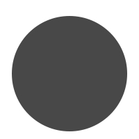](images/imagedata/ag-psd/read-write/round/expected.png) |  |
| [read-write/group-blend/expected.psd](https://github.com/Agamnentzar/ag-psd/tree/master/test/read-write/group-blend/expected.psd) | 39.0 KB | 99.31%  | ✅ PERFECT |  |  | [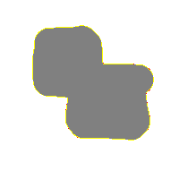](images/imagedata/ag-psd/read-write/group-blend/expected_diff.png) |
| [read-write/round/src.psd](https://github.com/Agamnentzar/ag-psd/tree/master/test/read-write/round/src.psd) | 40.3 KB | 99.89%  | ✅ PERFECT |  |  |  |
| [read/round/src.psd](https://github.com/Agamnentzar/ag-psd/tree/master/test/read/round/src.psd) | 40.3 KB | 99.89%  | ✅ PERFECT |  |  |  |
| [read/vector-complex/src.psd](https://github.com/Agamnentzar/ag-psd/tree/master/test/read/vector-complex/src.psd) | 41.1 KB | 99.16%  | ✅ PERFECT |  |  |  |
| [write/vector/src.psd](https://github.com/Agamnentzar/ag-psd/tree/master/test/write/vector/src.psd) | 41.1 KB | 99.16%  | ✅ PERFECT |  |  |  |
| [read/text-layer/src.psd](https://github.com/Agamnentzar/ag-psd/tree/master/test/read/text-layer/src.psd) | 42.1 KB | 97.97%  | ✅ GOOD |  |  |  |
| [read-write/masks/expected.psd](https://github.com/Agamnentzar/ag-psd/tree/master/test/read-write/masks/expected.psd) | 42.6 KB | 98.75%  | ✅ GOOD |  |  |  |
| [read-write/gradient-mode/expected.psd](https://github.com/Agamnentzar/ag-psd/tree/master/test/read-write/gradient-mode/expected.psd) | 43.7 KB | 99.52%  | ✅ PERFECT |  |  | [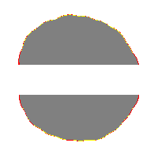](images/imagedata/ag-psd/read-write/gradient-mode/expected_diff.png) |
| [read-write/text/expected.psd](https://github.com/Agamnentzar/ag-psd/tree/master/test/read-write/text/expected.psd) | 43.8 KB | 97.86%  | ✅ GOOD |  |  |  |
| [read-write/group-blend/src.psd](https://github.com/Agamnentzar/ag-psd/tree/master/test/read-write/group-blend/src.psd) | 44.5 KB | 99.31%  | ✅ PERFECT |  |  |  |
| [read-write/gradient-mode/src.psd](https://github.com/Agamnentzar/ag-psd/tree/master/test/read-write/gradient-mode/src.psd) | 45.7 KB | 99.55%  | ✅ PERFECT |  |  | [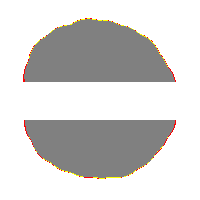](images/imagedata/ag-psd/read-write/gradient-mode/src_diff.png) |
| [read/alpha-composite/src.psd](https://github.com/Agamnentzar/ag-psd/tree/master/test/read/alpha-composite/src.psd) | 45.8 KB | 6.82%  | ❌ FAILED |  |  |  |
| [read-write/text-box/expected.psd](https://github.com/Agamnentzar/ag-psd/tree/master/test/read-write/text-box/expected.psd) | 47.5 KB | 97.80%  | ✅ GOOD |  |  |  |
| [read-write/text/src.psd](https://github.com/Agamnentzar/ag-psd/tree/master/test/read-write/text/src.psd) | 48.2 KB | 97.86%  | ✅ GOOD |  |  |  |
| [read/text-path/src.psd](https://github.com/Agamnentzar/ag-psd/tree/master/test/read/text-path/src.psd) | 48.3 KB | 35.21%  | ❌ FAILED |  |  | [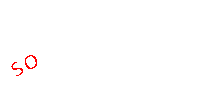](images/imagedata/ag-psd/read/text-path/src_diff.png) |
| [text-simple.psd](https://github.com/Agamnentzar/ag-psd/tree/master/test/text-simple.psd) | 48.9 KB | 98.60%  | ✅ GOOD |  | [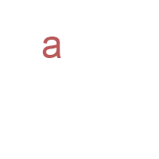](images/imagedata/ag-psd/text-simple.png) | [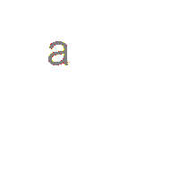](images/imagedata/ag-psd/text-simple_diff.png) |
| [read/layer-mask/src.psd](https://github.com/Agamnentzar/ag-psd/tree/master/test/read/layer-mask/src.psd) | 49.0 KB | 99.87%  | ✅ PERFECT |  |  |  |
| [read/text-alternatives/src.psd](https://github.com/Agamnentzar/ag-psd/tree/master/test/read/text-alternatives/src.psd) | 50.2 KB | 32.54%  | ❌ FAILED |  |  | [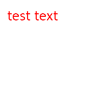](images/imagedata/ag-psd/read/text-alternatives/src_diff.png) |
| [read-write/text-box/src.psd](https://github.com/Agamnentzar/ag-psd/tree/master/test/read-write/text-box/src.psd) | 51.9 KB | 97.79%  | ✅ GOOD |  |  |  |
| [read/text-simple/src.psd](https://github.com/Agamnentzar/ag-psd/tree/master/test/read/text-simple/src.psd) | 55.7 KB | 98.91%  | ✅ GOOD |  |  |  |
| [read/text-carriage-return/src.psd](https://github.com/Agamnentzar/ag-psd/tree/master/test/read/text-carriage-return/src.psd) | 56.0 KB | 100.00%  | ✅ PERFECT |  | [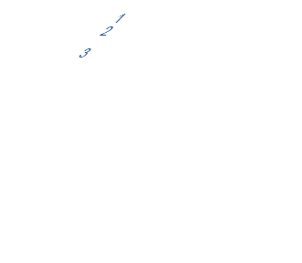](images/imagedata/ag-psd/read/text-carriage-return/src.png) | [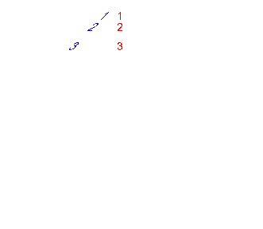](images/imagedata/ag-psd/read/text-carriage-return/src_diff.png) |
| [test.psd](https://github.com/Agamnentzar/ag-psd/tree/master/test/test.psd) | 57.3 KB | 99.39%  | ✅ PERFECT |  |  |  |
| [read-write/masks/src.psd](https://github.com/Agamnentzar/ag-psd/tree/master/test/read-write/masks/src.psd) | 57.4 KB | 98.73%  | ✅ GOOD |  |  |  |
| [text-test.psd](https://github.com/Agamnentzar/ag-psd/tree/master/test/text-test.psd) | 62.7 KB | 98.47%  | ✅ GOOD |  | [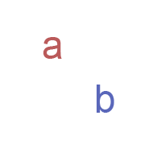](images/imagedata/ag-psd/text-test.png) |  |
| [write/simple-compress/expected.psd](https://github.com/Agamnentzar/ag-psd/tree/master/test/write/simple-compress/expected.psd) | 63.5 KB | 100.00%  | ✅ PERFECT |  |  |  |
| [read/pattern/src.psd](https://github.com/Agamnentzar/ag-psd/tree/master/test/read/pattern/src.psd) | 64.8 KB | 96.46%  | ✅ GOOD |  | [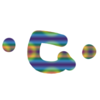](images/imagedata/ag-psd/read/pattern/src.png) |  |
| [read/guides/src.psd](https://github.com/Agamnentzar/ag-psd/tree/master/test/read/guides/src.psd) | 65.7 KB | 100.00%  | ✅ PERFECT |  |  |  |
| [read-write/annotations/expected.psd](https://github.com/Agamnentzar/ag-psd/tree/master/test/read-write/annotations/expected.psd) | 71.9 KB | 100.00%  | ✅ PERFECT |  |  |  |
| [read/text-paragraph-align/src.psd](https://github.com/Agamnentzar/ag-psd/tree/master/test/read/text-paragraph-align/src.psd) | 72.2 KB | 24.48%  | ❌ FAILED |  |  |  |
| [vector-test.psd](https://github.com/Agamnentzar/ag-psd/tree/master/test/vector-test.psd) | 75.8 KB | 99.32%  | ✅ PERFECT |  | [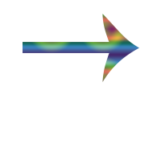](images/imagedata/ag-psd/vector-test.png) | [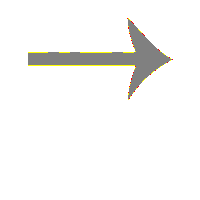](images/imagedata/ag-psd/vector-test_diff.png) |
| [read-write/annotations/src.psd](https://github.com/Agamnentzar/ag-psd/tree/master/test/read-write/annotations/src.psd) | 76.8 KB | 100.00%  | ✅ PERFECT |  |  |  |
| [write/groups/original.psd](https://github.com/Agamnentzar/ag-psd/tree/master/test/write/groups/original.psd) | 79.4 KB | 0.00%  | ❌ FAILED |  |  |  |
| [write/simple/expected.psd](https://github.com/Agamnentzar/ag-psd/tree/master/test/write/simple/expected.psd) | 79.5 KB | 100.00%  | ✅ PERFECT |  |  |  |
| [write/layer-color/expected.psd](https://github.com/Agamnentzar/ag-psd/tree/master/test/write/layer-color/expected.psd) | 79.5 KB | 100.00%  | ✅ PERFECT |  |  |  |
| [read/text-simple2/src.psd](https://github.com/Agamnentzar/ag-psd/tree/master/test/read/text-simple2/src.psd) | 83.4 KB | 98.43%  | ✅ GOOD |  |  |  |
| [read/blend-mode/src.psd](https://github.com/Agamnentzar/ag-psd/tree/master/test/read/blend-mode/src.psd) | 83.5 KB | 93.76%  | ✅ GOOD |  |  |  |
| [write/effects/expected.psd](https://github.com/Agamnentzar/ag-psd/tree/master/test/write/effects/expected.psd) | 85.8 KB | 79.43%  | ⚠️ LOW |  |  | [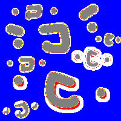](images/imagedata/ag-psd/write/effects/expected_diff.png) |
| [read/text-complex/src.psd](https://github.com/Agamnentzar/ag-psd/tree/master/test/read/text-complex/src.psd) | 85.9 KB | 100.00%  | ✅ PERFECT |  |  |  |
| [write/groups/expected.psd](https://github.com/Agamnentzar/ag-psd/tree/master/test/write/groups/expected.psd) | 95.0 KB | 100.00%  | ✅ PERFECT |  |  |  |
| [read-write/effects/expected.psd](https://github.com/Agamnentzar/ag-psd/tree/master/test/read-write/effects/expected.psd) | 98.2 KB | 96.05%  | ✅ GOOD |  | [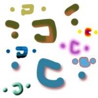](images/imagedata/ag-psd/read-write/effects/expected.png) |  |
| [write/complex/expected.psd](https://github.com/Agamnentzar/ag-psd/tree/master/test/write/complex/expected.psd) | 99.7 KB | 100.00%  | ✅ PERFECT |  |  |  |
| [read/effects/src.psd](https://github.com/Agamnentzar/ag-psd/tree/master/test/read/effects/src.psd) | 101.5 KB | 95.78%  | ✅ GOOD |  |  | [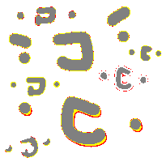](images/imagedata/ag-psd/read/effects/src_diff.png) |
| [read-write/animation-frame/expected.psd](https://github.com/Agamnentzar/ag-psd/tree/master/test/read-write/animation-frame/expected.psd) | 106.4 KB | 78.87%  | ⚠️ LOW |  |  | [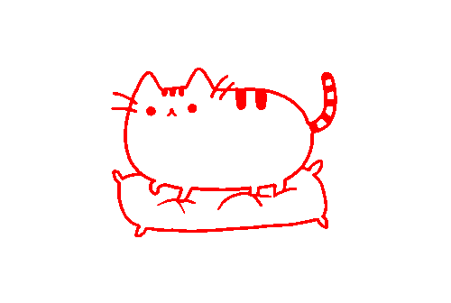](images/imagedata/ag-psd/read-write/animation-frame/expected_diff.png) |
| [read-write/gradient/expected.psd](https://github.com/Agamnentzar/ag-psd/tree/master/test/read-write/gradient/expected.psd) | 106.6 KB | 98.59%  | ✅ GOOD |  |  |  |
| [read-write/effects/src.psd](https://github.com/Agamnentzar/ag-psd/tree/master/test/read-write/effects/src.psd) | 106.9 KB | 96.04%  | ✅ GOOD |  |  | [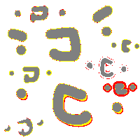](images/imagedata/ag-psd/read-write/effects/src_diff.png) |
| [read/key-origin-shape-bbox/src.psd](https://github.com/Agamnentzar/ag-psd/tree/master/test/read/key-origin-shape-bbox/src.psd) | 109.4 KB | 100.00%  | ✅ PERFECT |  |  | [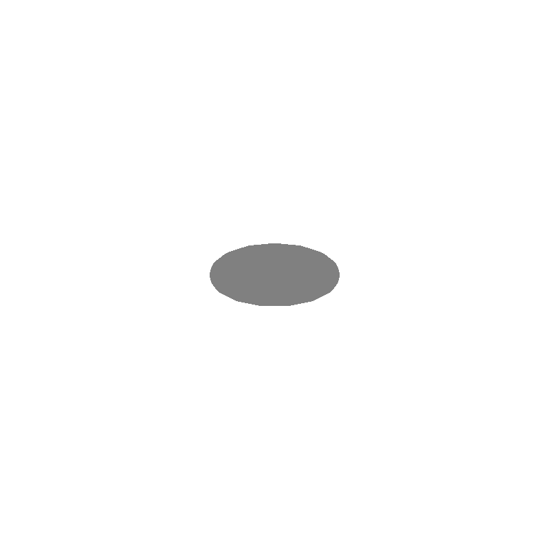](images/imagedata/ag-psd/read/key-origin-shape-bbox/src_diff.png) |
| [read/sai/src.psd](https://github.com/Agamnentzar/ag-psd/tree/master/test/read/sai/src.psd) | 110.9 KB | 99.83%  | ✅ PERFECT |  |  |  |
| [read-write/gradient/src.psd](https://github.com/Agamnentzar/ag-psd/tree/master/test/read-write/gradient/src.psd) | 110.9 KB | 98.59%  | ✅ GOOD |  |  |  |
| [read/gradient/src.psd](https://github.com/Agamnentzar/ag-psd/tree/master/test/read/gradient/src.psd) | 110.9 KB | 98.59%  | ✅ GOOD |  |  |  |
| [read-write/shapes/expected.psd](https://github.com/Agamnentzar/ag-psd/tree/master/test/read-write/shapes/expected.psd) | 112.1 KB | 100.00%  | ✅ PERFECT |  |  |  |
| [write/no-background/expected.psd](https://github.com/Agamnentzar/ag-psd/tree/master/test/write/no-background/expected.psd) | 114.4 KB | 96.28%  | ✅ GOOD |  |  | [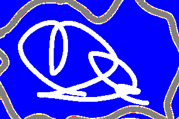](images/imagedata/ag-psd/write/no-background/expected_diff.png) |
| [read-write/shapes/src.psd](https://github.com/Agamnentzar/ag-psd/tree/master/test/read-write/shapes/src.psd) | 121.3 KB | 100.00%  | ✅ PERFECT |  |  |  |
| [read-write/animation-frame/src.psd](https://github.com/Agamnentzar/ag-psd/tree/master/test/read-write/animation-frame/src.psd) | 122.0 KB | 78.87%  | ⚠️ LOW |  |  |  |
| [read/animation-frame/src.psd](https://github.com/Agamnentzar/ag-psd/tree/master/test/read/animation-frame/src.psd) | 122.0 KB | 78.87%  | ⚠️ LOW |  |  |  |
| [read-write/strokes/expected.psd](https://github.com/Agamnentzar/ag-psd/tree/master/test/read-write/strokes/expected.psd) | 130.0 KB | 100.00%  | ✅ PERFECT |  |  | [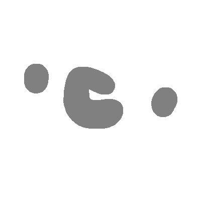](images/imagedata/ag-psd/read-write/strokes/expected_diff.png) |
| [read/grayscale/src.psd](https://github.com/Agamnentzar/ag-psd/tree/master/test/read/grayscale/src.psd) | 130.6 KB | 100.00%  | ✅ PERFECT |  |  |  |
| [read-write/float-color/expected.psd](https://github.com/Agamnentzar/ag-psd/tree/master/test/read-write/float-color/expected.psd) | 140.5 KB | 99.98%  | ✅ PERFECT |  | [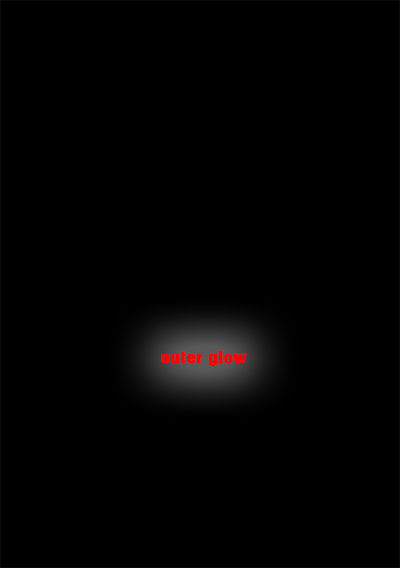](images/imagedata/ag-psd/read-write/float-color/expected.png) | [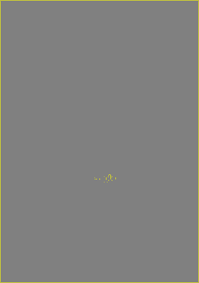](images/imagedata/ag-psd/read-write/float-color/expected_diff.png) |
| [read-write/strokes/src.psd](https://github.com/Agamnentzar/ag-psd/tree/master/test/read-write/strokes/src.psd) | 142.3 KB | 100.00%  | ✅ PERFECT |  |  |  |
| [read-write/float-color/src.psd](https://github.com/Agamnentzar/ag-psd/tree/master/test/read-write/float-color/src.psd) | 145.9 KB | 99.98%  | ✅ PERFECT |  |  |  |
| [multiple-strokes-test.psd](https://github.com/Agamnentzar/ag-psd/tree/master/test/multiple-strokes-test.psd) | 159.2 KB | 100.00%  | ✅ PERFECT |  | [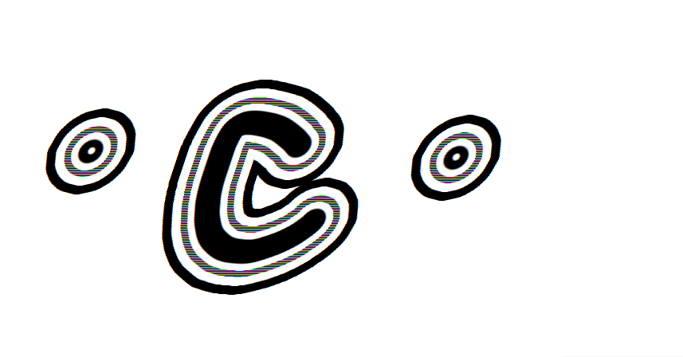](images/imagedata/ag-psd/multiple-strokes-test.png) |  |
| [read/mesh-transform/src.psd](https://github.com/Agamnentzar/ag-psd/tree/master/test/read/mesh-transform/src.psd) | 179.0 KB | 99.98%  | ✅ PERFECT |  |  | [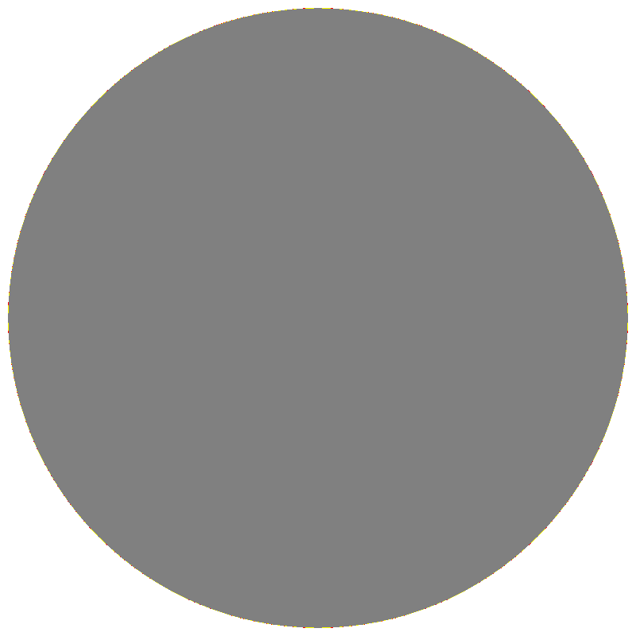](images/imagedata/ag-psd/read/mesh-transform/src_diff.png) |
| [read/grayscale-alpha/src.psd](https://github.com/Agamnentzar/ag-psd/tree/master/test/read/grayscale-alpha/src.psd) | 186.1 KB | 99.97%  | ✅ PERFECT |  |  | [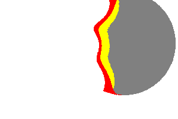](images/imagedata/ag-psd/read/grayscale-alpha/src_diff.png) |
| [read/layers/src.psd](https://github.com/Agamnentzar/ag-psd/tree/master/test/read/layers/src.psd) | 189.9 KB | 100.00%  | ✅ PERFECT |  |  | [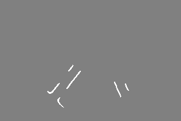](images/imagedata/ag-psd/read/layers/src_diff.png) |
| [read-write/adjustments/expected.psd](https://github.com/Agamnentzar/ag-psd/tree/master/test/read-write/adjustments/expected.psd) | 209.5 KB | 97.82%  | ✅ GOOD |  |  |  |
| [read-write/vectors/expected.psd](https://github.com/Agamnentzar/ag-psd/tree/master/test/read-write/vectors/expected.psd) | 211.0 KB | 100.00%  | ✅ PERFECT |  |  |  |
| [read-write/vectors/src.psd](https://github.com/Agamnentzar/ag-psd/tree/master/test/read-write/vectors/src.psd) | 217.1 KB | 100.00%  | ✅ PERFECT |  |  |  |
| [read/groups/src.psd](https://github.com/Agamnentzar/ag-psd/tree/master/test/read/groups/src.psd) | 221.3 KB | 97.21%  | ✅ GOOD |  | [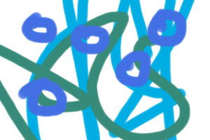](images/imagedata/ag-psd/read/groups/src.png) |  |
| [read-write/adjustments/src.psd](https://github.com/Agamnentzar/ag-psd/tree/master/test/read-write/adjustments/src.psd) | 224.0 KB | 97.80%  | ✅ GOOD |  |  |  |
| [read/adjustment-layers/src.psd](https://github.com/Agamnentzar/ag-psd/tree/master/test/read/adjustment-layers/src.psd) | 224.0 KB | 97.80%  | ✅ GOOD |  |  |  |
| [read/background/src.psd](https://github.com/Agamnentzar/ag-psd/tree/master/test/read/background/src.psd) | 240.2 KB | 100.00%  | ✅ PERFECT |  |  |  |
| [write/float-size/expected.psd](https://github.com/Agamnentzar/ag-psd/tree/master/test/write/float-size/expected.psd) | 246.4 KB | 0.00%  | ❌ FAILED |  |  |  |
| [timeline.psd](https://github.com/Agamnentzar/ag-psd/tree/master/test/timeline.psd) | 248.1 KB | 100.00%  | ✅ PERFECT |  |  |  |
| [read/alias/src.psd](https://github.com/Agamnentzar/ag-psd/tree/master/test/read/alias/src.psd) | 257.9 KB | 99.36%  | ✅ PERFECT |  |  |  |
| [write/smart-object/expected.psd](https://github.com/Agamnentzar/ag-psd/tree/master/test/write/smart-object/expected.psd) | 269.6 KB | 100.00%  | ✅ PERFECT |  |  | [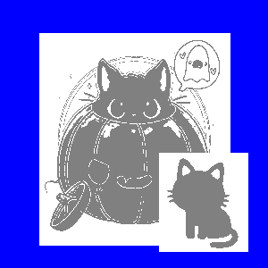](images/imagedata/ag-psd/write/smart-object/expected_diff.png) |
| [read-write/smart/expected.psd](https://github.com/Agamnentzar/ag-psd/tree/master/test/read-write/smart/expected.psd) | 288.9 KB | 100.00%  | ✅ PERFECT |  |  | [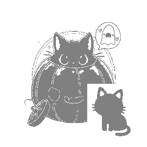](images/imagedata/ag-psd/read-write/smart/expected_diff.png) |
| [read-write/artboards/expected.psd](https://github.com/Agamnentzar/ag-psd/tree/master/test/read-write/artboards/expected.psd) | 295.1 KB | 100.00%  | ✅ PERFECT |  |  |  |
| [read-write/smart/src.psd](https://github.com/Agamnentzar/ag-psd/tree/master/test/read-write/smart/src.psd) | 295.4 KB | 100.00%  | ✅ PERFECT |  |  |  |
| [read/smart-object/src.psd](https://github.com/Agamnentzar/ag-psd/tree/master/test/read/smart-object/src.psd) | 295.4 KB | 100.00%  | ✅ PERFECT |  |  |  |
| [read/text-bug/src.psd](https://github.com/Agamnentzar/ag-psd/tree/master/test/read/text-bug/src.psd) | 306.0 KB | 100.00%  | ✅ PERFECT |  |  | [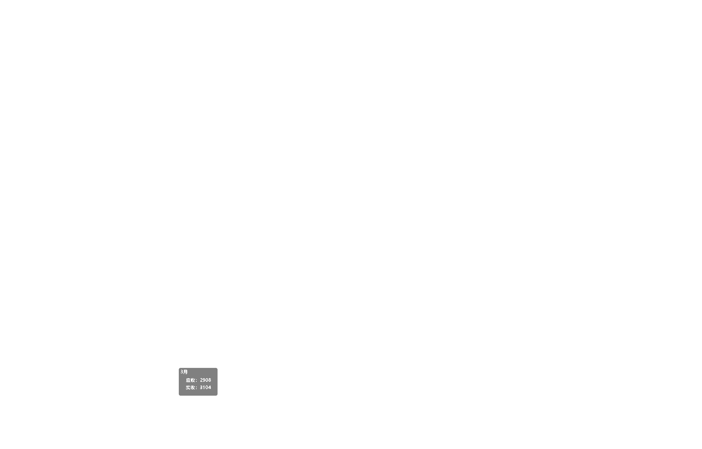](images/imagedata/ag-psd/read/text-bug/src_diff.png) |
| [read-write/artboards/src.psd](https://github.com/Agamnentzar/ag-psd/tree/master/test/read-write/artboards/src.psd) | 316.1 KB | 100.00%  | ✅ PERFECT |  |  |  |
| [read/artboards/src.psd](https://github.com/Agamnentzar/ag-psd/tree/master/test/read/artboards/src.psd) | 316.1 KB | 100.00%  | ✅ PERFECT |  |  | [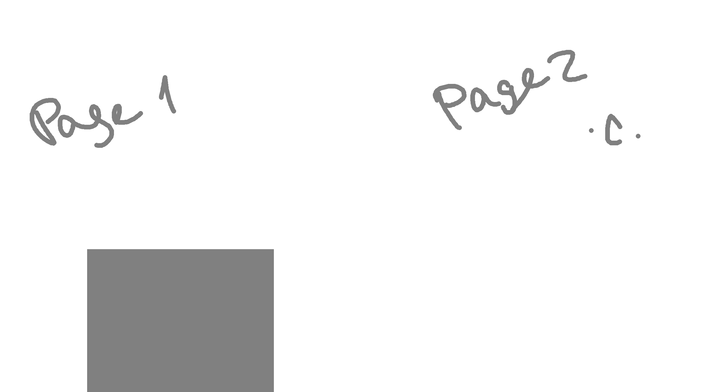](images/imagedata/ag-psd/read/artboards/src_diff.png) |
| [read-write/smart-filters-2/expected.psd](https://github.com/Agamnentzar/ag-psd/tree/master/test/read-write/smart-filters-2/expected.psd) | 327.7 KB | 2.25%  | ❌ FAILED |  |  |  |
| [read-write/smart-filters-2/src.psd](https://github.com/Agamnentzar/ag-psd/tree/master/test/read-write/smart-filters-2/src.psd) | 333.0 KB | 2.25%  | ❌ FAILED |  |  |  |
| [read/placed-transform/src.psd](https://github.com/Agamnentzar/ag-psd/tree/master/test/read/placed-transform/src.psd) | 344.3 KB | 100.00%  | ✅ PERFECT |  |  |  |
| [read-write/werps/src.psd](https://github.com/Agamnentzar/ag-psd/tree/master/test/read-write/werps/src.psd) | 657.2 KB | 100.00%  | ✅ PERFECT |  |  |  |
| [read/cmyk/src.psd](https://github.com/Agamnentzar/ag-psd/tree/master/test/read/cmyk/src.psd) | 718.9 KB | 99.31%  | ✅ PERFECT |  |  |  |
| [read/rle-fail/src.psd](https://github.com/Agamnentzar/ag-psd/tree/master/test/read/rle-fail/src.psd) | 1.1 MB | 100.00%  | ✅ PERFECT |  |  |  |
| [read/32bits/src.psd](https://github.com/Agamnentzar/ag-psd/tree/master/test/read/32bits/src.psd) | 1.2 MB | 0.22%  | ❌ FAILED |  |  | [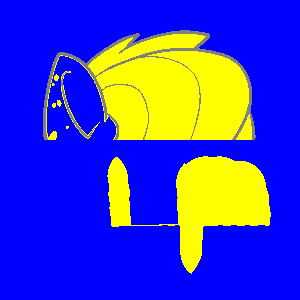](images/imagedata/ag-psd/read/32bits/src_diff.png) |
| [read-write/cyllinder-warp/expected.psd](https://github.com/Agamnentzar/ag-psd/tree/master/test/read-write/cyllinder-warp/expected.psd) | 1.4 MB | 100.00%  | ✅ PERFECT |  | [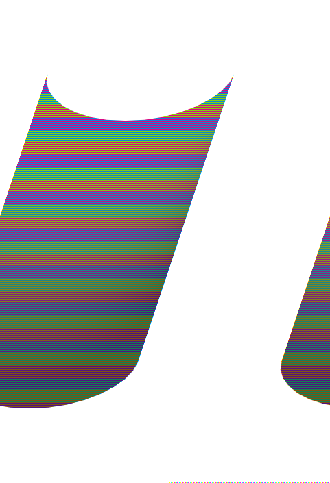](images/imagedata/ag-psd/read-write/cyllinder-warp/expected.png) |  |
| [read-write/cyllinder-warp/src.psd](https://github.com/Agamnentzar/ag-psd/tree/master/test/read-write/cyllinder-warp/src.psd) | 1.4 MB | 100.00%  | ✅ PERFECT |  |  |  |
| [read/cyllinder-warp/src.psd](https://github.com/Agamnentzar/ag-psd/tree/master/test/read/cyllinder-warp/src.psd) | 1.4 MB | 100.00%  | ✅ PERFECT |  |  |  |
| [read-write/animation-timeline/expected.psd](https://github.com/Agamnentzar/ag-psd/tree/master/test/read-write/animation-timeline/expected.psd) | 2.2 MB | 24.69%  | ❌ FAILED |  |  |  |
| [read-write/animation-timeline/src.psd](https://github.com/Agamnentzar/ag-psd/tree/master/test/read-write/animation-timeline/src.psd) | 2.2 MB | 24.69%  | ❌ FAILED |  |  |  |
| [read/animation-timeline/src.psd](https://github.com/Agamnentzar/ag-psd/tree/master/test/read/animation-timeline/src.psd) | 2.2 MB | 24.69%  | ❌ FAILED |  |  |  |
| [read-write/smart-filters/expected.psd](https://github.com/Agamnentzar/ag-psd/tree/master/test/read-write/smart-filters/expected.psd) | 8.0 MB | 0.01%  | ❌ FAILED |  |  |  |
| [read-write/smart-filters/src.psd](https://github.com/Agamnentzar/ag-psd/tree/master/test/read-write/smart-filters/src.psd) | 8.0 MB | 0.01%  | ❌ FAILED |  |  |  |
| [read/16bits/src.psd](https://github.com/Agamnentzar/ag-psd/tree/master/test/read/16bits/src.psd) | 13.5 MB | 99.84%  | ✅ PERFECT |  |  |  |

## Section 3: Image Data vs QPsdView

| File | Size | Similarity | Status | Image Data | QPsdView | Difference |
|------|------|------------|--------|------------|----------|------------|
| [read/fill-opacity/src.psd](https://github.com/Agamnentzar/ag-psd/tree/master/test/read/fill-opacity/src.psd) | 970 B | 0.00%  | ❌ FAILED |  |  |  |
| [write/empty/expected.psd](https://github.com/Agamnentzar/ag-psd/tree/master/test/write/empty/expected.psd) | 6.4 KB | 100.00%  | ✅ PERFECT |  |  |  |
| [write/layer-name/expected.psd](https://github.com/Agamnentzar/ag-psd/tree/master/test/write/layer-name/expected.psd) | 6.4 KB | 100.00%  | ✅ PERFECT |  |  |  |
| [write/long-name/expected.psd](https://github.com/Agamnentzar/ag-psd/tree/master/test/write/long-name/expected.psd) | 8.1 KB | 100.00%  | ✅ PERFECT |  |  |  |
| [read/mesh-transform/Layer 1.psd](https://github.com/Agamnentzar/ag-psd/tree/master/test/read/mesh-transform/Layer%201.psd) | 9.9 KB | 0.00%  | ❌ FAILED |  |  |  |
| [write/write-text/expected.psd](https://github.com/Agamnentzar/ag-psd/tree/master/test/write/write-text/expected.psd) | 11.0 KB | 46.31%  | ❌ FAILED |  |  |  |
| [write/write-text2/expected.psd](https://github.com/Agamnentzar/ag-psd/tree/master/test/write/write-text2/expected.psd) | 11.4 KB | 35.86%  | ❌ FAILED |  |  |  |
| [write/auto-lead/expected.psd](https://github.com/Agamnentzar/ag-psd/tree/master/test/write/auto-lead/expected.psd) | 12.1 KB | 100.00%  | ✅ PERFECT |  |  |  |
| [write/layer-offsets/expected.psd](https://github.com/Agamnentzar/ag-psd/tree/master/test/write/layer-offsets/expected.psd) | 17.6 KB | 100.00%  | ✅ PERFECT |  |  |  |
| [write/group-blend/expected.psd](https://github.com/Agamnentzar/ag-psd/tree/master/test/write/group-blend/expected.psd) | 17.9 KB | 0.00%  | ❌ FAILED |  |  |  |
| [write/vector/expected.psd](https://github.com/Agamnentzar/ag-psd/tree/master/test/write/vector/expected.psd) | 18.3 KB | 76.11%  | ⚠️ LOW |  |  |  |
| [read/bitmap-rle/src.psd](https://github.com/Agamnentzar/ag-psd/tree/master/test/read/bitmap-rle/src.psd) | 19.4 KB | 100.00%  | ✅ PERFECT |  |  |  |
| [read/layer-offsets-read/src.psd](https://github.com/Agamnentzar/ag-psd/tree/master/test/read/layer-offsets-read/src.psd) | 19.6 KB | 100.00%  | ✅ PERFECT |  |  |  |
| [read/section/src.psd](https://github.com/Agamnentzar/ag-psd/tree/master/test/read/section/src.psd) | 19.7 KB | 100.00%  | ✅ PERFECT |  |  |  |
| [read/just-bg/src.psd](https://github.com/Agamnentzar/ag-psd/tree/master/test/read/just-bg/src.psd) | 21.4 KB | 100.00%  | ✅ PERFECT |  |  |  |
| [read/count/src.psd](https://github.com/Agamnentzar/ag-psd/tree/master/test/read/count/src.psd) | 22.3 KB | 100.00%  | ✅ PERFECT |  |  |  |
| [read/indexed/src.psd](https://github.com/Agamnentzar/ag-psd/tree/master/test/read/indexed/src.psd) | 23.2 KB | 100.00%  | ✅ PERFECT |  |  |  |
| [read/layer-larger-than-drawing/src.psd](https://github.com/Agamnentzar/ag-psd/tree/master/test/read/layer-larger-than-drawing/src.psd) | 23.2 KB | 100.00%  | ✅ PERFECT |  |  |  |
| [write/circle/expected.psd](https://github.com/Agamnentzar/ag-psd/tree/master/test/write/circle/expected.psd) | 24.6 KB | 99.87%  | ✅ PERFECT |  |  |  |
| [read/placed-transform/Layer 1.psd](https://github.com/Agamnentzar/ag-psd/tree/master/test/read/placed-transform/Layer%201.psd) | 24.8 KB | 0.00%  | ❌ FAILED |  |  |  |
| [read-write/vector-and-mask/expected.psd](https://github.com/Agamnentzar/ag-psd/tree/master/test/read-write/vector-and-mask/expected.psd) | 25.2 KB | 100.00%  | ✅ PERFECT |  |  |  |
| [read/nested/src.psd](https://github.com/Agamnentzar/ag-psd/tree/master/test/read/nested/src.psd) | 25.4 KB | 100.00%  | ✅ PERFECT |  |  |  |
| [read-write/stroke/expected.psd](https://github.com/Agamnentzar/ag-psd/tree/master/test/read-write/stroke/expected.psd) | 25.5 KB | 10.59%  | ❌ FAILED |  |  |  |
| [write/layer-mask/expected.psd](https://github.com/Agamnentzar/ag-psd/tree/master/test/write/layer-mask/expected.psd) | 25.6 KB | 99.82%  | ✅ PERFECT |  |  |  |
| [read/slices/src.psd](https://github.com/Agamnentzar/ag-psd/tree/master/test/read/slices/src.psd) | 26.2 KB | 100.00%  | ✅ PERFECT |  |  |  |
| [read/pass-through/src.psd](https://github.com/Agamnentzar/ag-psd/tree/master/test/read/pass-through/src.psd) | 26.3 KB | 100.00%  | ✅ PERFECT |  |  |  |
| [layer-mask/src.psd](https://github.com/Agamnentzar/ag-psd/tree/master/test/layer-mask/src.psd) | 26.7 KB | 100.00%  | ✅ PERFECT |  |  |  |
| [read-write/winding-non-zero/expected.psd](https://github.com/Agamnentzar/ag-psd/tree/master/test/read-write/winding-non-zero/expected.psd) | 26.9 KB | 99.98%  | ✅ PERFECT |  |  |  |
| [read-write/vector-and-mask/src.psd](https://github.com/Agamnentzar/ag-psd/tree/master/test/read-write/vector-and-mask/src.psd) | 27.0 KB | 100.00%  | ✅ PERFECT |  |  |  |
| [read/section-2/src.psd](https://github.com/Agamnentzar/ag-psd/tree/master/test/read/section-2/src.psd) | 27.8 KB | 100.00%  | ✅ PERFECT |  |  |  |
| [read/cat/src.psd](https://github.com/Agamnentzar/ag-psd/tree/master/test/read/cat/src.psd) | 29.5 KB | 100.00%  | ✅ PERFECT |  |  |  |
| [read-write/animation-effects/expected.psd](https://github.com/Agamnentzar/ag-psd/tree/master/test/read-write/animation-effects/expected.psd) | 30.3 KB | 19.67%  | ❌ FAILED |  |  |  |
| [read/vector-layer/src.psd](https://github.com/Agamnentzar/ag-psd/tree/master/test/read/vector-layer/src.psd) | 30.4 KB | 100.00%  | ✅ PERFECT |  |  |  |
| [read-write/stroke/src.psd](https://github.com/Agamnentzar/ag-psd/tree/master/test/read-write/stroke/src.psd) | 30.4 KB | 10.59%  | ❌ FAILED |  |  |  |
| [read-write/animation-offset/expected.psd](https://github.com/Agamnentzar/ag-psd/tree/master/test/read-write/animation-offset/expected.psd) | 31.0 KB | 0.00%  | ❌ FAILED |  |  |  |
| [read-write/layer-comps/expected.psd](https://github.com/Agamnentzar/ag-psd/tree/master/test/read-write/layer-comps/expected.psd) | 31.1 KB | 0.00%  | ❌ FAILED |  |  |  |
| [read-write/winding-non-zero/src.psd](https://github.com/Agamnentzar/ag-psd/tree/master/test/read-write/winding-non-zero/src.psd) | 31.1 KB | 99.98%  | ✅ PERFECT |  |  |  |
| [read/winding-non-zero/src.psd](https://github.com/Agamnentzar/ag-psd/tree/master/test/read/winding-non-zero/src.psd) | 31.1 KB | 99.98%  | ✅ PERFECT |  |  |  |
| [read-write/boolean/expected.psd](https://github.com/Agamnentzar/ag-psd/tree/master/test/read-write/boolean/expected.psd) | 31.9 KB | 99.70%  | ✅ PERFECT |  |  |  |
| [read/winding-even-odd/src.psd](https://github.com/Agamnentzar/ag-psd/tree/master/test/read/winding-even-odd/src.psd) | 32.9 KB | 99.96%  | ✅ PERFECT |  |  |  |
| [read-write/boolean/src.psd](https://github.com/Agamnentzar/ag-psd/tree/master/test/read-write/boolean/src.psd) | 33.8 KB | 99.70%  | ✅ PERFECT |  |  |  |
| [read-write/animation-effects/src.psd](https://github.com/Agamnentzar/ag-psd/tree/master/test/read-write/animation-effects/src.psd) | 34.8 KB | 19.67%  | ❌ FAILED |  |  |  |
| [read/animation-effects/src.psd](https://github.com/Agamnentzar/ag-psd/tree/master/test/read/animation-effects/src.psd) | 34.8 KB | 19.67%  | ❌ FAILED |  |  |  |
| [read/lantern/src.psd](https://github.com/Agamnentzar/ag-psd/tree/master/test/read/lantern/src.psd) | 35.0 KB | 0.00%  | ❌ FAILED |  |  |  |
| [read/smart-object-png/expected.psd](https://github.com/Agamnentzar/ag-psd/tree/master/test/read/smart-object-png/expected.psd) | 35.1 KB | 1.27%  | ❌ FAILED |  |  |  |
| [read/smart-object-png/src.psd](https://github.com/Agamnentzar/ag-psd/tree/master/test/read/smart-object-png/src.psd) | 35.1 KB | 1.27%  | ❌ FAILED |  |  |  |
| [read-write/layer-comps/src.psd](https://github.com/Agamnentzar/ag-psd/tree/master/test/read-write/layer-comps/src.psd) | 35.2 KB | 0.00%  | ❌ FAILED |  |  |  |
| [read/layer-comps/src.psd](https://github.com/Agamnentzar/ag-psd/tree/master/test/read/layer-comps/src.psd) | 35.2 KB | 0.00%  | ❌ FAILED |  |  |  |
| [read-write/animation-offset/src.psd](https://github.com/Agamnentzar/ag-psd/tree/master/test/read-write/animation-offset/src.psd) | 35.2 KB | 0.00%  | ❌ FAILED |  |  |  |
| [read/animation-offset/src.psd](https://github.com/Agamnentzar/ag-psd/tree/master/test/read/animation-offset/src.psd) | 35.2 KB | 0.00%  | ❌ FAILED |  |  |  |
| [read/bitmap/src.psd](https://github.com/Agamnentzar/ag-psd/tree/master/test/read/bitmap/src.psd) | 37.8 KB | 100.00%  | ✅ PERFECT |  |  |  |
| [read-write/round/expected.psd](https://github.com/Agamnentzar/ag-psd/tree/master/test/read-write/round/expected.psd) | 38.6 KB | 99.92%  | ✅ PERFECT |  |  |  |
| [read-write/group-blend/expected.psd](https://github.com/Agamnentzar/ag-psd/tree/master/test/read-write/group-blend/expected.psd) | 39.0 KB | 99.31%  | ✅ PERFECT |  |  |  |
| [read-write/round/src.psd](https://github.com/Agamnentzar/ag-psd/tree/master/test/read-write/round/src.psd) | 40.3 KB | 99.92%  | ✅ PERFECT |  |  |  |
| [read/round/src.psd](https://github.com/Agamnentzar/ag-psd/tree/master/test/read/round/src.psd) | 40.3 KB | 99.92%  | ✅ PERFECT |  |  |  |
| [read/vector-complex/src.psd](https://github.com/Agamnentzar/ag-psd/tree/master/test/read/vector-complex/src.psd) | 41.1 KB | 75.46%  | ⚠️ LOW |  |  |  |
| [write/vector/src.psd](https://github.com/Agamnentzar/ag-psd/tree/master/test/write/vector/src.psd) | 41.1 KB | 75.46%  | ⚠️ LOW |  |  |  |
| [read/text-layer/src.psd](https://github.com/Agamnentzar/ag-psd/tree/master/test/read/text-layer/src.psd) | 42.1 KB | 37.32%  | ❌ FAILED |  |  |  |
| [read/linked-layers/src.psd](https://github.com/Agamnentzar/ag-psd/tree/master/test/read/linked-layers/src.psd) | 42.1 KB | 0.00%  | ❌ FAILED |  |  |  |
| [read-write/masks/expected.psd](https://github.com/Agamnentzar/ag-psd/tree/master/test/read-write/masks/expected.psd) | 42.6 KB | 99.97%  | ✅ PERFECT |  |  |  |
| [read-write/gradient-mode/expected.psd](https://github.com/Agamnentzar/ag-psd/tree/master/test/read-write/gradient-mode/expected.psd) | 43.7 KB | 94.79%  | ✅ GOOD |  |  |  |
| [read-write/text/expected.psd](https://github.com/Agamnentzar/ag-psd/tree/master/test/read-write/text/expected.psd) | 43.8 KB | 32.42%  | ❌ FAILED |  |  |  |
| [read-write/group-blend/src.psd](https://github.com/Agamnentzar/ag-psd/tree/master/test/read-write/group-blend/src.psd) | 44.5 KB | 99.31%  | ✅ PERFECT |  |  |  |
| [read-write/gradient-mode/src.psd](https://github.com/Agamnentzar/ag-psd/tree/master/test/read-write/gradient-mode/src.psd) | 45.7 KB | 94.79%  | ✅ GOOD |  |  |  |
| [read/alpha-composite/src.psd](https://github.com/Agamnentzar/ag-psd/tree/master/test/read/alpha-composite/src.psd) | 45.8 KB | 6.82%  | ❌ FAILED |  |  |  |
| [read-write/text-box/expected.psd](https://github.com/Agamnentzar/ag-psd/tree/master/test/read-write/text-box/expected.psd) | 47.5 KB | 37.07%  | ❌ FAILED |  |  |  |
| [read-write/text/src.psd](https://github.com/Agamnentzar/ag-psd/tree/master/test/read-write/text/src.psd) | 48.2 KB | 32.42%  | ❌ FAILED |  |  |  |
| [read/text-path/src.psd](https://github.com/Agamnentzar/ag-psd/tree/master/test/read/text-path/src.psd) | 48.3 KB | 25.86%  | ❌ FAILED |  |  |  |
| [text-simple.psd](https://github.com/Agamnentzar/ag-psd/tree/master/test/text-simple.psd) | 48.9 KB | 44.86%  | ❌ FAILED |  |  |  |
| [read/layer-mask/src.psd](https://github.com/Agamnentzar/ag-psd/tree/master/test/read/layer-mask/src.psd) | 49.0 KB | 99.87%  | ✅ PERFECT |  |  |  |
| [read/text-alternatives/src.psd](https://github.com/Agamnentzar/ag-psd/tree/master/test/read/text-alternatives/src.psd) | 50.2 KB | 30.80%  | ❌ FAILED |  |  |  |
| [read-write/text-box/src.psd](https://github.com/Agamnentzar/ag-psd/tree/master/test/read-write/text-box/src.psd) | 51.9 KB | 37.07%  | ❌ FAILED |  |  |  |
| [read/text-simple/src.psd](https://github.com/Agamnentzar/ag-psd/tree/master/test/read/text-simple/src.psd) | 55.7 KB | 69.94%  | ⚠️ LOW |  |  |  |
| [read/text-carriage-return/src.psd](https://github.com/Agamnentzar/ag-psd/tree/master/test/read/text-carriage-return/src.psd) | 56.0 KB | 5.61%  | ❌ FAILED |  |  |  |
| [test.psd](https://github.com/Agamnentzar/ag-psd/tree/master/test/test.psd) | 57.3 KB | 99.39%  | ✅ PERFECT |  |  |  |
| [read-write/masks/src.psd](https://github.com/Agamnentzar/ag-psd/tree/master/test/read-write/masks/src.psd) | 57.4 KB | 99.96%  | ✅ PERFECT |  |  |  |
| [text-test.psd](https://github.com/Agamnentzar/ag-psd/tree/master/test/text-test.psd) | 62.7 KB | 47.47%  | ❌ FAILED |  |  |  |
| [write/simple-compress/expected.psd](https://github.com/Agamnentzar/ag-psd/tree/master/test/write/simple-compress/expected.psd) | 63.5 KB | 100.00%  | ✅ PERFECT |  |  |  |
| [read/pattern/src.psd](https://github.com/Agamnentzar/ag-psd/tree/master/test/read/pattern/src.psd) | 64.8 KB | 3.42%  | ❌ FAILED |  |  |  |
| [read/guides/src.psd](https://github.com/Agamnentzar/ag-psd/tree/master/test/read/guides/src.psd) | 65.7 KB | 100.00%  | ✅ PERFECT |  |  |  |
| [read-write/annotations/expected.psd](https://github.com/Agamnentzar/ag-psd/tree/master/test/read-write/annotations/expected.psd) | 71.9 KB | 100.00%  | ✅ PERFECT |  |  |  |
| [read/text-paragraph-align/src.psd](https://github.com/Agamnentzar/ag-psd/tree/master/test/read/text-paragraph-align/src.psd) | 72.2 KB | 31.33%  | ❌ FAILED |  |  |  |
| [vector-test.psd](https://github.com/Agamnentzar/ag-psd/tree/master/test/vector-test.psd) | 75.8 KB | 98.38%  | ✅ GOOD |  |  |  |
| [read-write/annotations/src.psd](https://github.com/Agamnentzar/ag-psd/tree/master/test/read-write/annotations/src.psd) | 76.8 KB | 100.00%  | ✅ PERFECT |  |  |  |
| [write/groups/original.psd](https://github.com/Agamnentzar/ag-psd/tree/master/test/write/groups/original.psd) | 79.4 KB | 0.00%  | ❌ FAILED |  |  |  |
| [write/simple/expected.psd](https://github.com/Agamnentzar/ag-psd/tree/master/test/write/simple/expected.psd) | 79.5 KB | 100.00%  | ✅ PERFECT |  |  |  |
| [write/layer-color/expected.psd](https://github.com/Agamnentzar/ag-psd/tree/master/test/write/layer-color/expected.psd) | 79.5 KB | 100.00%  | ✅ PERFECT |  |  |  |
| [read/text-simple2/src.psd](https://github.com/Agamnentzar/ag-psd/tree/master/test/read/text-simple2/src.psd) | 83.4 KB | 24.66%  | ❌ FAILED |  |  |  |
| [read/blend-mode/src.psd](https://github.com/Agamnentzar/ag-psd/tree/master/test/read/blend-mode/src.psd) | 83.5 KB | 72.65%  | ⚠️ LOW |  |  |  |
| [write/effects/expected.psd](https://github.com/Agamnentzar/ag-psd/tree/master/test/write/effects/expected.psd) | 85.8 KB | 53.88%  | ⚠️ LOW |  |  |  |
| [read/text-complex/src.psd](https://github.com/Agamnentzar/ag-psd/tree/master/test/read/text-complex/src.psd) | 85.9 KB | 26.91%  | ❌ FAILED |  |  |  |
| [write/groups/expected.psd](https://github.com/Agamnentzar/ag-psd/tree/master/test/write/groups/expected.psd) | 95.0 KB | 100.00%  | ✅ PERFECT |  |  |  |
| [read-write/effects/expected.psd](https://github.com/Agamnentzar/ag-psd/tree/master/test/read-write/effects/expected.psd) | 98.2 KB | 56.09%  | ⚠️ LOW |  |  |  |
| [write/complex/expected.psd](https://github.com/Agamnentzar/ag-psd/tree/master/test/write/complex/expected.psd) | 99.7 KB | 99.67%  | ✅ PERFECT |  |  |  |
| [read/effects/src.psd](https://github.com/Agamnentzar/ag-psd/tree/master/test/read/effects/src.psd) | 101.5 KB | 54.44%  | ⚠️ LOW |  |  |  |
| [read-write/animation-frame/expected.psd](https://github.com/Agamnentzar/ag-psd/tree/master/test/read-write/animation-frame/expected.psd) | 106.4 KB | 78.87%  | ⚠️ LOW |  |  |  |
| [read-write/gradient/expected.psd](https://github.com/Agamnentzar/ag-psd/tree/master/test/read-write/gradient/expected.psd) | 106.6 KB | 13.94%  | ❌ FAILED |  |  |  |
| [read-write/effects/src.psd](https://github.com/Agamnentzar/ag-psd/tree/master/test/read-write/effects/src.psd) | 106.9 KB | 56.06%  | ⚠️ LOW |  |  |  |
| [read/key-origin-shape-bbox/src.psd](https://github.com/Agamnentzar/ag-psd/tree/master/test/read/key-origin-shape-bbox/src.psd) | 109.4 KB | 99.66%  | ✅ PERFECT |  |  |  |
| [read/sai/src.psd](https://github.com/Agamnentzar/ag-psd/tree/master/test/read/sai/src.psd) | 110.9 KB | 99.83%  | ✅ PERFECT |  |  |  |
| [read-write/gradient/src.psd](https://github.com/Agamnentzar/ag-psd/tree/master/test/read-write/gradient/src.psd) | 110.9 KB | 13.94%  | ❌ FAILED |  |  |  |
| [read/gradient/src.psd](https://github.com/Agamnentzar/ag-psd/tree/master/test/read/gradient/src.psd) | 110.9 KB | 13.94%  | ❌ FAILED |  |  |  |
| [read-write/shapes/expected.psd](https://github.com/Agamnentzar/ag-psd/tree/master/test/read-write/shapes/expected.psd) | 112.1 KB | 98.25%  | ✅ GOOD |  |  |  |
| [write/no-background/expected.psd](https://github.com/Agamnentzar/ag-psd/tree/master/test/write/no-background/expected.psd) | 114.4 KB | 96.28%  | ✅ GOOD |  |  |  |
| [read-write/shapes/src.psd](https://github.com/Agamnentzar/ag-psd/tree/master/test/read-write/shapes/src.psd) | 121.3 KB | 98.25%  | ✅ GOOD |  |  |  |
| [read-write/animation-frame/src.psd](https://github.com/Agamnentzar/ag-psd/tree/master/test/read-write/animation-frame/src.psd) | 122.0 KB | 78.87%  | ⚠️ LOW |  |  |  |
| [read/animation-frame/src.psd](https://github.com/Agamnentzar/ag-psd/tree/master/test/read/animation-frame/src.psd) | 122.0 KB | 78.87%  | ⚠️ LOW |  |  |  |
| [read-write/strokes/expected.psd](https://github.com/Agamnentzar/ag-psd/tree/master/test/read-write/strokes/expected.psd) | 130.0 KB | 48.76%  | ❌ FAILED |  |  |  |
| [read/grayscale/src.psd](https://github.com/Agamnentzar/ag-psd/tree/master/test/read/grayscale/src.psd) | 130.6 KB | 100.00%  | ✅ PERFECT |  |  |  |
| [read-write/float-color/expected.psd](https://github.com/Agamnentzar/ag-psd/tree/master/test/read-write/float-color/expected.psd) | 140.5 KB | 98.67%  | ✅ GOOD |  |  |  |
| [read-write/strokes/src.psd](https://github.com/Agamnentzar/ag-psd/tree/master/test/read-write/strokes/src.psd) | 142.3 KB | 48.76%  | ❌ FAILED |  |  |  |
| [read-write/float-color/src.psd](https://github.com/Agamnentzar/ag-psd/tree/master/test/read-write/float-color/src.psd) | 145.9 KB | 98.67%  | ✅ GOOD |  |  |  |
| [multiple-strokes-test.psd](https://github.com/Agamnentzar/ag-psd/tree/master/test/multiple-strokes-test.psd) | 159.2 KB | 35.34%  | ❌ FAILED |  |  |  |
| [read/mesh-transform/src.psd](https://github.com/Agamnentzar/ag-psd/tree/master/test/read/mesh-transform/src.psd) | 179.0 KB | 99.98%  | ✅ PERFECT |  |  |  |
| [read/grayscale-alpha/src.psd](https://github.com/Agamnentzar/ag-psd/tree/master/test/read/grayscale-alpha/src.psd) | 186.1 KB | 99.97%  | ✅ PERFECT |  |  |  |
| [read/layers/src.psd](https://github.com/Agamnentzar/ag-psd/tree/master/test/read/layers/src.psd) | 189.9 KB | 100.00%  | ✅ PERFECT |  |  |  |
| [read/gradient-overlay-2/src.psd](https://github.com/Agamnentzar/ag-psd/tree/master/test/read/gradient-overlay-2/src.psd) | 208.3 KB | 100.00%  | ✅ PERFECT |  |  |  |
| [read-write/adjustments/expected.psd](https://github.com/Agamnentzar/ag-psd/tree/master/test/read-write/adjustments/expected.psd) | 209.5 KB | 99.87%  | ✅ PERFECT |  |  |  |
| [read-write/vectors/expected.psd](https://github.com/Agamnentzar/ag-psd/tree/master/test/read-write/vectors/expected.psd) | 211.0 KB | 99.82%  | ✅ PERFECT |  |  |  |
| [read/smart-filter/src.psd](https://github.com/Agamnentzar/ag-psd/tree/master/test/read/smart-filter/src.psd) | 215.9 KB | 0.86%  | ❌ FAILED |  |  |  |
| [read-write/vectors/src.psd](https://github.com/Agamnentzar/ag-psd/tree/master/test/read-write/vectors/src.psd) | 217.1 KB | 98.74%  | ✅ GOOD |  |  |  |
| [read/groups/src.psd](https://github.com/Agamnentzar/ag-psd/tree/master/test/read/groups/src.psd) | 221.3 KB | 97.21%  | ✅ GOOD |  |  |  |
| [read-write/adjustments/src.psd](https://github.com/Agamnentzar/ag-psd/tree/master/test/read-write/adjustments/src.psd) | 224.0 KB | 99.88%  | ✅ PERFECT |  |  |  |
| [read/adjustment-layers/src.psd](https://github.com/Agamnentzar/ag-psd/tree/master/test/read/adjustment-layers/src.psd) | 224.0 KB | 99.88%  | ✅ PERFECT |  |  |  |
| [read/background/src.psd](https://github.com/Agamnentzar/ag-psd/tree/master/test/read/background/src.psd) | 240.2 KB | 100.00%  | ✅ PERFECT |  |  |  |
| [write/float-size/expected.psd](https://github.com/Agamnentzar/ag-psd/tree/master/test/write/float-size/expected.psd) | 246.4 KB | 0.00%  | ❌ FAILED |  |  |  |
| [timeline.psd](https://github.com/Agamnentzar/ag-psd/tree/master/test/timeline.psd) | 248.1 KB | 100.00%  | ✅ PERFECT |  |  |  |
| [read/alias/src.psd](https://github.com/Agamnentzar/ag-psd/tree/master/test/read/alias/src.psd) | 257.9 KB | 15.35%  | ❌ FAILED |  |  |  |
| [write/smart-object/expected.psd](https://github.com/Agamnentzar/ag-psd/tree/master/test/write/smart-object/expected.psd) | 269.6 KB | 100.00%  | ✅ PERFECT |  |  |  |
| [read-write/smart/expected.psd](https://github.com/Agamnentzar/ag-psd/tree/master/test/read-write/smart/expected.psd) | 288.9 KB | 100.00%  | ✅ PERFECT |  |  |  |
| [read-write/artboards/expected.psd](https://github.com/Agamnentzar/ag-psd/tree/master/test/read-write/artboards/expected.psd) | 295.1 KB | 98.16%  | ✅ GOOD |  |  |  |
| [read-write/smart/src.psd](https://github.com/Agamnentzar/ag-psd/tree/master/test/read-write/smart/src.psd) | 295.4 KB | 100.00%  | ✅ PERFECT |  |  |  |
| [read/smart-object/src.psd](https://github.com/Agamnentzar/ag-psd/tree/master/test/read/smart-object/src.psd) | 295.4 KB | 100.00%  | ✅ PERFECT |  |  |  |
| [read/text-bug/src.psd](https://github.com/Agamnentzar/ag-psd/tree/master/test/read/text-bug/src.psd) | 306.0 KB | 99.97%  | ✅ PERFECT |  |  |  |
| [read-write/artboards/src.psd](https://github.com/Agamnentzar/ag-psd/tree/master/test/read-write/artboards/src.psd) | 316.1 KB | 98.16%  | ✅ GOOD |  |  |  |
| [read/artboards/src.psd](https://github.com/Agamnentzar/ag-psd/tree/master/test/read/artboards/src.psd) | 316.1 KB | 98.16%  | ✅ GOOD |  |  |  |
| [read-write/smart-filters-2/expected.psd](https://github.com/Agamnentzar/ag-psd/tree/master/test/read-write/smart-filters-2/expected.psd) | 327.7 KB | 2.25%  | ❌ FAILED |  |  |  |
| [read-write/smart-filters-2/src.psd](https://github.com/Agamnentzar/ag-psd/tree/master/test/read-write/smart-filters-2/src.psd) | 333.0 KB | 2.25%  | ❌ FAILED |  |  |  |
| [read/placed-transform/src.psd](https://github.com/Agamnentzar/ag-psd/tree/master/test/read/placed-transform/src.psd) | 344.3 KB | 100.00%  | ✅ PERFECT |  |  |  |
| [read/group-drop-shadows/src.psd](https://github.com/Agamnentzar/ag-psd/tree/master/test/read/group-drop-shadows/src.psd) | 377.0 KB | 54.21%  | ⚠️ LOW |  |  |  |
| [read-write/werps/expected.psd](https://github.com/Agamnentzar/ag-psd/tree/master/test/read-write/werps/expected.psd) | 630.8 KB | 100.00%  | ✅ PERFECT |  |  |  |
| [read-write/werps/src.psd](https://github.com/Agamnentzar/ag-psd/tree/master/test/read-write/werps/src.psd) | 657.2 KB | 100.00%  | ✅ PERFECT |  |  |  |
| [read/cmyk/src.psd](https://github.com/Agamnentzar/ag-psd/tree/master/test/read/cmyk/src.psd) | 718.9 KB | 100.00%  | ✅ PERFECT |  |  |  |
| [read-write/smart-object-curves/expected.psd](https://github.com/Agamnentzar/ag-psd/tree/master/test/read-write/smart-object-curves/expected.psd) | 1.0 MB | 99.70%  | ✅ PERFECT |  |  |  |
| [read-write/smart-object-curves/src.psd](https://github.com/Agamnentzar/ag-psd/tree/master/test/read-write/smart-object-curves/src.psd) | 1.0 MB | 99.59%  | ✅ PERFECT |  |  |  |
| [read/smart-object-curves/src.psd](https://github.com/Agamnentzar/ag-psd/tree/master/test/read/smart-object-curves/src.psd) | 1.0 MB | 99.59%  | ✅ PERFECT |  |  |  |
| [read/rle-fail/src.psd](https://github.com/Agamnentzar/ag-psd/tree/master/test/read/rle-fail/src.psd) | 1.1 MB | 100.00%  | ✅ PERFECT |  |  |  |
| [read/smart-filter-blur/src.psd](https://github.com/Agamnentzar/ag-psd/tree/master/test/read/smart-filter-blur/src.psd) | 1.1 MB | 98.77%  | ✅ GOOD |  |  |  |
| [read/32bits/src.psd](https://github.com/Agamnentzar/ag-psd/tree/master/test/read/32bits/src.psd) | 1.2 MB | 100.00%  | ✅ PERFECT |  |  |  |
| [read-write/cyllinder-warp/expected.psd](https://github.com/Agamnentzar/ag-psd/tree/master/test/read-write/cyllinder-warp/expected.psd) | 1.4 MB | 100.00%  | ✅ PERFECT |  |  |  |
| [read-write/cyllinder-warp/src.psd](https://github.com/Agamnentzar/ag-psd/tree/master/test/read-write/cyllinder-warp/src.psd) | 1.4 MB | 100.00%  | ✅ PERFECT |  |  |  |
| [read/cyllinder-warp/src.psd](https://github.com/Agamnentzar/ag-psd/tree/master/test/read/cyllinder-warp/src.psd) | 1.4 MB | 100.00%  | ✅ PERFECT |  |  |  |
| [read-write/animation-timeline/expected.psd](https://github.com/Agamnentzar/ag-psd/tree/master/test/read-write/animation-timeline/expected.psd) | 2.2 MB | 24.66%  | ❌ FAILED |  |  |  |
| [read-write/animation-timeline/src.psd](https://github.com/Agamnentzar/ag-psd/tree/master/test/read-write/animation-timeline/src.psd) | 2.2 MB | 24.66%  | ❌ FAILED |  |  |  |
| [read/animation-timeline/src.psd](https://github.com/Agamnentzar/ag-psd/tree/master/test/read/animation-timeline/src.psd) | 2.2 MB | 24.66%  | ❌ FAILED |  |  |  |
| [read/gradient-overlay/src.psd](https://github.com/Agamnentzar/ag-psd/tree/master/test/read/gradient-overlay/src.psd) | 2.8 MB | 0.00%  | ❌ FAILED |  |  |  |
| [read-write/blend-if/src.psd](https://github.com/Agamnentzar/ag-psd/tree/master/test/read-write/blend-if/src.psd) | 4.3 MB | 42.91%  | ❌ FAILED |  |  |  |
| [read/blend-if/src.psd](https://github.com/Agamnentzar/ag-psd/tree/master/test/read/blend-if/src.psd) | 4.3 MB | 42.91%  | ❌ FAILED |  |  |  |
| [read-write/blend-if/expected.psd](https://github.com/Agamnentzar/ag-psd/tree/master/test/read-write/blend-if/expected.psd) | 4.3 MB | 43.02%  | ❌ FAILED |  |  |  |
| [read-write/smart-filters/expected.psd](https://github.com/Agamnentzar/ag-psd/tree/master/test/read-write/smart-filters/expected.psd) | 8.0 MB | 0.01%  | ❌ FAILED |  |  |  |
| [read-write/smart-filters/src.psd](https://github.com/Agamnentzar/ag-psd/tree/master/test/read-write/smart-filters/src.psd) | 8.0 MB | 0.01%  | ❌ FAILED |  |  |  |
| [read/16bits/src.psd](https://github.com/Agamnentzar/ag-psd/tree/master/test/read/16bits/src.psd) | 13.5 MB | 100.00%  | ✅ PERFECT |  |  |  |
