# QtPsd Similarity Test Results (psd-zoo)

Generated on: 2026-02-10T19:14:40

## Summary Statistics

| Metric | Image Data vs QPsdView |
|--------|------------------------|
| Total Tests | 337 |
| Passed Tests (>50%) | 241 (71.5%) |
| Average Similarity | 75.99% |
| Minimum Similarity | 0.00% |
| Maximum Similarity | 100.00% |

## Section 1: Image Data vs QPsdView

| File | Size | Similarity | Status | Image Data | QPsdView | Difference |
|------|------|------------|--------|------------|----------|------------|
| [bitmap_mode.psd](https://github.com/signal-slot/psd-zoo/tree/main/bitmap_mode.psd) | 19.0 KB | 100.00%  | ✅ PERFECT |  |  |  |
| [canvas_1x1.psd](https://github.com/signal-slot/psd-zoo/tree/main/canvas_1x1.psd) | 21.1 KB | 100.00%  | ✅ PERFECT |  |  |  |
| [canvas_1x1_rgb.psd](https://github.com/signal-slot/psd-zoo/tree/main/canvas_1x1_rgb.psd) | 21.9 KB | 100.00%  | ✅ PERFECT |  |  |  |
| [multichannel_mode.psd](https://github.com/signal-slot/psd-zoo/tree/main/multichannel_mode.psd) | 22.1 KB | 100.00%  | ✅ PERFECT |  |  |  |
| [blank_document.psd](https://github.com/signal-slot/psd-zoo/tree/main/blank_document.psd) | 22.5 KB | 100.00%  | ✅ PERFECT |  |  |  |
| [indexed_color.psd](https://github.com/signal-slot/psd-zoo/tree/main/indexed_color.psd) | 23.5 KB | 100.00%  | ✅ PERFECT |  |  |  |
| [grayscale_mode.psd](https://github.com/signal-slot/psd-zoo/tree/main/grayscale_mode.psd) | 24.7 KB | 100.00%  | ✅ PERFECT |  |  |  |
| [flattened.psd](https://github.com/signal-slot/psd-zoo/tree/main/flattened.psd) | 25.1 KB | 100.00%  | ✅ PERFECT |  |  |  |
| [flattened_bg.psd](https://github.com/signal-slot/psd-zoo/tree/main/flattened_bg.psd) | 25.1 KB | 100.00%  | ✅ PERFECT |  |  |  |
| [guides.psd](https://github.com/signal-slot/psd-zoo/tree/main/guides.psd) | 25.4 KB | 100.00%  | ✅ PERFECT |  |  |  |
| [grayscale_alpha.psd](https://github.com/signal-slot/psd-zoo/tree/main/grayscale_alpha.psd) | 26.0 KB | 100.00%  | ✅ PERFECT |  |  |  |
| [canvas_purple_bg.psd](https://github.com/signal-slot/psd-zoo/tree/main/canvas_purple_bg.psd) | 29.4 KB | 100.00%  | ✅ PERFECT |  |  |  |
| [empty_layer.psd](https://github.com/signal-slot/psd-zoo/tree/main/empty_layer.psd) | 29.4 KB | 100.00%  | ✅ PERFECT |  |  |  |
| [layer_empty.psd](https://github.com/signal-slot/psd-zoo/tree/main/layer_empty.psd) | 29.4 KB | 100.00%  | ✅ PERFECT |  |  |  |
| [empty_group.psd](https://github.com/signal-slot/psd-zoo/tree/main/empty_group.psd) | 29.7 KB | 100.00%  | ✅ PERFECT |  |  |  |
| [no_background.psd](https://github.com/signal-slot/psd-zoo/tree/main/no_background.psd) | 30.2 KB | 100.00%  | ✅ PERFECT |  |  |  |
| [transparent_background.psd](https://github.com/signal-slot/psd-zoo/tree/main/transparent_background.psd) | 30.4 KB | 100.00%  | ✅ PERFECT |  |  |  |
| [canvas_transparent.psd](https://github.com/signal-slot/psd-zoo/tree/main/canvas_transparent.psd) | 30.6 KB | 100.00%  | ✅ PERFECT |  |  |  |
| [icc_none.psd](https://github.com/signal-slot/psd-zoo/tree/main/icc_none.psd) | 30.9 KB | 100.00%  | ✅ PERFECT |  |  |  |
| [lab_mode.psd](https://github.com/signal-slot/psd-zoo/tree/main/lab_mode.psd) | 30.9 KB | 100.00%  | ✅ PERFECT |  |  |  |
| [lab_with_layers.psd](https://github.com/signal-slot/psd-zoo/tree/main/lab_with_layers.psd) | 30.9 KB | 100.00%  | ✅ PERFECT |  |  |  |
| [shape_rect_small.psd](https://github.com/signal-slot/psd-zoo/tree/main/shape_rect_small.psd) | 31.8 KB | 100.00%  | ✅ PERFECT |  |  |  |
| [layer_comp_position.psd](https://github.com/signal-slot/psd-zoo/tree/main/layer_comp_position.psd) | 31.9 KB | 100.00%  | ✅ PERFECT |  |  |  |
| [icc_prophoto_rgb.psd](https://github.com/signal-slot/psd-zoo/tree/main/icc_prophoto_rgb.psd) | 31.9 KB | 100.00%  | ✅ PERFECT |  |  |  |
| [background_layer.psd](https://github.com/signal-slot/psd-zoo/tree/main/background_layer.psd) | 32.2 KB | 100.00%  | ✅ PERFECT |  |  |  |
| [layer_flipped_vertical.psd](https://github.com/signal-slot/psd-zoo/tree/main/layer_flipped_vertical.psd) | 32.4 KB | 100.00%  | ✅ PERFECT |  |  |  |
| [layer_locked_transparent.psd](https://github.com/signal-slot/psd-zoo/tree/main/layer_locked_transparent.psd) | 32.7 KB | 100.00%  | ✅ PERFECT |  |  |  |
| [raster_transparency.psd](https://github.com/signal-slot/psd-zoo/tree/main/raster_transparency.psd) | 33.8 KB | 100.00%  | ✅ PERFECT |  |  |  |
| [layer_flipped_horizontal.psd](https://github.com/signal-slot/psd-zoo/tree/main/layer_flipped_horizontal.psd) | 33.9 KB | 100.00%  | ✅ PERFECT |  |  |  |
| [layer_color_red.psd](https://github.com/signal-slot/psd-zoo/tree/main/layer_color_red.psd) | 34.1 KB | 100.00%  | ✅ PERFECT |  |  |  |
| [icc_srgb.psd](https://github.com/signal-slot/psd-zoo/tree/main/icc_srgb.psd) | 34.1 KB | 100.00%  | ✅ PERFECT |  |  |  |
| [layer_color_blue.psd](https://github.com/signal-slot/psd-zoo/tree/main/layer_color_blue.psd) | 34.1 KB | 100.00%  | ✅ PERFECT |  |  |  |
| [layer_color_gray.psd](https://github.com/signal-slot/psd-zoo/tree/main/layer_color_gray.psd) | 34.1 KB | 100.00%  | ✅ PERFECT |  |  |  |
| [layer_color_green.psd](https://github.com/signal-slot/psd-zoo/tree/main/layer_color_green.psd) | 34.1 KB | 100.00%  | ✅ PERFECT |  |  |  |
| [layer_color_orange.psd](https://github.com/signal-slot/psd-zoo/tree/main/layer_color_orange.psd) | 34.1 KB | 100.00%  | ✅ PERFECT |  |  |  |
| [layer_color_violet.psd](https://github.com/signal-slot/psd-zoo/tree/main/layer_color_violet.psd) | 34.1 KB | 100.00%  | ✅ PERFECT |  |  |  |
| [layer_color_yellow.psd](https://github.com/signal-slot/psd-zoo/tree/main/layer_color_yellow.psd) | 34.1 KB | 100.00%  | ✅ PERFECT |  |  |  |
| [filter_median.psd](https://github.com/signal-slot/psd-zoo/tree/main/filter_median.psd) | 34.1 KB | 100.00%  | ✅ PERFECT |  |  |  |
| [layer_opacity_1.psd](https://github.com/signal-slot/psd-zoo/tree/main/layer_opacity_1.psd) | 34.1 KB | 100.00%  | ✅ PERFECT |  |  |  |
| [blend_mode_hue.psd](https://github.com/signal-slot/psd-zoo/tree/main/blend_mode_hue.psd) | 34.1 KB | 0.00%  | ❌ FAILED |  |  |  |
| [filter_unsharp_mask.psd](https://github.com/signal-slot/psd-zoo/tree/main/filter_unsharp_mask.psd) | 34.1 KB | 100.00%  | ✅ PERFECT |  |  |  |
| [normal_content.psd](https://github.com/signal-slot/psd-zoo/tree/main/normal_content.psd) | 34.1 KB | 100.00%  | ✅ PERFECT |  |  |  |
| [layer_hidden.psd](https://github.com/signal-slot/psd-zoo/tree/main/layer_hidden.psd) | 34.1 KB | 100.00%  | ✅ PERFECT |  |  |  |
| [layer_locked_all.psd](https://github.com/signal-slot/psd-zoo/tree/main/layer_locked_all.psd) | 34.1 KB | 100.00%  | ✅ PERFECT |  |  |  |
| [blend_mode_color.psd](https://github.com/signal-slot/psd-zoo/tree/main/blend_mode_color.psd) | 34.1 KB | 0.00%  | ❌ FAILED |  |  |  |
| [pixel_aspect_nonsquare.psd](https://github.com/signal-slot/psd-zoo/tree/main/pixel_aspect_nonsquare.psd) | 34.1 KB | 100.00%  | ✅ PERFECT |  |  |  |
| [layer_opacity.psd](https://github.com/signal-slot/psd-zoo/tree/main/layer_opacity.psd) | 34.1 KB | 92.47%  | ✅ GOOD |  |  |  |
| [blend_mode_divide.psd](https://github.com/signal-slot/psd-zoo/tree/main/blend_mode_divide.psd) | 34.1 KB | 91.37%  | ✅ GOOD |  |  |  |
| [blend_mode_screen.psd](https://github.com/signal-slot/psd-zoo/tree/main/blend_mode_screen.psd) | 34.1 KB | 100.00%  | ✅ PERFECT |  |  |  |
| [locked_layer.psd](https://github.com/signal-slot/psd-zoo/tree/main/locked_layer.psd) | 34.1 KB | 100.00%  | ✅ PERFECT |  |  |  |
| [fill_opacity.psd](https://github.com/signal-slot/psd-zoo/tree/main/fill_opacity.psd) | 34.1 KB | 99.88%  | ✅ PERFECT |  |  |  |
| [foreground_background_color.psd](https://github.com/signal-slot/psd-zoo/tree/main/foreground_background_color.psd) | 34.1 KB | 100.00%  | ✅ PERFECT |  |  |  |
| [blend_mode_hardmix.psd](https://github.com/signal-slot/psd-zoo/tree/main/blend_mode_hardmix.psd) | 34.1 KB | 0.00%  | ❌ FAILED |  |  |  |
| [blend_mode_lighten.psd](https://github.com/signal-slot/psd-zoo/tree/main/blend_mode_lighten.psd) | 34.1 KB | 100.00%  | ✅ PERFECT |  |  |  |
| [blend_mode_overlay.psd](https://github.com/signal-slot/psd-zoo/tree/main/blend_mode_overlay.psd) | 34.1 KB | 100.00%  | ✅ PERFECT |  |  |  |
| [fill_vs_opacity.psd](https://github.com/signal-slot/psd-zoo/tree/main/fill_vs_opacity.psd) | 34.1 KB | 98.35%  | ✅ GOOD |  |  |  |
| [layer_name_empty.psd](https://github.com/signal-slot/psd-zoo/tree/main/layer_name_empty.psd) | 34.1 KB | 100.00%  | ✅ PERFECT |  |  |  |
| [blend_mode_darken.psd](https://github.com/signal-slot/psd-zoo/tree/main/blend_mode_darken.psd) | 34.1 KB | 100.00%  | ✅ PERFECT |  |  |  |
| [blend_mode_luminosity.psd](https://github.com/signal-slot/psd-zoo/tree/main/blend_mode_luminosity.psd) | 34.1 KB | 0.00%  | ❌ FAILED |  |  |  |
| [fill_opacity_1.psd](https://github.com/signal-slot/psd-zoo/tree/main/fill_opacity_1.psd) | 34.1 KB | 100.00%  | ✅ PERFECT |  |  |  |
| [layer_opacity_99.psd](https://github.com/signal-slot/psd-zoo/tree/main/layer_opacity_99.psd) | 34.1 KB | 99.53%  | ✅ PERFECT |  |  |  |
| [resolution_96dpi.psd](https://github.com/signal-slot/psd-zoo/tree/main/resolution_96dpi.psd) | 34.1 KB | 100.00%  | ✅ PERFECT |  |  |  |
| [solid_color_fill.psd](https://github.com/signal-slot/psd-zoo/tree/main/solid_color_fill.psd) | 34.1 KB | 100.00%  | ✅ PERFECT |  |  |  |
| [blend_mode_colorburn.psd](https://github.com/signal-slot/psd-zoo/tree/main/blend_mode_colorburn.psd) | 34.1 KB | 100.00%  | ✅ PERFECT |  |  |  |
| [blend_mode_softlight.psd](https://github.com/signal-slot/psd-zoo/tree/main/blend_mode_softlight.psd) | 34.1 KB | 100.00%  | ✅ PERFECT |  |  |  |
| [blend_mode_subtract.psd](https://github.com/signal-slot/psd-zoo/tree/main/blend_mode_subtract.psd) | 34.1 KB | 0.00%  | ❌ FAILED |  |  |  |
| [layer_locked_pixels.psd](https://github.com/signal-slot/psd-zoo/tree/main/layer_locked_pixels.psd) | 34.1 KB | 100.00%  | ✅ PERFECT |  |  |  |
| [blend_mode_saturation.psd](https://github.com/signal-slot/psd-zoo/tree/main/blend_mode_saturation.psd) | 34.1 KB | 0.00%  | ❌ FAILED |  |  |  |
| [blend_mode_pinlight.psd](https://github.com/signal-slot/psd-zoo/tree/main/blend_mode_pinlight.psd) | 34.1 KB | 0.00%  | ❌ FAILED |  |  |  |
| [layer_name_unicode.psd](https://github.com/signal-slot/psd-zoo/tree/main/layer_name_unicode.psd) | 34.1 KB | 100.00%  | ✅ PERFECT |  |  |  |
| [blend_mode_colordodge.psd](https://github.com/signal-slot/psd-zoo/tree/main/blend_mode_colordodge.psd) | 34.1 KB | 100.00%  | ✅ PERFECT |  |  |  |
| [blend_mode_exclusion.psd](https://github.com/signal-slot/psd-zoo/tree/main/blend_mode_exclusion.psd) | 34.1 KB | 100.00%  | ✅ PERFECT |  |  |  |
| [blend_mode_linearburn.psd](https://github.com/signal-slot/psd-zoo/tree/main/blend_mode_linearburn.psd) | 34.1 KB | 100.00%  | ✅ PERFECT |  |  |  |
| [blend_mode_vividlight.psd](https://github.com/signal-slot/psd-zoo/tree/main/blend_mode_vividlight.psd) | 34.1 KB | 0.00%  | ❌ FAILED |  |  |  |
| [layer_name_special.psd](https://github.com/signal-slot/psd-zoo/tree/main/layer_name_special.psd) | 34.1 KB | 100.00%  | ✅ PERFECT |  |  |  |
| [blend_mode_lineardodge.psd](https://github.com/signal-slot/psd-zoo/tree/main/blend_mode_lineardodge.psd) | 34.1 KB | 0.00%  | ❌ FAILED |  |  |  |
| [layer_locked_position.psd](https://github.com/signal-slot/psd-zoo/tree/main/layer_locked_position.psd) | 34.1 KB | 100.00%  | ✅ PERFECT |  |  |  |
| [blend_mode_hardlight.psd](https://github.com/signal-slot/psd-zoo/tree/main/blend_mode_hardlight.psd) | 34.1 KB | 100.00%  | ✅ PERFECT |  |  |  |
| [blend_mode_difference.psd](https://github.com/signal-slot/psd-zoo/tree/main/blend_mode_difference.psd) | 34.1 KB | 100.00%  | ✅ PERFECT |  |  |  |
| [blend_mode_linearlight.psd](https://github.com/signal-slot/psd-zoo/tree/main/blend_mode_linearlight.psd) | 34.1 KB | 0.00%  | ❌ FAILED |  |  |  |
| [blend_mode_multiply.psd](https://github.com/signal-slot/psd-zoo/tree/main/blend_mode_multiply.psd) | 34.1 KB | 100.00%  | ✅ PERFECT |  |  |  |
| [layer_mask_inverted.psd](https://github.com/signal-slot/psd-zoo/tree/main/layer_mask_inverted.psd) | 34.1 KB | 0.00%  | ❌ FAILED |  |  |  |
| [guides_multiple.psd](https://github.com/signal-slot/psd-zoo/tree/main/guides_multiple.psd) | 34.2 KB | 100.00%  | ✅ PERFECT |  |  |  |
| [adjustment_invert.psd](https://github.com/signal-slot/psd-zoo/tree/main/adjustment_invert.psd) | 34.5 KB | 100.00%  | ✅ PERFECT |  |  |  |
| [adjustment_threshold.psd](https://github.com/signal-slot/psd-zoo/tree/main/adjustment_threshold.psd) | 34.5 KB | 100.00%  | ✅ PERFECT |  |  |  |
| [layer_long_name.psd](https://github.com/signal-slot/psd-zoo/tree/main/layer_long_name.psd) | 34.5 KB | 100.00%  | ✅ PERFECT |  |  |  |
| [vector_mask_triangle.psd](https://github.com/signal-slot/psd-zoo/tree/main/vector_mask_triangle.psd) | 34.5 KB | 100.00%  | ✅ PERFECT |  |  |  |
| [adjustment_exposure.psd](https://github.com/signal-slot/psd-zoo/tree/main/adjustment_exposure.psd) | 34.5 KB | 100.00%  | ✅ PERFECT |  |  |  |
| [adjustment_curves.psd](https://github.com/signal-slot/psd-zoo/tree/main/adjustment_curves.psd) | 34.5 KB | 100.00%  | ✅ PERFECT |  |  |  |
| [adjustment_posterize.psd](https://github.com/signal-slot/psd-zoo/tree/main/adjustment_posterize.psd) | 34.5 KB | 100.00%  | ✅ PERFECT |  |  |  |
| [guides_hv.psd](https://github.com/signal-slot/psd-zoo/tree/main/guides_hv.psd) | 34.5 KB | 100.00%  | ✅ PERFECT |  |  |  |
| [adjustment_color_balance.psd](https://github.com/signal-slot/psd-zoo/tree/main/adjustment_color_balance.psd) | 34.5 KB | 100.00%  | ✅ PERFECT |  |  |  |
| [adjustment_photo_filter.psd](https://github.com/signal-slot/psd-zoo/tree/main/adjustment_photo_filter.psd) | 34.5 KB | 100.00%  | ✅ PERFECT |  |  |  |
| [adjustment_disabled.psd](https://github.com/signal-slot/psd-zoo/tree/main/adjustment_disabled.psd) | 34.6 KB | 100.00%  | ✅ PERFECT |  |  |  |
| [layer_mask_disabled.psd](https://github.com/signal-slot/psd-zoo/tree/main/layer_mask_disabled.psd) | 34.6 KB | 100.00%  | ✅ PERFECT |  |  |  |
| [adjustment_brightness_legacy.psd](https://github.com/signal-slot/psd-zoo/tree/main/adjustment_brightness_legacy.psd) | 34.6 KB | 100.00%  | ✅ PERFECT |  |  |  |
| [adjustment_vibrance.psd](https://github.com/signal-slot/psd-zoo/tree/main/adjustment_vibrance.psd) | 34.6 KB | 100.00%  | ✅ PERFECT |  |  |  |
| [saved_path.psd](https://github.com/signal-slot/psd-zoo/tree/main/saved_path.psd) | 34.6 KB | 100.00%  | ✅ PERFECT |  |  |  |
| [adjustment_selective_color.psd](https://github.com/signal-slot/psd-zoo/tree/main/adjustment_selective_color.psd) | 34.6 KB | 100.00%  | ✅ PERFECT |  |  |  |
| [adjustment_curves_perchannel.psd](https://github.com/signal-slot/psd-zoo/tree/main/adjustment_curves_perchannel.psd) | 34.6 KB | 100.00%  | ✅ PERFECT |  |  |  |
| [adjustment_selective_perchannel.psd](https://github.com/signal-slot/psd-zoo/tree/main/adjustment_selective_perchannel.psd) | 34.6 KB | 100.00%  | ✅ PERFECT |  |  |  |
| [path_bezier.psd](https://github.com/signal-slot/psd-zoo/tree/main/path_bezier.psd) | 34.6 KB | 100.00%  | ✅ PERFECT |  |  |  |
| [adjustment_gradient_map_custom.psd](https://github.com/signal-slot/psd-zoo/tree/main/adjustment_gradient_map_custom.psd) | 34.7 KB | 100.00%  | ✅ PERFECT |  |  |  |
| [adjustment_hue_saturation.psd](https://github.com/signal-slot/psd-zoo/tree/main/adjustment_hue_saturation.psd) | 34.7 KB | 100.00%  | ✅ PERFECT |  |  |  |
| [adjustment_brightness.psd](https://github.com/signal-slot/psd-zoo/tree/main/adjustment_brightness.psd) | 34.7 KB | 100.00%  | ✅ PERFECT |  |  |  |
| [adjustment_gradient_map.psd](https://github.com/signal-slot/psd-zoo/tree/main/adjustment_gradient_map.psd) | 34.7 KB | 100.00%  | ✅ PERFECT |  |  |  |
| [layer_outside_canvas.psd](https://github.com/signal-slot/psd-zoo/tree/main/layer_outside_canvas.psd) | 34.8 KB | 100.00%  | ✅ PERFECT |  |  |  |
| [layer_group_closed.psd](https://github.com/signal-slot/psd-zoo/tree/main/layer_group_closed.psd) | 34.8 KB | 100.00%  | ✅ PERFECT |  |  |  |
| [adjustment_black_white.psd](https://github.com/signal-slot/psd-zoo/tree/main/adjustment_black_white.psd) | 34.8 KB | 100.00%  | ✅ PERFECT |  |  |  |
| [group_opacity.psd](https://github.com/signal-slot/psd-zoo/tree/main/group_opacity.psd) | 34.8 KB | 0.00%  | ❌ FAILED |  |  |  |
| [mask_disabled.psd](https://github.com/signal-slot/psd-zoo/tree/main/mask_disabled.psd) | 34.9 KB | 100.00%  | ✅ PERFECT |  |  |  |
| [layer_negative_bounds.psd](https://github.com/signal-slot/psd-zoo/tree/main/layer_negative_bounds.psd) | 35.0 KB | 100.00%  | ✅ PERFECT |  |  |  |
| [multiple_paths.psd](https://github.com/signal-slot/psd-zoo/tree/main/multiple_paths.psd) | 35.0 KB | 100.00%  | ✅ PERFECT |  |  |  |
| [adjustment_levels.psd](https://github.com/signal-slot/psd-zoo/tree/main/adjustment_levels.psd) | 35.1 KB | 100.00%  | ✅ PERFECT |  |  |  |
| [background_locked.psd](https://github.com/signal-slot/psd-zoo/tree/main/background_locked.psd) | 35.1 KB | 91.57%  | ✅ GOOD |  |  |  |
| [adjustment_levels_perchannel.psd](https://github.com/signal-slot/psd-zoo/tree/main/adjustment_levels_perchannel.psd) | 35.2 KB | 100.00%  | ✅ PERFECT |  |  |  |
| [group_with_vector_mask.psd](https://github.com/signal-slot/psd-zoo/tree/main/group_with_vector_mask.psd) | 35.2 KB | 100.00%  | ✅ PERFECT |  |  |  |
| [spot_color_channel.psd](https://github.com/signal-slot/psd-zoo/tree/main/spot_color_channel.psd) | 35.4 KB | 0.00%  | ❌ FAILED |  |  |  |
| [vector_mask_disabled.psd](https://github.com/signal-slot/psd-zoo/tree/main/vector_mask_disabled.psd) | 35.4 KB | 49.00%  | ❌ FAILED |  |  |  |
| [clipping_mask.psd](https://github.com/signal-slot/psd-zoo/tree/main/clipping_mask.psd) | 35.4 KB | 100.00%  | ✅ PERFECT |  |  |  |
| [fill_gradient_linear.psd](https://github.com/signal-slot/psd-zoo/tree/main/fill_gradient_linear.psd) | 35.5 KB | 100.00%  | ✅ PERFECT |  |  |  |
| [layer_name_special_chars.psd](https://github.com/signal-slot/psd-zoo/tree/main/layer_name_special_chars.psd) | 35.7 KB | 100.00%  | ✅ PERFECT |  |  |  |
| [alpha_channel.psd](https://github.com/signal-slot/psd-zoo/tree/main/alpha_channel.psd) | 35.7 KB | 25.00%  | ❌ FAILED |  |  |  |
| [channel_selection.psd](https://github.com/signal-slot/psd-zoo/tree/main/channel_selection.psd) | 35.8 KB | 25.00%  | ❌ FAILED |  |  |  |
| [layer_mask.psd](https://github.com/signal-slot/psd-zoo/tree/main/layer_mask.psd) | 35.8 KB | 100.00%  | ✅ PERFECT |  |  |  |
| [shape_rect_full.psd](https://github.com/signal-slot/psd-zoo/tree/main/shape_rect_full.psd) | 36.2 KB | 100.00%  | ✅ PERFECT |  |  |  |
| [nested_groups.psd](https://github.com/signal-slot/psd-zoo/tree/main/nested_groups.psd) | 36.2 KB | 100.00%  | ✅ PERFECT |  |  |  |
| [vector_mask_combined.psd](https://github.com/signal-slot/psd-zoo/tree/main/vector_mask_combined.psd) | 36.4 KB | 100.00%  | ✅ PERFECT |  |  |  |
| [vector_mask_rectangle.psd](https://github.com/signal-slot/psd-zoo/tree/main/vector_mask_rectangle.psd) | 36.5 KB | 100.00%  | ✅ PERFECT |  |  |  |
| [adjustment_with_mask.psd](https://github.com/signal-slot/psd-zoo/tree/main/adjustment_with_mask.psd) | 36.7 KB | 100.00%  | ✅ PERFECT |  |  |  |
| [mask_density.psd](https://github.com/signal-slot/psd-zoo/tree/main/mask_density.psd) | 36.8 KB | 49.00%  | ❌ FAILED |  |  |  |
| [linked_layers.psd](https://github.com/signal-slot/psd-zoo/tree/main/linked_layers.psd) | 36.8 KB | 100.00%  | ✅ PERFECT |  |  |  |
| [multiple_masks.psd](https://github.com/signal-slot/psd-zoo/tree/main/multiple_masks.psd) | 36.8 KB | 100.00%  | ✅ PERFECT |  |  |  |
| [filter_motion_blur.psd](https://github.com/signal-slot/psd-zoo/tree/main/filter_motion_blur.psd) | 37.0 KB | 100.00%  | ✅ PERFECT |  |  |  |
| [layer_order_rgb.psd](https://github.com/signal-slot/psd-zoo/tree/main/layer_order_rgb.psd) | 37.0 KB | 100.00%  | ✅ PERFECT |  |  |  |
| [nesting_5_levels.psd](https://github.com/signal-slot/psd-zoo/tree/main/nesting_5_levels.psd) | 37.6 KB | 100.00%  | ✅ PERFECT |  |  |  |
| [multiple_alpha_channels.psd](https://github.com/signal-slot/psd-zoo/tree/main/multiple_alpha_channels.psd) | 37.8 KB | 0.00%  | ❌ FAILED |  |  |  |
| [shape_square.psd](https://github.com/signal-slot/psd-zoo/tree/main/shape_square.psd) | 38.0 KB | 100.00%  | ✅ PERFECT |  |  |  |
| [text_rasterized.psd](https://github.com/signal-slot/psd-zoo/tree/main/text_rasterized.psd) | 38.2 KB | 100.00%  | ✅ PERFECT |  |  |  |
| [adjustment_clipped.psd](https://github.com/signal-slot/psd-zoo/tree/main/adjustment_clipped.psd) | 38.2 KB | 100.00%  | ✅ PERFECT |  |  |  |
| [vector_mask_density.psd](https://github.com/signal-slot/psd-zoo/tree/main/vector_mask_density.psd) | 38.4 KB | 64.00%  | ⚠️ LOW |  |  |  |
| [layer_color_tag.psd](https://github.com/signal-slot/psd-zoo/tree/main/layer_color_tag.psd) | 39.1 KB | 100.00%  | ✅ PERFECT |  |  |  |
| [blend_mode_darkercolor.psd](https://github.com/signal-slot/psd-zoo/tree/main/blend_mode_darkercolor.psd) | 39.1 KB | 100.00%  | ✅ PERFECT |  |  |  |
| [blend_mode_lightercolor.psd](https://github.com/signal-slot/psd-zoo/tree/main/blend_mode_lightercolor.psd) | 39.1 KB | 0.00%  | ❌ FAILED |  |  |  |
| [opacity_fill_blend_combined.psd](https://github.com/signal-slot/psd-zoo/tree/main/opacity_fill_blend_combined.psd) | 39.2 KB | 98.64%  | ✅ GOOD |  |  |  |
| [layer_moved.psd](https://github.com/signal-slot/psd-zoo/tree/main/layer_moved.psd) | 39.6 KB | 100.00%  | ✅ PERFECT |  |  |  |
| [global_light.psd](https://github.com/signal-slot/psd-zoo/tree/main/global_light.psd) | 39.8 KB | 100.00%  | ✅ PERFECT |  |  |  |
| [group_blend_mode.psd](https://github.com/signal-slot/psd-zoo/tree/main/group_blend_mode.psd) | 39.8 KB | 94.00%  | ✅ GOOD |  |  |  |
| [group_blend_multiply.psd](https://github.com/signal-slot/psd-zoo/tree/main/group_blend_multiply.psd) | 39.8 KB | 100.00%  | ✅ PERFECT |  |  |  |
| [drop_shadow_noise.psd](https://github.com/signal-slot/psd-zoo/tree/main/drop_shadow_noise.psd) | 39.8 KB | 100.00%  | ✅ PERFECT |  |  |  |
| [drop_shadow_spread.psd](https://github.com/signal-slot/psd-zoo/tree/main/drop_shadow_spread.psd) | 39.8 KB | 100.00%  | ✅ PERFECT |  |  |  |
| [bevel_outer.psd](https://github.com/signal-slot/psd-zoo/tree/main/bevel_outer.psd) | 39.9 KB | 100.00%  | ✅ PERFECT |  |  |  |
| [group_blend_normal.psd](https://github.com/signal-slot/psd-zoo/tree/main/group_blend_normal.psd) | 39.9 KB | 100.00%  | ✅ PERFECT |  |  |  |
| [group_blend_clipped.psd](https://github.com/signal-slot/psd-zoo/tree/main/group_blend_clipped.psd) | 39.9 KB | 100.00%  | ✅ PERFECT |  |  |  |
| [effect_disabled.psd](https://github.com/signal-slot/psd-zoo/tree/main/effect_disabled.psd) | 39.9 KB | 100.00%  | ✅ PERFECT |  |  |  |
| [outer_glow_spread.psd](https://github.com/signal-slot/psd-zoo/tree/main/outer_glow_spread.psd) | 39.9 KB | 100.00%  | ✅ PERFECT |  |  |  |
| [bevel_stroke_emboss.psd](https://github.com/signal-slot/psd-zoo/tree/main/bevel_stroke_emboss.psd) | 39.9 KB | 100.00%  | ✅ PERFECT |  |  |  |
| [layer_group.psd](https://github.com/signal-slot/psd-zoo/tree/main/layer_group.psd) | 39.9 KB | 100.00%  | ✅ PERFECT |  |  |  |
| [color_overlay_blendmode.psd](https://github.com/signal-slot/psd-zoo/tree/main/color_overlay_blendmode.psd) | 39.9 KB | 0.00%  | ❌ FAILED |  |  |  |
| [pass_through_group.psd](https://github.com/signal-slot/psd-zoo/tree/main/pass_through_group.psd) | 39.9 KB | 100.00%  | ✅ PERFECT |  |  |  |
| [clipping_chain.psd](https://github.com/signal-slot/psd-zoo/tree/main/clipping_chain.psd) | 40.0 KB | 100.00%  | ✅ PERFECT |  |  |  |
| [vector_mask_ellipse.psd](https://github.com/signal-slot/psd-zoo/tree/main/vector_mask_ellipse.psd) | 40.1 KB | 99.96%  | ✅ PERFECT |  |  |  |
| [groups_siblings.psd](https://github.com/signal-slot/psd-zoo/tree/main/groups_siblings.psd) | 40.2 KB | 100.00%  | ✅ PERFECT |  |  |  |
| [effect_gradient_overlay.psd](https://github.com/signal-slot/psd-zoo/tree/main/effect_gradient_overlay.psd) | 40.3 KB | 98.21%  | ✅ GOOD |  |  |  |
| [effect_gradient_overlay2.psd](https://github.com/signal-slot/psd-zoo/tree/main/effect_gradient_overlay2.psd) | 40.3 KB | 98.21%  | ✅ GOOD |  |  |  |
| [group_passthrough.psd](https://github.com/signal-slot/psd-zoo/tree/main/group_passthrough.psd) | 40.3 KB | 100.00%  | ✅ PERFECT |  |  |  |
| [transparency_shapes_layer.psd](https://github.com/signal-slot/psd-zoo/tree/main/transparency_shapes_layer.psd) | 40.4 KB | 94.70%  | ✅ GOOD |  |  |  |
| [layer_comp.psd](https://github.com/signal-slot/psd-zoo/tree/main/layer_comp.psd) | 40.4 KB | 100.00%  | ✅ PERFECT |  |  |  |
| [layer_comps.psd](https://github.com/signal-slot/psd-zoo/tree/main/layer_comps.psd) | 40.4 KB | 100.00%  | ✅ PERFECT |  |  |  |
| [layer_scaled.psd](https://github.com/signal-slot/psd-zoo/tree/main/layer_scaled.psd) | 40.4 KB | 100.00%  | ✅ PERFECT |  |  |  |
| [shape_ellipse_wide.psd](https://github.com/signal-slot/psd-zoo/tree/main/shape_ellipse_wide.psd) | 40.5 KB | 99.95%  | ✅ PERFECT | [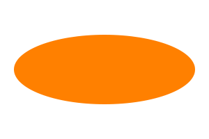](images/imagedata/psd-zoo/shape_ellipse_wide.png) |  |  |
| [nested_groups_blend.psd](https://github.com/signal-slot/psd-zoo/tree/main/nested_groups_blend.psd) | 40.5 KB | 0.00%  | ❌ FAILED |  |  |  |
| [stroke_gradient.psd](https://github.com/signal-slot/psd-zoo/tree/main/stroke_gradient.psd) | 40.8 KB | 100.00%  | ✅ PERFECT |  |  |  |
| [clipping_mask_chain.psd](https://github.com/signal-slot/psd-zoo/tree/main/clipping_mask_chain.psd) | 40.8 KB | 50.00%  | ❌ FAILED |  |  |  |
| [color_overlay.psd](https://github.com/signal-slot/psd-zoo/tree/main/color_overlay.psd) | 41.2 KB | 100.00%  | ✅ PERFECT |  |  |  |
| [stroke_outside.psd](https://github.com/signal-slot/psd-zoo/tree/main/stroke_outside.psd) | 41.2 KB | 99.88%  | ✅ PERFECT |  |  |  |
| [filter_twirl.psd](https://github.com/signal-slot/psd-zoo/tree/main/filter_twirl.psd) | 41.3 KB | 100.00%  | ✅ PERFECT |  |  |  |
| [deep_nesting_10.psd](https://github.com/signal-slot/psd-zoo/tree/main/deep_nesting_10.psd) | 41.3 KB | 100.00%  | ✅ PERFECT |  |  |  |
| [outer_glow.psd](https://github.com/signal-slot/psd-zoo/tree/main/outer_glow.psd) | 41.4 KB | 100.00%  | ✅ PERFECT |  |  |  |
| [shape_ellipse.psd](https://github.com/signal-slot/psd-zoo/tree/main/shape_ellipse.psd) | 41.6 KB | 99.96%  | ✅ PERFECT |  |  |  |
| [multiple_layer_masks.psd](https://github.com/signal-slot/psd-zoo/tree/main/multiple_layer_masks.psd) | 41.7 KB | 100.00%  | ✅ PERFECT |  |  | [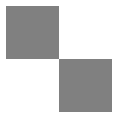](images/psdview/psd-zoo/multiple_layer_masks_diff.png) |
| [shape_circle.psd](https://github.com/signal-slot/psd-zoo/tree/main/shape_circle.psd) | 41.7 KB | 99.97%  | ✅ PERFECT |  |  |  |
| [shape_multiple_on_layer.psd](https://github.com/signal-slot/psd-zoo/tree/main/shape_multiple_on_layer.psd) | 42.2 KB | 100.00%  | ✅ PERFECT |  |  |  |
| [stroke_inside.psd](https://github.com/signal-slot/psd-zoo/tree/main/stroke_inside.psd) | 42.3 KB | 86.22%  | ⚠️ LOW | [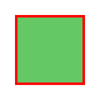](images/imagedata/psd-zoo/stroke_inside.png) |  |  |
| [shape_no_fill.psd](https://github.com/signal-slot/psd-zoo/tree/main/shape_no_fill.psd) | 42.5 KB | 20.00%  | ❌ FAILED |  |  |  |
| [stroke_effect.psd](https://github.com/signal-slot/psd-zoo/tree/main/stroke_effect.psd) | 42.8 KB | 99.95%  | ✅ PERFECT |  |  |  |
| [bitmap_1bit.psd](https://github.com/signal-slot/psd-zoo/tree/main/bitmap_1bit.psd) | 42.9 KB | 100.00%  | ✅ PERFECT |  |  |  |
| [filter_emboss.psd](https://github.com/signal-slot/psd-zoo/tree/main/filter_emboss.psd) | 43.2 KB | 100.00%  | ✅ PERFECT |  |  |  |
| [filter_spherize.psd](https://github.com/signal-slot/psd-zoo/tree/main/filter_spherize.psd) | 43.7 KB | 100.00%  | ✅ PERFECT |  |  |  |
| [guides_grid.psd](https://github.com/signal-slot/psd-zoo/tree/main/guides_grid.psd) | 44.0 KB | 100.00%  | ✅ PERFECT |  |  |  |
| [knockout_shallow.psd](https://github.com/signal-slot/psd-zoo/tree/main/knockout_shallow.psd) | 44.0 KB | 100.00%  | ✅ PERFECT |  |  |  |
| [knockout_deep.psd](https://github.com/signal-slot/psd-zoo/tree/main/knockout_deep.psd) | 44.0 KB | 100.00%  | ✅ PERFECT |  |  |  |
| [multiple_solid_colors.psd](https://github.com/signal-slot/psd-zoo/tree/main/multiple_solid_colors.psd) | 44.2 KB | 100.00%  | ✅ PERFECT |  |  |  |
| [inner_shadow.psd](https://github.com/signal-slot/psd-zoo/tree/main/inner_shadow.psd) | 44.4 KB | 90.21%  | ✅ GOOD |  |  |  |
| [bevel_emboss.psd](https://github.com/signal-slot/psd-zoo/tree/main/bevel_emboss.psd) | 44.9 KB | 94.09%  | ✅ GOOD |  |  |  |
| [effect_scaled.psd](https://github.com/signal-slot/psd-zoo/tree/main/effect_scaled.psd) | 45.0 KB | 90.49%  | ✅ GOOD |  |  | [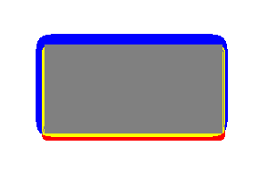](images/psdview/psd-zoo/effect_scaled_diff.png) |
| [drop_shadow.psd](https://github.com/signal-slot/psd-zoo/tree/main/drop_shadow.psd) | 45.1 KB | 90.49%  | ✅ GOOD |  |  |  |
| [effect_multiple_effects.psd](https://github.com/signal-slot/psd-zoo/tree/main/effect_multiple_effects.psd) | 45.2 KB | 18.79%  | ❌ FAILED | [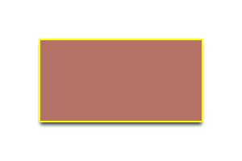](images/imagedata/psd-zoo/effect_multiple_effects.png) |  |  |
| [stroke_center.psd](https://github.com/signal-slot/psd-zoo/tree/main/stroke_center.psd) | 45.2 KB | 96.04%  | ✅ GOOD |  |  |  |
| [bevel_pillow.psd](https://github.com/signal-slot/psd-zoo/tree/main/bevel_pillow.psd) | 45.3 KB | 98.01%  | ✅ GOOD |  |  |  |
| [layer_order.psd](https://github.com/signal-slot/psd-zoo/tree/main/layer_order.psd) | 45.6 KB | 100.00%  | ✅ PERFECT |  |  |  |
| [bevel_emboss_style.psd](https://github.com/signal-slot/psd-zoo/tree/main/bevel_emboss_style.psd) | 45.6 KB | 97.02%  | ✅ GOOD |  |  |  |
| [filter_radial_blur.psd](https://github.com/signal-slot/psd-zoo/tree/main/filter_radial_blur.psd) | 45.7 KB | 100.00%  | ✅ PERFECT |  |  |  |
| [layer_comp_appearance.psd](https://github.com/signal-slot/psd-zoo/tree/main/layer_comp_appearance.psd) | 46.2 KB | 100.00%  | ✅ PERFECT |  |  |  |
| [layer_comp_visibility.psd](https://github.com/signal-slot/psd-zoo/tree/main/layer_comp_visibility.psd) | 46.2 KB | 100.00%  | ✅ PERFECT |  |  |  |
| [bevel_texture.psd](https://github.com/signal-slot/psd-zoo/tree/main/bevel_texture.psd) | 46.7 KB | 96.52%  | ✅ GOOD |  |  |  |
| [bevel_chisel_hard.psd](https://github.com/signal-slot/psd-zoo/tree/main/bevel_chisel_hard.psd) | 47.0 KB | 96.52%  | ✅ GOOD |  |  |  |
| [bevel_chisel_soft.psd](https://github.com/signal-slot/psd-zoo/tree/main/bevel_chisel_soft.psd) | 47.1 KB | 96.52%  | ✅ GOOD |  |  |  |
| [shape_ellipse_tall.psd](https://github.com/signal-slot/psd-zoo/tree/main/shape_ellipse_tall.psd) | 47.3 KB | 84.42%  | ⚠️ LOW |  |  |  |
| [vector_stroke.psd](https://github.com/signal-slot/psd-zoo/tree/main/vector_stroke.psd) | 47.6 KB | 89.42%  | ⚠️ LOW |  |  |  |
| [layers_50.psd](https://github.com/signal-slot/psd-zoo/tree/main/layers_50.psd) | 48.0 KB | 100.00%  | ✅ PERFECT |  |  |  |
| [blend_interior_effects.psd](https://github.com/signal-slot/psd-zoo/tree/main/blend_interior_effects.psd) | 48.5 KB | 99.06%  | ✅ PERFECT |  |  |  |
| [layer_rotated.psd](https://github.com/signal-slot/psd-zoo/tree/main/layer_rotated.psd) | 48.7 KB | 100.00%  | ✅ PERFECT |  |  |  |
| [layer_transformed.psd](https://github.com/signal-slot/psd-zoo/tree/main/layer_transformed.psd) | 50.4 KB | 100.00%  | ✅ PERFECT |  |  |  |
| [artboard.psd](https://github.com/signal-slot/psd-zoo/tree/main/artboard.psd) | 51.0 KB | 100.00%  | ✅ PERFECT |  |  |  |
| [text_nobreak.psd](https://github.com/signal-slot/psd-zoo/tree/main/text_nobreak.psd) | 51.9 KB | 100.00%  | ✅ PERFECT |  |  |  |
| [layer_opacity_gradient.psd](https://github.com/signal-slot/psd-zoo/tree/main/layer_opacity_gradient.psd) | 52.0 KB | 95.67%  | ✅ GOOD |  |  |  |
| [inner_glow.psd](https://github.com/signal-slot/psd-zoo/tree/main/inner_glow.psd) | 52.2 KB | 86.47%  | ⚠️ LOW |  |  |  |
| [drop_shadow_knockout.psd](https://github.com/signal-slot/psd-zoo/tree/main/drop_shadow_knockout.psd) | 52.9 KB | 94.43%  | ✅ GOOD |  |  |  |
| [text_small_font.psd](https://github.com/signal-slot/psd-zoo/tree/main/text_small_font.psd) | 54.1 KB | 46.36%  | ❌ FAILED |  |  |  |
| [single_text_layer.psd](https://github.com/signal-slot/psd-zoo/tree/main/single_text_layer.psd) | 55.6 KB | 24.65%  | ❌ FAILED |  |  |  |
| [many_groups.psd](https://github.com/signal-slot/psd-zoo/tree/main/many_groups.psd) | 56.0 KB | 100.00%  | ✅ PERFECT |  |  |  |
| [text_with_color.psd](https://github.com/signal-slot/psd-zoo/tree/main/text_with_color.psd) | 56.8 KB | 34.76%  | ❌ FAILED |  |  |  |
| [shape_stroke_gradient.psd](https://github.com/signal-slot/psd-zoo/tree/main/shape_stroke_gradient.psd) | 58.1 KB | 79.80%  | ⚠️ LOW |  |  |  |
| [text_anti_alias_none.psd](https://github.com/signal-slot/psd-zoo/tree/main/text_anti_alias_none.psd) | 58.4 KB | 17.17%  | ❌ FAILED |  |  |  |
| [text_warp_vdistort.psd](https://github.com/signal-slot/psd-zoo/tree/main/text_warp_vdistort.psd) | 59.1 KB | 17.62%  | ❌ FAILED |  |  |  |
| [text_bold.psd](https://github.com/signal-slot/psd-zoo/tree/main/text_bold.psd) | 60.0 KB | 31.25%  | ❌ FAILED |  |  |  |
| [text_anti_alias_crisp.psd](https://github.com/signal-slot/psd-zoo/tree/main/text_anti_alias_crisp.psd) | 60.1 KB | 26.39%  | ❌ FAILED |  |  |  |
| [text_align_left.psd](https://github.com/signal-slot/psd-zoo/tree/main/text_align_left.psd) | 60.2 KB | 22.51%  | ❌ FAILED |  |  |  |
| [text_warp_fish.psd](https://github.com/signal-slot/psd-zoo/tree/main/text_warp_fish.psd) | 60.3 KB | 22.66%  | ❌ FAILED |  |  |  |
| [text_italic.psd](https://github.com/signal-slot/psd-zoo/tree/main/text_italic.psd) | 60.3 KB | 24.38%  | ❌ FAILED |  |  |  |
| [text_warp_twist.psd](https://github.com/signal-slot/psd-zoo/tree/main/text_warp_twist.psd) | 60.7 KB | 25.77%  | ❌ FAILED |  |  |  |
| [text_warp_rise.psd](https://github.com/signal-slot/psd-zoo/tree/main/text_warp_rise.psd) | 61.1 KB | 14.29%  | ❌ FAILED |  |  |  |
| [text_anti_alias_sharp.psd](https://github.com/signal-slot/psd-zoo/tree/main/text_anti_alias_sharp.psd) | 61.1 KB | 21.00%  | ❌ FAILED |  |  | [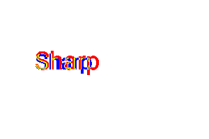](images/psdview/psd-zoo/text_anti_alias_sharp_diff.png) |
| [text_align_right.psd](https://github.com/signal-slot/psd-zoo/tree/main/text_align_right.psd) | 61.5 KB | 20.88%  | ❌ FAILED |  |  |  |
| [text_anti_alias_strong.psd](https://github.com/signal-slot/psd-zoo/tree/main/text_anti_alias_strong.psd) | 61.7 KB | 21.96%  | ❌ FAILED |  |  |  |
| [text_align_center.psd](https://github.com/signal-slot/psd-zoo/tree/main/text_align_center.psd) | 61.8 KB | 27.07%  | ❌ FAILED |  |  |  |
| [mask_feather.psd](https://github.com/signal-slot/psd-zoo/tree/main/mask_feather.psd) | 61.8 KB | 20.23%  | ❌ FAILED |  |  |  |
| [text_anti_alias_smooth.psd](https://github.com/signal-slot/psd-zoo/tree/main/text_anti_alias_smooth.psd) | 62.4 KB | 20.55%  | ❌ FAILED |  |  |  |
| [resolution_150dpi.psd](https://github.com/signal-slot/psd-zoo/tree/main/resolution_150dpi.psd) | 62.4 KB | 14.40%  | ❌ FAILED |  |  | [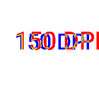](images/psdview/psd-zoo/resolution_150dpi_diff.png) |
| [text_baseline_shift.psd](https://github.com/signal-slot/psd-zoo/tree/main/text_baseline_shift.psd) | 62.5 KB | 18.62%  | ❌ FAILED |  |  |  |
| [text_warp_hdistort.psd](https://github.com/signal-slot/psd-zoo/tree/main/text_warp_hdistort.psd) | 62.8 KB | 19.84%  | ❌ FAILED |  |  |  |
| [text_faux_italic.psd](https://github.com/signal-slot/psd-zoo/tree/main/text_faux_italic.psd) | 63.1 KB | 25.59%  | ❌ FAILED |  |  |  |
| [text_faux_bold.psd](https://github.com/signal-slot/psd-zoo/tree/main/text_faux_bold.psd) | 63.2 KB | 23.47%  | ❌ FAILED |  |  |  |
| [text_all_caps.psd](https://github.com/signal-slot/psd-zoo/tree/main/text_all_caps.psd) | 63.2 KB | 20.67%  | ❌ FAILED |  |  |  |
| [text_vertical_scale.psd](https://github.com/signal-slot/psd-zoo/tree/main/text_vertical_scale.psd) | 63.5 KB | 20.71%  | ❌ FAILED |  |  | [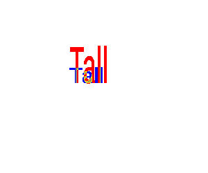](images/psdview/psd-zoo/text_vertical_scale_diff.png) |
| [text_vertical.psd](https://github.com/signal-slot/psd-zoo/tree/main/text_vertical.psd) | 63.7 KB | 19.95%  | ❌ FAILED |  |  |  |
| [text_tracking.psd](https://github.com/signal-slot/psd-zoo/tree/main/text_tracking.psd) | 63.8 KB | 19.73%  | ❌ FAILED |  |  |  |
| [text_warp_fisheye.psd](https://github.com/signal-slot/psd-zoo/tree/main/text_warp_fisheye.psd) | 63.9 KB | 25.18%  | ❌ FAILED |  |  |  |
| [text_large_font.psd](https://github.com/signal-slot/psd-zoo/tree/main/text_large_font.psd) | 64.7 KB | 23.56%  | ❌ FAILED |  |  |  |
| [text_underline.psd](https://github.com/signal-slot/psd-zoo/tree/main/text_underline.psd) | 64.8 KB | 18.79%  | ❌ FAILED |  |  |  |
| [text_warp_squeeze.psd](https://github.com/signal-slot/psd-zoo/tree/main/text_warp_squeeze.psd) | 64.8 KB | 26.27%  | ❌ FAILED |  |  | [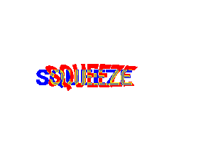](images/psdview/psd-zoo/text_warp_squeeze_diff.png) |
| [text_warp_inflate.psd](https://github.com/signal-slot/psd-zoo/tree/main/text_warp_inflate.psd) | 64.9 KB | 20.94%  | ❌ FAILED |  |  |  |
| [text_small_caps.psd](https://github.com/signal-slot/psd-zoo/tree/main/text_small_caps.psd) | 65.6 KB | 19.52%  | ❌ FAILED |  |  |  |
| [text_warp_bulge.psd](https://github.com/signal-slot/psd-zoo/tree/main/text_warp_bulge.psd) | 66.1 KB | 19.80%  | ❌ FAILED |  |  |  |
| [effect_satin.psd](https://github.com/signal-slot/psd-zoo/tree/main/effect_satin.psd) | 66.3 KB | 15.98%  | ❌ FAILED |  |  |  |
| [text_strikethrough.psd](https://github.com/signal-slot/psd-zoo/tree/main/text_strikethrough.psd) | 66.5 KB | 25.73%  | ❌ FAILED |  |  | [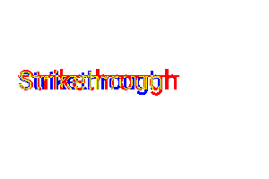](images/psdview/psd-zoo/text_strikethrough_diff.png) |
| [text_mixed_styles.psd](https://github.com/signal-slot/psd-zoo/tree/main/text_mixed_styles.psd) | 67.0 KB | 27.81%  | ❌ FAILED |  |  |  |
| [text_rotated.psd](https://github.com/signal-slot/psd-zoo/tree/main/text_rotated.psd) | 67.6 KB | 15.74%  | ❌ FAILED |  |  |  |
| [inner_glow_center.psd](https://github.com/signal-slot/psd-zoo/tree/main/inner_glow_center.psd) | 67.7 KB | 0.02%  | ❌ FAILED |  |  |  |
| [effects_combined_3.psd](https://github.com/signal-slot/psd-zoo/tree/main/effects_combined_3.psd) | 67.8 KB | 86.46%  | ⚠️ LOW |  |  |  |
| [text_horizontal_scale.psd](https://github.com/signal-slot/psd-zoo/tree/main/text_horizontal_scale.psd) | 67.9 KB | 18.53%  | ❌ FAILED |  |  |  |
| [high_resolution.psd](https://github.com/signal-slot/psd-zoo/tree/main/high_resolution.psd) | 68.5 KB | 17.03%  | ❌ FAILED |  | [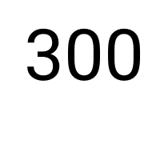](images/psdview/psd-zoo/high_resolution.png) | [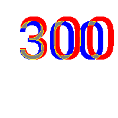](images/psdview/psd-zoo/high_resolution_diff.png) |
| [text_warp_negative.psd](https://github.com/signal-slot/psd-zoo/tree/main/text_warp_negative.psd) | 68.9 KB | 10.26%  | ❌ FAILED |  |  |  |
| [text_white_on_black.psd](https://github.com/signal-slot/psd-zoo/tree/main/text_white_on_black.psd) | 70.3 KB | 0.36%  | ❌ FAILED |  |  |  |
| [text_warp_flag.psd](https://github.com/signal-slot/psd-zoo/tree/main/text_warp_flag.psd) | 70.8 KB | 18.50%  | ❌ FAILED |  |  |  |
| [mixed_layers.psd](https://github.com/signal-slot/psd-zoo/tree/main/mixed_layers.psd) | 71.9 KB | 90.72%  | ✅ GOOD |  |  |  |
| [canvas_512.psd](https://github.com/signal-slot/psd-zoo/tree/main/canvas_512.psd) | 72.3 KB | 100.00%  | ✅ PERFECT |  |  |  |
| [filter_gaussian_blur.psd](https://github.com/signal-slot/psd-zoo/tree/main/filter_gaussian_blur.psd) | 72.5 KB | 100.00%  | ✅ PERFECT |  |  |  |
| [text_on_shape.psd](https://github.com/signal-slot/psd-zoo/tree/main/text_on_shape.psd) | 72.7 KB | 97.47%  | ✅ GOOD |  |  |  |
| [text_warp_wave.psd](https://github.com/signal-slot/psd-zoo/tree/main/text_warp_wave.psd) | 73.2 KB | 22.65%  | ❌ FAILED |  |  |  |
| [text_warp_arcupper.psd](https://github.com/signal-slot/psd-zoo/tree/main/text_warp_arcupper.psd) | 73.4 KB | 16.14%  | ❌ FAILED |  |  |  |
| [text_indent_lr.psd](https://github.com/signal-slot/psd-zoo/tree/main/text_indent_lr.psd) | 73.5 KB | 29.46%  | ❌ FAILED |  |  |  |
| [text_leading.psd](https://github.com/signal-slot/psd-zoo/tree/main/text_leading.psd) | 73.8 KB | 20.68%  | ❌ FAILED |  |  |  |
| [text_warp_arclower.psd](https://github.com/signal-slot/psd-zoo/tree/main/text_warp_arclower.psd) | 74.3 KB | 23.69%  | ❌ FAILED |  |  |  |
| [text_hyphenation.psd](https://github.com/signal-slot/psd-zoo/tree/main/text_hyphenation.psd) | 74.6 KB | 29.80%  | ❌ FAILED |  |  |  |
| [text_warp_shelllower.psd](https://github.com/signal-slot/psd-zoo/tree/main/text_warp_shelllower.psd) | 75.0 KB | 18.99%  | ❌ FAILED |  |  |  |
| [multiple_styled_layers.psd](https://github.com/signal-slot/psd-zoo/tree/main/multiple_styled_layers.psd) | 75.0 KB | 94.22%  | ✅ GOOD |  |  |  |
| [text_justify_all.psd](https://github.com/signal-slot/psd-zoo/tree/main/text_justify_all.psd) | 75.8 KB | 30.26%  | ❌ FAILED |  |  |  |
| [text_align_justify.psd](https://github.com/signal-slot/psd-zoo/tree/main/text_align_justify.psd) | 76.1 KB | 27.07%  | ❌ FAILED |  |  |  |
| [text_mixed_fonts.psd](https://github.com/signal-slot/psd-zoo/tree/main/text_mixed_fonts.psd) | 76.7 KB | 25.25%  | ❌ FAILED |  |  |  |
| [text_warp_arc.psd](https://github.com/signal-slot/psd-zoo/tree/main/text_warp_arc.psd) | 76.9 KB | 14.02%  | ❌ FAILED | [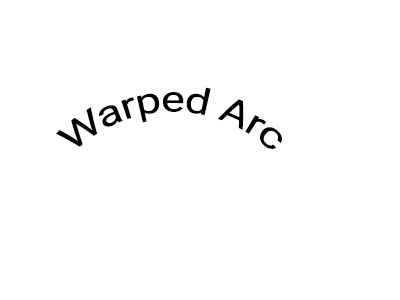](images/imagedata/psd-zoo/text_warp_arc.png) |  |  |
| [resolution_600dpi.psd](https://github.com/signal-slot/psd-zoo/tree/main/resolution_600dpi.psd) | 77.0 KB | 35.51%  | ❌ FAILED |  |  |  |
| [text_warp_shellupper.psd](https://github.com/signal-slot/psd-zoo/tree/main/text_warp_shellupper.psd) | 77.6 KB | 19.55%  | ❌ FAILED |  |  |  |
| [text_positioned.psd](https://github.com/signal-slot/psd-zoo/tree/main/text_positioned.psd) | 78.2 KB | 24.40%  | ❌ FAILED | [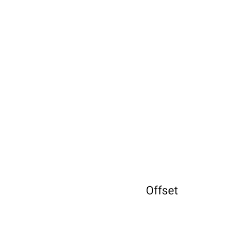](images/imagedata/psd-zoo/text_positioned.png) | [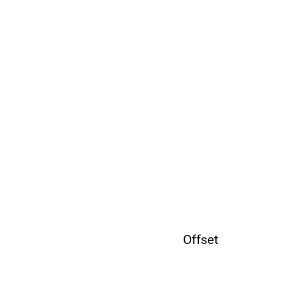](images/psdview/psd-zoo/text_positioned.png) |  |
| [text_multiline.psd](https://github.com/signal-slot/psd-zoo/tree/main/text_multiline.psd) | 78.4 KB | 20.85%  | ❌ FAILED |  |  |  |
| [text_with_effect.psd](https://github.com/signal-slot/psd-zoo/tree/main/text_with_effect.psd) | 81.8 KB | 35.41%  | ❌ FAILED |  |  |  |
| [text_drop_shadow.psd](https://github.com/signal-slot/psd-zoo/tree/main/text_drop_shadow.psd) | 82.4 KB | 97.21%  | ✅ GOOD |  |  |  |
| [vector_mask_feather.psd](https://github.com/signal-slot/psd-zoo/tree/main/vector_mask_feather.psd) | 83.1 KB | 67.88%  | ⚠️ LOW |  |  |  |
| [text_paragraph_spacing.psd](https://github.com/signal-slot/psd-zoo/tree/main/text_paragraph_spacing.psd) | 84.4 KB | 26.30%  | ❌ FAILED |  |  | [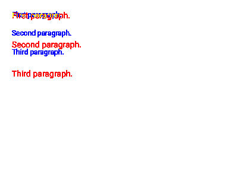](images/psdview/psd-zoo/text_paragraph_spacing_diff.png) |
| [mixed_text_shape_raster.psd](https://github.com/signal-slot/psd-zoo/tree/main/mixed_text_shape_raster.psd) | 85.1 KB | 94.94%  | ✅ GOOD |  |  |  |
| [text_emoji.psd](https://github.com/signal-slot/psd-zoo/tree/main/text_emoji.psd) | 86.5 KB | 14.29%  | ❌ FAILED |  |  | [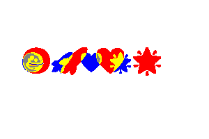](images/psdview/psd-zoo/text_emoji_diff.png) |
| [canvas_wide.psd](https://github.com/signal-slot/psd-zoo/tree/main/canvas_wide.psd) | 88.3 KB | 100.00%  | ✅ PERFECT |  |  |  |
| [text_paragraph_indent.psd](https://github.com/signal-slot/psd-zoo/tree/main/text_paragraph_indent.psd) | 93.6 KB | 27.60%  | ❌ FAILED |  |  |  |
| [multiple_text_layers.psd](https://github.com/signal-slot/psd-zoo/tree/main/multiple_text_layers.psd) | 94.6 KB | 24.23%  | ❌ FAILED |  |  |  |
| [text_paragraph_box.psd](https://github.com/signal-slot/psd-zoo/tree/main/text_paragraph_box.psd) | 95.8 KB | 27.30%  | ❌ FAILED |  |  |  |
| [dpi_300.psd](https://github.com/signal-slot/psd-zoo/tree/main/dpi_300.psd) | 98.7 KB | 17.45%  | ❌ FAILED |  |  |  |
| [grayscale_16bit.psd](https://github.com/signal-slot/psd-zoo/tree/main/grayscale_16bit.psd) | 99.5 KB | 100.00%  | ✅ PERFECT |  |  |  |
| [shape_gradient_fill.psd](https://github.com/signal-slot/psd-zoo/tree/main/shape_gradient_fill.psd) | 113.3 KB | 100.00%  | ✅ PERFECT |  |  |  |
| [blend_mode_dissolve.psd](https://github.com/signal-slot/psd-zoo/tree/main/blend_mode_dissolve.psd) | 117.2 KB | 0.00%  | ❌ FAILED |  |  |  |
| [fill_gradient_angle.psd](https://github.com/signal-slot/psd-zoo/tree/main/fill_gradient_angle.psd) | 117.8 KB | 100.00%  | ✅ PERFECT |  |  |  |
| [icc_adobe_rgb.psd](https://github.com/signal-slot/psd-zoo/tree/main/icc_adobe_rgb.psd) | 119.4 KB | 100.00%  | ✅ PERFECT |  |  |  |
| [complex_layout.psd](https://github.com/signal-slot/psd-zoo/tree/main/complex_layout.psd) | 127.5 KB | 96.06%  | ✅ GOOD |  |  |  |
| [canvas_tall.psd](https://github.com/signal-slot/psd-zoo/tree/main/canvas_tall.psd) | 139.2 KB | 100.00%  | ✅ PERFECT |  |  |  |
| [fill_gradient_radial.psd](https://github.com/signal-slot/psd-zoo/tree/main/fill_gradient_radial.psd) | 151.4 KB | 100.00%  | ✅ PERFECT |  | [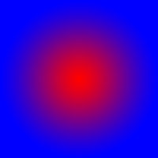](images/psdview/psd-zoo/fill_gradient_radial.png) |  |
| [fill_gradient_diamond.psd](https://github.com/signal-slot/psd-zoo/tree/main/fill_gradient_diamond.psd) | 154.2 KB | 100.00%  | ✅ PERFECT |  |  |  |
| [fill_gradient_dither.psd](https://github.com/signal-slot/psd-zoo/tree/main/fill_gradient_dither.psd) | 184.6 KB | 100.00%  | ✅ PERFECT |  |  |  |
| [many_layers.psd](https://github.com/signal-slot/psd-zoo/tree/main/many_layers.psd) | 189.2 KB | 22.37%  | ❌ FAILED |  |  |  |
| [layers_100.psd](https://github.com/signal-slot/psd-zoo/tree/main/layers_100.psd) | 191.6 KB | 100.00%  | ✅ PERFECT |  |  |  |
| [canvas_1024.psd](https://github.com/signal-slot/psd-zoo/tree/main/canvas_1024.psd) | 202.3 KB | 100.00%  | ✅ PERFECT |  |  |  |
| [text_long_content.psd](https://github.com/signal-slot/psd-zoo/tree/main/text_long_content.psd) | 256.2 KB | 29.36%  | ❌ FAILED |  |  |  |
| [depth_16bit.psd](https://github.com/signal-slot/psd-zoo/tree/main/depth_16bit.psd) | 258.1 KB | 100.00%  | ✅ PERFECT |  |  |  |
| [depth_16bit_layers.psd](https://github.com/signal-slot/psd-zoo/tree/main/depth_16bit_layers.psd) | 262.0 KB | 100.00%  | ✅ PERFECT |  |  |  |
| [canvas_landscape.psd](https://github.com/signal-slot/psd-zoo/tree/main/canvas_landscape.psd) | 262.0 KB | 20.54%  | ❌ FAILED |  |  |  |
| [fill_gradient_reflected.psd](https://github.com/signal-slot/psd-zoo/tree/main/fill_gradient_reflected.psd) | 262.9 KB | 100.00%  | ✅ PERFECT |  |  |  |
| [gradient_opacity_stops.psd](https://github.com/signal-slot/psd-zoo/tree/main/gradient_opacity_stops.psd) | 266.8 KB | 95.44%  | ✅ GOOD |  |  |  |
| [gradient_three_stops.psd](https://github.com/signal-slot/psd-zoo/tree/main/gradient_three_stops.psd) | 269.1 KB | 100.00%  | ✅ PERFECT |  |  |  |
| [canvas_portrait.psd](https://github.com/signal-slot/psd-zoo/tree/main/canvas_portrait.psd) | 279.9 KB | 21.93%  | ❌ FAILED |  |  |  |
| [filter_add_noise.psd](https://github.com/signal-slot/psd-zoo/tree/main/filter_add_noise.psd) | 279.9 KB | 100.00%  | ✅ PERFECT |  |  |  |
| [depth_32bit.psd](https://github.com/signal-slot/psd-zoo/tree/main/depth_32bit.psd) | 487.8 KB | 100.00%  | ✅ PERFECT |  |  |  |
| [depth_32bit_layers.psd](https://github.com/signal-slot/psd-zoo/tree/main/depth_32bit_layers.psd) | 487.9 KB | 100.00%  | ✅ PERFECT |  |  |  |
| [cmyk_with_color.psd](https://github.com/signal-slot/psd-zoo/tree/main/cmyk_with_color.psd) | 578.6 KB | 100.00%  | ✅ PERFECT |  |  |  |
| [cmyk_mode.psd](https://github.com/signal-slot/psd-zoo/tree/main/cmyk_mode.psd) | 578.6 KB | 100.00%  | ✅ PERFECT |  |  |  |
| [fill_pattern.psd](https://github.com/signal-slot/psd-zoo/tree/main/fill_pattern.psd) | 673.4 KB | 100.00%  | ✅ PERFECT |  |  |  |
| [cmyk_16bit.psd](https://github.com/signal-slot/psd-zoo/tree/main/cmyk_16bit.psd) | 875.1 KB | 100.00%  | ✅ PERFECT |  |  |  |
| [smart_object_linked.psd](https://github.com/signal-slot/psd-zoo/tree/main/smart_object_linked.psd) | 1.0 MB | 100.00%  | ✅ PERFECT |  |  |  |
| [smart_object_embedded.psd](https://github.com/signal-slot/psd-zoo/tree/main/smart_object_embedded.psd) | 1.0 MB | 100.00%  | ✅ PERFECT |  |  |  |
| [smart_filter_sharpen.psd](https://github.com/signal-slot/psd-zoo/tree/main/smart_filter_sharpen.psd) | 1.0 MB | 100.00%  | ✅ PERFECT |  |  |  |
| [smart_filter_blur.psd](https://github.com/signal-slot/psd-zoo/tree/main/smart_filter_blur.psd) | 1.0 MB | 100.00%  | ✅ PERFECT |  |  |  |
| [smart_filter_multiple.psd](https://github.com/signal-slot/psd-zoo/tree/main/smart_filter_multiple.psd) | 1.0 MB | 100.00%  | ✅ PERFECT |  |  |  |
| [smart_filter_stack.psd](https://github.com/signal-slot/psd-zoo/tree/main/smart_filter_stack.psd) | 1.1 MB | 100.00%  | ✅ PERFECT |  |  |  |
| [smart_filter_motion_blur.psd](https://github.com/signal-slot/psd-zoo/tree/main/smart_filter_motion_blur.psd) | 1.1 MB | 100.00%  | ✅ PERFECT |  |  |  |
| [smart_filter_gaussian_20.psd](https://github.com/signal-slot/psd-zoo/tree/main/smart_filter_gaussian_20.psd) | 1.1 MB | 100.00%  | ✅ PERFECT |  |  |  |
| [smart_filter_noise.psd](https://github.com/signal-slot/psd-zoo/tree/main/smart_filter_noise.psd) | 1.3 MB | 100.00%  | ✅ PERFECT |  |  |  |
| [canvas_large.psd](https://github.com/signal-slot/psd-zoo/tree/main/canvas_large.psd) | 1.6 MB | 19.16%  | ❌ FAILED |  |  |  |
| [canvas_4000x3000.psd](https://github.com/signal-slot/psd-zoo/tree/main/canvas_4000x3000.psd) | 1.9 MB | 100.00%  | ✅ PERFECT |  |  |  |
| [canvas_4000.psd](https://github.com/signal-slot/psd-zoo/tree/main/canvas_4000.psd) | 2.2 MB | 100.00%  | ✅ PERFECT |  |  |  |
