# QtPsd Similarity Test Results (psd-zoo)

Generated on: 2026-02-11T01:02:49

## Summary Statistics

| Metric | Image Data vs QPsdView |
|--------|------------------------|
| Total Tests | 337 |
| Passed Tests (>50%) | 241 (71.5%) |
| Average Similarity | 75.99% |
| Minimum Similarity | 0.00% |
| Maximum Similarity | 100.00% |

## Section 1: Image Data vs QPsdView

| File | Size | Similarity | Status | Image Data | QPsdView | Difference |
|------|------|------------|--------|------------|----------|------------|
| [color_mode/bitmap_mode.psd](https://github.com/signal-slot/psd-zoo/tree/main/color_mode/bitmap_mode.psd) | 19.0 KB | 100.00%  | ✅ PERFECT |  |  |  |
| [canvas/1x1.psd](https://github.com/signal-slot/psd-zoo/tree/main/canvas/1x1.psd) | 21.1 KB | 100.00%  | ✅ PERFECT |  |  |  |
| [canvas/1x1_rgb.psd](https://github.com/signal-slot/psd-zoo/tree/main/canvas/1x1_rgb.psd) | 21.9 KB | 100.00%  | ✅ PERFECT |  |  |  |
| [color_mode/multichannel_mode.psd](https://github.com/signal-slot/psd-zoo/tree/main/color_mode/multichannel_mode.psd) | 22.1 KB | 100.00%  | ✅ PERFECT |  |  |  |
| [document/blank_document.psd](https://github.com/signal-slot/psd-zoo/tree/main/document/blank_document.psd) | 22.5 KB | 100.00%  | ✅ PERFECT |  |  |  |
| [color_mode/indexed_color.psd](https://github.com/signal-slot/psd-zoo/tree/main/color_mode/indexed_color.psd) | 23.5 KB | 100.00%  | ✅ PERFECT |  |  |  |
| [color_mode/grayscale_mode.psd](https://github.com/signal-slot/psd-zoo/tree/main/color_mode/grayscale_mode.psd) | 24.7 KB | 100.00%  | ✅ PERFECT |  |  |  |
| [document/flattened.psd](https://github.com/signal-slot/psd-zoo/tree/main/document/flattened.psd) | 25.1 KB | 100.00%  | ✅ PERFECT |  |  |  |
| [document/flattened_bg.psd](https://github.com/signal-slot/psd-zoo/tree/main/document/flattened_bg.psd) | 25.1 KB | 100.00%  | ✅ PERFECT |  |  |  |
| [document/guides.psd](https://github.com/signal-slot/psd-zoo/tree/main/document/guides.psd) | 25.4 KB | 100.00%  | ✅ PERFECT |  |  |  |
| [color_mode/grayscale_alpha.psd](https://github.com/signal-slot/psd-zoo/tree/main/color_mode/grayscale_alpha.psd) | 26.0 KB | 100.00%  | ✅ PERFECT |  |  |  |
| [canvas/purple_bg.psd](https://github.com/signal-slot/psd-zoo/tree/main/canvas/purple_bg.psd) | 29.4 KB | 100.00%  | ✅ PERFECT |  |  |  |
| [layer/empty_layer.psd](https://github.com/signal-slot/psd-zoo/tree/main/layer/empty_layer.psd) | 29.4 KB | 100.00%  | ✅ PERFECT |  |  |  |
| [layer/empty.psd](https://github.com/signal-slot/psd-zoo/tree/main/layer/empty.psd) | 29.4 KB | 100.00%  | ✅ PERFECT |  |  |  |
| [group/empty_group.psd](https://github.com/signal-slot/psd-zoo/tree/main/group/empty_group.psd) | 29.7 KB | 100.00%  | ✅ PERFECT |  |  |  |
| [canvas/no_background.psd](https://github.com/signal-slot/psd-zoo/tree/main/canvas/no_background.psd) | 30.2 KB | 100.00%  | ✅ PERFECT |  |  |  |
| [canvas/transparent_background.psd](https://github.com/signal-slot/psd-zoo/tree/main/canvas/transparent_background.psd) | 30.4 KB | 100.00%  | ✅ PERFECT |  |  |  |
| [canvas/transparent.psd](https://github.com/signal-slot/psd-zoo/tree/main/canvas/transparent.psd) | 30.6 KB | 100.00%  | ✅ PERFECT |  |  |  |
| [document/icc_none.psd](https://github.com/signal-slot/psd-zoo/tree/main/document/icc_none.psd) | 30.9 KB | 100.00%  | ✅ PERFECT |  |  |  |
| [color_mode/lab_mode.psd](https://github.com/signal-slot/psd-zoo/tree/main/color_mode/lab_mode.psd) | 30.9 KB | 100.00%  | ✅ PERFECT |  |  |  |
| [color_mode/lab_with_layers.psd](https://github.com/signal-slot/psd-zoo/tree/main/color_mode/lab_with_layers.psd) | 30.9 KB | 100.00%  | ✅ PERFECT |  |  |  |
| [shape/rect_small.psd](https://github.com/signal-slot/psd-zoo/tree/main/shape/rect_small.psd) | 31.8 KB | 100.00%  | ✅ PERFECT |  |  |  |
| [layer_comp/position.psd](https://github.com/signal-slot/psd-zoo/tree/main/layer_comp/position.psd) | 31.9 KB | 100.00%  | ✅ PERFECT |  |  | [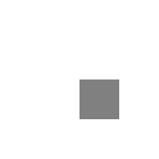](images/psdview/psd-zoo/layer_comp/position_diff.png) |
| [document/icc_prophoto_rgb.psd](https://github.com/signal-slot/psd-zoo/tree/main/document/icc_prophoto_rgb.psd) | 31.9 KB | 100.00%  | ✅ PERFECT |  |  |  |
| [layer/background_layer.psd](https://github.com/signal-slot/psd-zoo/tree/main/layer/background_layer.psd) | 32.2 KB | 100.00%  | ✅ PERFECT |  |  |  |
| [layer/flipped_vertical.psd](https://github.com/signal-slot/psd-zoo/tree/main/layer/flipped_vertical.psd) | 32.4 KB | 100.00%  | ✅ PERFECT |  |  |  |
| [layer/locked_transparent.psd](https://github.com/signal-slot/psd-zoo/tree/main/layer/locked_transparent.psd) | 32.7 KB | 100.00%  | ✅ PERFECT |  |  |  |
| [layer/raster_transparency.psd](https://github.com/signal-slot/psd-zoo/tree/main/layer/raster_transparency.psd) | 33.8 KB | 100.00%  | ✅ PERFECT |  |  |  |
| [layer/flipped_horizontal.psd](https://github.com/signal-slot/psd-zoo/tree/main/layer/flipped_horizontal.psd) | 33.9 KB | 100.00%  | ✅ PERFECT |  |  |  |
| [layer/color_red.psd](https://github.com/signal-slot/psd-zoo/tree/main/layer/color_red.psd) | 34.1 KB | 100.00%  | ✅ PERFECT |  |  |  |
| [document/icc_srgb.psd](https://github.com/signal-slot/psd-zoo/tree/main/document/icc_srgb.psd) | 34.1 KB | 100.00%  | ✅ PERFECT |  |  |  |
| [layer/color_blue.psd](https://github.com/signal-slot/psd-zoo/tree/main/layer/color_blue.psd) | 34.1 KB | 100.00%  | ✅ PERFECT |  |  |  |
| [layer/color_gray.psd](https://github.com/signal-slot/psd-zoo/tree/main/layer/color_gray.psd) | 34.1 KB | 100.00%  | ✅ PERFECT |  |  |  |
| [layer/color_green.psd](https://github.com/signal-slot/psd-zoo/tree/main/layer/color_green.psd) | 34.1 KB | 100.00%  | ✅ PERFECT |  |  |  |
| [layer/color_orange.psd](https://github.com/signal-slot/psd-zoo/tree/main/layer/color_orange.psd) | 34.1 KB | 100.00%  | ✅ PERFECT |  |  |  |
| [layer/color_violet.psd](https://github.com/signal-slot/psd-zoo/tree/main/layer/color_violet.psd) | 34.1 KB | 100.00%  | ✅ PERFECT |  |  |  |
| [layer/color_yellow.psd](https://github.com/signal-slot/psd-zoo/tree/main/layer/color_yellow.psd) | 34.1 KB | 100.00%  | ✅ PERFECT |  |  |  |
| [filter/median.psd](https://github.com/signal-slot/psd-zoo/tree/main/filter/median.psd) | 34.1 KB | 100.00%  | ✅ PERFECT |  |  |  |
| [layer/opacity_1.psd](https://github.com/signal-slot/psd-zoo/tree/main/layer/opacity_1.psd) | 34.1 KB | 100.00%  | ✅ PERFECT |  |  |  |
| [blend_mode/hue.psd](https://github.com/signal-slot/psd-zoo/tree/main/blend_mode/hue.psd) | 34.1 KB | 0.00%  | ❌ FAILED |  |  |  |
| [filter/unsharp_mask.psd](https://github.com/signal-slot/psd-zoo/tree/main/filter/unsharp_mask.psd) | 34.1 KB | 100.00%  | ✅ PERFECT |  |  |  |
| [misc/normal_content.psd](https://github.com/signal-slot/psd-zoo/tree/main/misc/normal_content.psd) | 34.1 KB | 100.00%  | ✅ PERFECT |  |  |  |
| [layer/hidden.psd](https://github.com/signal-slot/psd-zoo/tree/main/layer/hidden.psd) | 34.1 KB | 100.00%  | ✅ PERFECT |  |  |  |
| [layer/locked_all.psd](https://github.com/signal-slot/psd-zoo/tree/main/layer/locked_all.psd) | 34.1 KB | 100.00%  | ✅ PERFECT |  |  |  |
| [blend_mode/color.psd](https://github.com/signal-slot/psd-zoo/tree/main/blend_mode/color.psd) | 34.1 KB | 0.00%  | ❌ FAILED |  |  |  |
| [document/pixel_aspect_nonsquare.psd](https://github.com/signal-slot/psd-zoo/tree/main/document/pixel_aspect_nonsquare.psd) | 34.1 KB | 100.00%  | ✅ PERFECT |  |  |  |
| [layer/opacity.psd](https://github.com/signal-slot/psd-zoo/tree/main/layer/opacity.psd) | 34.1 KB | 92.47%  | ✅ GOOD |  |  |  |
| [blend_mode/divide.psd](https://github.com/signal-slot/psd-zoo/tree/main/blend_mode/divide.psd) | 34.1 KB | 91.37%  | ✅ GOOD |  |  |  |
| [blend_mode/screen.psd](https://github.com/signal-slot/psd-zoo/tree/main/blend_mode/screen.psd) | 34.1 KB | 100.00%  | ✅ PERFECT |  |  |  |
| [layer/locked_layer.psd](https://github.com/signal-slot/psd-zoo/tree/main/layer/locked_layer.psd) | 34.1 KB | 100.00%  | ✅ PERFECT |  |  |  |
| [document/foreground_background_color.psd](https://github.com/signal-slot/psd-zoo/tree/main/document/foreground_background_color.psd) | 34.1 KB | 100.00%  | ✅ PERFECT |  |  |  |
| [fill/opacity.psd](https://github.com/signal-slot/psd-zoo/tree/main/fill/opacity.psd) | 34.1 KB | 99.88%  | ✅ PERFECT |  |  |  |
| [blend_mode/hardmix.psd](https://github.com/signal-slot/psd-zoo/tree/main/blend_mode/hardmix.psd) | 34.1 KB | 0.00%  | ❌ FAILED |  |  |  |
| [blend_mode/lighten.psd](https://github.com/signal-slot/psd-zoo/tree/main/blend_mode/lighten.psd) | 34.1 KB | 100.00%  | ✅ PERFECT |  |  |  |
| [blend_mode/overlay.psd](https://github.com/signal-slot/psd-zoo/tree/main/blend_mode/overlay.psd) | 34.1 KB | 100.00%  | ✅ PERFECT |  |  |  |
| [fill/vs_opacity.psd](https://github.com/signal-slot/psd-zoo/tree/main/fill/vs_opacity.psd) | 34.1 KB | 98.35%  | ✅ GOOD |  |  |  |
| [layer/name_empty.psd](https://github.com/signal-slot/psd-zoo/tree/main/layer/name_empty.psd) | 34.1 KB | 100.00%  | ✅ PERFECT |  |  |  |
| [blend_mode/darken.psd](https://github.com/signal-slot/psd-zoo/tree/main/blend_mode/darken.psd) | 34.1 KB | 100.00%  | ✅ PERFECT |  |  |  |
| [blend_mode/luminosity.psd](https://github.com/signal-slot/psd-zoo/tree/main/blend_mode/luminosity.psd) | 34.1 KB | 0.00%  | ❌ FAILED |  |  |  |
| [fill/opacity_1.psd](https://github.com/signal-slot/psd-zoo/tree/main/fill/opacity_1.psd) | 34.1 KB | 100.00%  | ✅ PERFECT |  |  |  |
| [layer/opacity_99.psd](https://github.com/signal-slot/psd-zoo/tree/main/layer/opacity_99.psd) | 34.1 KB | 99.53%  | ✅ PERFECT |  |  |  |
| [document/resolution_96dpi.psd](https://github.com/signal-slot/psd-zoo/tree/main/document/resolution_96dpi.psd) | 34.1 KB | 100.00%  | ✅ PERFECT |  |  |  |
| [fill/solid_color_fill.psd](https://github.com/signal-slot/psd-zoo/tree/main/fill/solid_color_fill.psd) | 34.1 KB | 100.00%  | ✅ PERFECT |  |  |  |
| [blend_mode/colorburn.psd](https://github.com/signal-slot/psd-zoo/tree/main/blend_mode/colorburn.psd) | 34.1 KB | 100.00%  | ✅ PERFECT |  |  |  |
| [blend_mode/softlight.psd](https://github.com/signal-slot/psd-zoo/tree/main/blend_mode/softlight.psd) | 34.1 KB | 100.00%  | ✅ PERFECT |  |  |  |
| [blend_mode/subtract.psd](https://github.com/signal-slot/psd-zoo/tree/main/blend_mode/subtract.psd) | 34.1 KB | 0.00%  | ❌ FAILED |  |  |  |
| [layer/locked_pixels.psd](https://github.com/signal-slot/psd-zoo/tree/main/layer/locked_pixels.psd) | 34.1 KB | 100.00%  | ✅ PERFECT |  |  |  |
| [blend_mode/saturation.psd](https://github.com/signal-slot/psd-zoo/tree/main/blend_mode/saturation.psd) | 34.1 KB | 0.00%  | ❌ FAILED |  |  |  |
| [blend_mode/pinlight.psd](https://github.com/signal-slot/psd-zoo/tree/main/blend_mode/pinlight.psd) | 34.1 KB | 0.00%  | ❌ FAILED |  |  |  |
| [layer/name_unicode.psd](https://github.com/signal-slot/psd-zoo/tree/main/layer/name_unicode.psd) | 34.1 KB | 100.00%  | ✅ PERFECT |  |  |  |
| [blend_mode/colordodge.psd](https://github.com/signal-slot/psd-zoo/tree/main/blend_mode/colordodge.psd) | 34.1 KB | 100.00%  | ✅ PERFECT |  |  |  |
| [blend_mode/exclusion.psd](https://github.com/signal-slot/psd-zoo/tree/main/blend_mode/exclusion.psd) | 34.1 KB | 100.00%  | ✅ PERFECT |  |  |  |
| [blend_mode/linearburn.psd](https://github.com/signal-slot/psd-zoo/tree/main/blend_mode/linearburn.psd) | 34.1 KB | 100.00%  | ✅ PERFECT |  |  |  |
| [blend_mode/vividlight.psd](https://github.com/signal-slot/psd-zoo/tree/main/blend_mode/vividlight.psd) | 34.1 KB | 0.00%  | ❌ FAILED |  |  |  |
| [layer/name_special.psd](https://github.com/signal-slot/psd-zoo/tree/main/layer/name_special.psd) | 34.1 KB | 100.00%  | ✅ PERFECT |  |  |  |
| [blend_mode/lineardodge.psd](https://github.com/signal-slot/psd-zoo/tree/main/blend_mode/lineardodge.psd) | 34.1 KB | 0.00%  | ❌ FAILED |  |  |  |
| [layer/locked_position.psd](https://github.com/signal-slot/psd-zoo/tree/main/layer/locked_position.psd) | 34.1 KB | 100.00%  | ✅ PERFECT |  |  |  |
| [blend_mode/hardlight.psd](https://github.com/signal-slot/psd-zoo/tree/main/blend_mode/hardlight.psd) | 34.1 KB | 100.00%  | ✅ PERFECT |  |  |  |
| [blend_mode/difference.psd](https://github.com/signal-slot/psd-zoo/tree/main/blend_mode/difference.psd) | 34.1 KB | 100.00%  | ✅ PERFECT |  |  |  |
| [blend_mode/linearlight.psd](https://github.com/signal-slot/psd-zoo/tree/main/blend_mode/linearlight.psd) | 34.1 KB | 0.00%  | ❌ FAILED |  |  |  |
| [blend_mode/multiply.psd](https://github.com/signal-slot/psd-zoo/tree/main/blend_mode/multiply.psd) | 34.1 KB | 100.00%  | ✅ PERFECT |  |  |  |
| [mask/mask_inverted.psd](https://github.com/signal-slot/psd-zoo/tree/main/mask/mask_inverted.psd) | 34.1 KB | 0.00%  | ❌ FAILED |  |  |  |
| [document/guides_multiple.psd](https://github.com/signal-slot/psd-zoo/tree/main/document/guides_multiple.psd) | 34.2 KB | 100.00%  | ✅ PERFECT |  |  |  |
| [adjustment/invert.psd](https://github.com/signal-slot/psd-zoo/tree/main/adjustment/invert.psd) | 34.5 KB | 100.00%  | ✅ PERFECT |  |  |  |
| [adjustment/threshold.psd](https://github.com/signal-slot/psd-zoo/tree/main/adjustment/threshold.psd) | 34.5 KB | 100.00%  | ✅ PERFECT |  |  |  |
| [layer/long_name.psd](https://github.com/signal-slot/psd-zoo/tree/main/layer/long_name.psd) | 34.5 KB | 100.00%  | ✅ PERFECT |  |  |  |
| [mask/vector_mask_triangle.psd](https://github.com/signal-slot/psd-zoo/tree/main/mask/vector_mask_triangle.psd) | 34.5 KB | 100.00%  | ✅ PERFECT |  |  |  |
| [adjustment/exposure.psd](https://github.com/signal-slot/psd-zoo/tree/main/adjustment/exposure.psd) | 34.5 KB | 100.00%  | ✅ PERFECT |  |  |  |
| [adjustment/curves.psd](https://github.com/signal-slot/psd-zoo/tree/main/adjustment/curves.psd) | 34.5 KB | 100.00%  | ✅ PERFECT |  |  |  |
| [adjustment/posterize.psd](https://github.com/signal-slot/psd-zoo/tree/main/adjustment/posterize.psd) | 34.5 KB | 100.00%  | ✅ PERFECT |  |  |  |
| [document/guides_hv.psd](https://github.com/signal-slot/psd-zoo/tree/main/document/guides_hv.psd) | 34.5 KB | 100.00%  | ✅ PERFECT |  |  |  |
| [adjustment/color_balance.psd](https://github.com/signal-slot/psd-zoo/tree/main/adjustment/color_balance.psd) | 34.5 KB | 100.00%  | ✅ PERFECT |  |  |  |
| [adjustment/photo_filter.psd](https://github.com/signal-slot/psd-zoo/tree/main/adjustment/photo_filter.psd) | 34.5 KB | 100.00%  | ✅ PERFECT |  |  |  |
| [adjustment/disabled.psd](https://github.com/signal-slot/psd-zoo/tree/main/adjustment/disabled.psd) | 34.6 KB | 100.00%  | ✅ PERFECT |  |  |  |
| [mask/mask_disabled.psd](https://github.com/signal-slot/psd-zoo/tree/main/mask/mask_disabled.psd) | 34.6 KB | 100.00%  | ✅ PERFECT |  |  |  |
| [adjustment/brightness_legacy.psd](https://github.com/signal-slot/psd-zoo/tree/main/adjustment/brightness_legacy.psd) | 34.6 KB | 100.00%  | ✅ PERFECT |  |  |  |
| [adjustment/vibrance.psd](https://github.com/signal-slot/psd-zoo/tree/main/adjustment/vibrance.psd) | 34.6 KB | 100.00%  | ✅ PERFECT |  |  |  |
| [shape/saved_path.psd](https://github.com/signal-slot/psd-zoo/tree/main/shape/saved_path.psd) | 34.6 KB | 100.00%  | ✅ PERFECT |  |  |  |
| [adjustment/selective_color.psd](https://github.com/signal-slot/psd-zoo/tree/main/adjustment/selective_color.psd) | 34.6 KB | 100.00%  | ✅ PERFECT |  |  |  |
| [adjustment/curves_perchannel.psd](https://github.com/signal-slot/psd-zoo/tree/main/adjustment/curves_perchannel.psd) | 34.6 KB | 100.00%  | ✅ PERFECT |  |  |  |
| [adjustment/selective_perchannel.psd](https://github.com/signal-slot/psd-zoo/tree/main/adjustment/selective_perchannel.psd) | 34.6 KB | 100.00%  | ✅ PERFECT |  |  |  |
| [shape/path_bezier.psd](https://github.com/signal-slot/psd-zoo/tree/main/shape/path_bezier.psd) | 34.6 KB | 100.00%  | ✅ PERFECT |  |  |  |
| [adjustment/gradient_map_custom.psd](https://github.com/signal-slot/psd-zoo/tree/main/adjustment/gradient_map_custom.psd) | 34.7 KB | 100.00%  | ✅ PERFECT |  |  |  |
| [adjustment/hue_saturation.psd](https://github.com/signal-slot/psd-zoo/tree/main/adjustment/hue_saturation.psd) | 34.7 KB | 100.00%  | ✅ PERFECT |  |  |  |
| [adjustment/brightness.psd](https://github.com/signal-slot/psd-zoo/tree/main/adjustment/brightness.psd) | 34.7 KB | 100.00%  | ✅ PERFECT |  |  |  |
| [adjustment/gradient_map.psd](https://github.com/signal-slot/psd-zoo/tree/main/adjustment/gradient_map.psd) | 34.7 KB | 100.00%  | ✅ PERFECT |  |  |  |
| [layer/outside_canvas.psd](https://github.com/signal-slot/psd-zoo/tree/main/layer/outside_canvas.psd) | 34.8 KB | 100.00%  | ✅ PERFECT |  |  |  |
| [group/group_closed.psd](https://github.com/signal-slot/psd-zoo/tree/main/group/group_closed.psd) | 34.8 KB | 100.00%  | ✅ PERFECT |  |  |  |
| [adjustment/black_white.psd](https://github.com/signal-slot/psd-zoo/tree/main/adjustment/black_white.psd) | 34.8 KB | 100.00%  | ✅ PERFECT |  |  |  |
| [group/opacity.psd](https://github.com/signal-slot/psd-zoo/tree/main/group/opacity.psd) | 34.8 KB | 0.00%  | ❌ FAILED |  |  |  |
| [mask/disabled.psd](https://github.com/signal-slot/psd-zoo/tree/main/mask/disabled.psd) | 34.9 KB | 100.00%  | ✅ PERFECT |  |  |  |
| [layer/negative_bounds.psd](https://github.com/signal-slot/psd-zoo/tree/main/layer/negative_bounds.psd) | 35.0 KB | 100.00%  | ✅ PERFECT |  |  |  |
| [shape/multiple_paths.psd](https://github.com/signal-slot/psd-zoo/tree/main/shape/multiple_paths.psd) | 35.0 KB | 100.00%  | ✅ PERFECT |  |  |  |
| [adjustment/levels.psd](https://github.com/signal-slot/psd-zoo/tree/main/adjustment/levels.psd) | 35.1 KB | 100.00%  | ✅ PERFECT |  |  |  |
| [layer/background_locked.psd](https://github.com/signal-slot/psd-zoo/tree/main/layer/background_locked.psd) | 35.1 KB | 91.57%  | ✅ GOOD |  |  |  |
| [adjustment/levels_perchannel.psd](https://github.com/signal-slot/psd-zoo/tree/main/adjustment/levels_perchannel.psd) | 35.2 KB | 100.00%  | ✅ PERFECT |  |  |  |
| [group/with_vector_mask.psd](https://github.com/signal-slot/psd-zoo/tree/main/group/with_vector_mask.psd) | 35.2 KB | 100.00%  | ✅ PERFECT |  |  |  |
| [channel/spot_color.psd](https://github.com/signal-slot/psd-zoo/tree/main/channel/spot_color.psd) | 35.4 KB | 0.00%  | ❌ FAILED |  |  |  |
| [mask/vector_mask_disabled.psd](https://github.com/signal-slot/psd-zoo/tree/main/mask/vector_mask_disabled.psd) | 35.4 KB | 49.00%  | ❌ FAILED |  |  |  |
| [mask/clipping_mask.psd](https://github.com/signal-slot/psd-zoo/tree/main/mask/clipping_mask.psd) | 35.4 KB | 100.00%  | ✅ PERFECT |  |  |  |
| [fill/gradient_linear.psd](https://github.com/signal-slot/psd-zoo/tree/main/fill/gradient_linear.psd) | 35.5 KB | 100.00%  | ✅ PERFECT |  |  |  |
| [layer/name_special_chars.psd](https://github.com/signal-slot/psd-zoo/tree/main/layer/name_special_chars.psd) | 35.7 KB | 100.00%  | ✅ PERFECT |  |  |  |
| [channel/alpha.psd](https://github.com/signal-slot/psd-zoo/tree/main/channel/alpha.psd) | 35.7 KB | 25.00%  | ❌ FAILED |  |  |  |
| [channel/selection.psd](https://github.com/signal-slot/psd-zoo/tree/main/channel/selection.psd) | 35.8 KB | 25.00%  | ❌ FAILED |  |  | [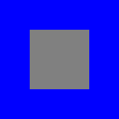](images/psdview/psd-zoo/channel/selection_diff.png) |
| [mask/mask.psd](https://github.com/signal-slot/psd-zoo/tree/main/mask/mask.psd) | 35.8 KB | 100.00%  | ✅ PERFECT |  |  |  |
| [shape/rect_full.psd](https://github.com/signal-slot/psd-zoo/tree/main/shape/rect_full.psd) | 36.2 KB | 100.00%  | ✅ PERFECT |  |  |  |
| [group/nested_groups.psd](https://github.com/signal-slot/psd-zoo/tree/main/group/nested_groups.psd) | 36.2 KB | 100.00%  | ✅ PERFECT |  |  |  |
| [mask/vector_mask_combined.psd](https://github.com/signal-slot/psd-zoo/tree/main/mask/vector_mask_combined.psd) | 36.4 KB | 100.00%  | ✅ PERFECT |  |  |  |
| [mask/vector_mask_rectangle.psd](https://github.com/signal-slot/psd-zoo/tree/main/mask/vector_mask_rectangle.psd) | 36.5 KB | 100.00%  | ✅ PERFECT |  |  |  |
| [adjustment/with_mask.psd](https://github.com/signal-slot/psd-zoo/tree/main/adjustment/with_mask.psd) | 36.7 KB | 100.00%  | ✅ PERFECT |  |  |  |
| [mask/density.psd](https://github.com/signal-slot/psd-zoo/tree/main/mask/density.psd) | 36.8 KB | 49.00%  | ❌ FAILED |  |  |  |
| [layer/linked_layers.psd](https://github.com/signal-slot/psd-zoo/tree/main/layer/linked_layers.psd) | 36.8 KB | 100.00%  | ✅ PERFECT |  |  |  |
| [mask/multiple_masks.psd](https://github.com/signal-slot/psd-zoo/tree/main/mask/multiple_masks.psd) | 36.8 KB | 100.00%  | ✅ PERFECT |  |  | [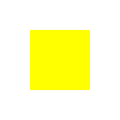](images/psdview/psd-zoo/mask/multiple_masks_diff.png) |
| [filter/motion_blur.psd](https://github.com/signal-slot/psd-zoo/tree/main/filter/motion_blur.psd) | 37.0 KB | 100.00%  | ✅ PERFECT |  |  |  |
| [layer/order_rgb.psd](https://github.com/signal-slot/psd-zoo/tree/main/layer/order_rgb.psd) | 37.0 KB | 100.00%  | ✅ PERFECT |  |  |  |
| [group/nesting_5_levels.psd](https://github.com/signal-slot/psd-zoo/tree/main/group/nesting_5_levels.psd) | 37.6 KB | 100.00%  | ✅ PERFECT |  |  |  |
| [channel/multiple_alpha.psd](https://github.com/signal-slot/psd-zoo/tree/main/channel/multiple_alpha.psd) | 37.8 KB | 0.00%  | ❌ FAILED |  |  |  |
| [shape/square.psd](https://github.com/signal-slot/psd-zoo/tree/main/shape/square.psd) | 38.0 KB | 100.00%  | ✅ PERFECT |  |  | [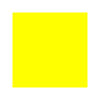](images/psdview/psd-zoo/shape/square_diff.png) |
| [text/rasterized.psd](https://github.com/signal-slot/psd-zoo/tree/main/text/rasterized.psd) | 38.2 KB | 100.00%  | ✅ PERFECT |  |  |  |
| [adjustment/clipped.psd](https://github.com/signal-slot/psd-zoo/tree/main/adjustment/clipped.psd) | 38.2 KB | 100.00%  | ✅ PERFECT |  |  |  |
| [mask/vector_mask_density.psd](https://github.com/signal-slot/psd-zoo/tree/main/mask/vector_mask_density.psd) | 38.4 KB | 64.00%  | ⚠️ LOW |  |  |  |
| [layer/color_tag.psd](https://github.com/signal-slot/psd-zoo/tree/main/layer/color_tag.psd) | 39.1 KB | 100.00%  | ✅ PERFECT |  |  |  |
| [blend_mode/darkercolor.psd](https://github.com/signal-slot/psd-zoo/tree/main/blend_mode/darkercolor.psd) | 39.1 KB | 100.00%  | ✅ PERFECT |  |  |  |
| [blend_mode/lightercolor.psd](https://github.com/signal-slot/psd-zoo/tree/main/blend_mode/lightercolor.psd) | 39.1 KB | 0.00%  | ❌ FAILED |  |  |  |
| [blend_mode/opacity_fill_blend_combined.psd](https://github.com/signal-slot/psd-zoo/tree/main/blend_mode/opacity_fill_blend_combined.psd) | 39.2 KB | 98.64%  | ✅ GOOD |  |  |  |
| [layer/moved.psd](https://github.com/signal-slot/psd-zoo/tree/main/layer/moved.psd) | 39.6 KB | 100.00%  | ✅ PERFECT |  |  | [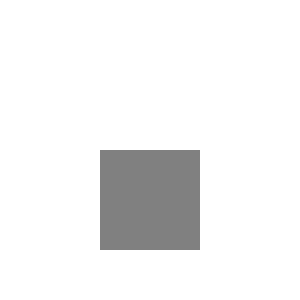](images/psdview/psd-zoo/layer/moved_diff.png) |
| [effect/global_light.psd](https://github.com/signal-slot/psd-zoo/tree/main/effect/global_light.psd) | 39.8 KB | 100.00%  | ✅ PERFECT |  |  |  |
| [group/blend_mode.psd](https://github.com/signal-slot/psd-zoo/tree/main/group/blend_mode.psd) | 39.8 KB | 94.00%  | ✅ GOOD |  |  |  |
| [group/blend_multiply.psd](https://github.com/signal-slot/psd-zoo/tree/main/group/blend_multiply.psd) | 39.8 KB | 100.00%  | ✅ PERFECT |  |  |  |
| [effect/drop_shadow_noise.psd](https://github.com/signal-slot/psd-zoo/tree/main/effect/drop_shadow_noise.psd) | 39.8 KB | 100.00%  | ✅ PERFECT |  |  |  |
| [effect/drop_shadow_spread.psd](https://github.com/signal-slot/psd-zoo/tree/main/effect/drop_shadow_spread.psd) | 39.8 KB | 100.00%  | ✅ PERFECT |  |  |  |
| [bevel/outer.psd](https://github.com/signal-slot/psd-zoo/tree/main/bevel/outer.psd) | 39.9 KB | 100.00%  | ✅ PERFECT |  |  |  |
| [group/blend_normal.psd](https://github.com/signal-slot/psd-zoo/tree/main/group/blend_normal.psd) | 39.9 KB | 100.00%  | ✅ PERFECT |  |  |  |
| [group/blend_clipped.psd](https://github.com/signal-slot/psd-zoo/tree/main/group/blend_clipped.psd) | 39.9 KB | 100.00%  | ✅ PERFECT |  |  |  |
| [effect/disabled.psd](https://github.com/signal-slot/psd-zoo/tree/main/effect/disabled.psd) | 39.9 KB | 100.00%  | ✅ PERFECT |  |  |  |
| [effect/outer_glow_spread.psd](https://github.com/signal-slot/psd-zoo/tree/main/effect/outer_glow_spread.psd) | 39.9 KB | 100.00%  | ✅ PERFECT |  |  |  |
| [bevel/stroke_emboss.psd](https://github.com/signal-slot/psd-zoo/tree/main/bevel/stroke_emboss.psd) | 39.9 KB | 100.00%  | ✅ PERFECT |  |  |  |
| [group/group.psd](https://github.com/signal-slot/psd-zoo/tree/main/group/group.psd) | 39.9 KB | 100.00%  | ✅ PERFECT |  |  |  |
| [effect/color_overlay_blendmode.psd](https://github.com/signal-slot/psd-zoo/tree/main/effect/color_overlay_blendmode.psd) | 39.9 KB | 0.00%  | ❌ FAILED |  |  |  |
| [group/pass_through_group.psd](https://github.com/signal-slot/psd-zoo/tree/main/group/pass_through_group.psd) | 39.9 KB | 100.00%  | ✅ PERFECT |  |  |  |
| [mask/clipping_chain.psd](https://github.com/signal-slot/psd-zoo/tree/main/mask/clipping_chain.psd) | 40.0 KB | 100.00%  | ✅ PERFECT |  |  |  |
| [mask/vector_mask_ellipse.psd](https://github.com/signal-slot/psd-zoo/tree/main/mask/vector_mask_ellipse.psd) | 40.1 KB | 99.96%  | ✅ PERFECT |  |  |  |
| [group/siblings.psd](https://github.com/signal-slot/psd-zoo/tree/main/group/siblings.psd) | 40.2 KB | 100.00%  | ✅ PERFECT |  |  | [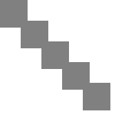](images/psdview/psd-zoo/group/siblings_diff.png) |
| [effect/gradient_overlay.psd](https://github.com/signal-slot/psd-zoo/tree/main/effect/gradient_overlay.psd) | 40.3 KB | 98.21%  | ✅ GOOD |  |  |  |
| [effect/gradient_overlay2.psd](https://github.com/signal-slot/psd-zoo/tree/main/effect/gradient_overlay2.psd) | 40.3 KB | 98.21%  | ✅ GOOD |  |  |  |
| [group/passthrough.psd](https://github.com/signal-slot/psd-zoo/tree/main/group/passthrough.psd) | 40.3 KB | 100.00%  | ✅ PERFECT |  |  |  |
| [layer/transparency_shapes_layer.psd](https://github.com/signal-slot/psd-zoo/tree/main/layer/transparency_shapes_layer.psd) | 40.4 KB | 94.70%  | ✅ GOOD |  |  |  |
| [layer_comp/comp.psd](https://github.com/signal-slot/psd-zoo/tree/main/layer_comp/comp.psd) | 40.4 KB | 100.00%  | ✅ PERFECT |  |  |  |
| [layer_comp/comps.psd](https://github.com/signal-slot/psd-zoo/tree/main/layer_comp/comps.psd) | 40.4 KB | 100.00%  | ✅ PERFECT |  |  |  |
| [layer/scaled.psd](https://github.com/signal-slot/psd-zoo/tree/main/layer/scaled.psd) | 40.4 KB | 100.00%  | ✅ PERFECT |  |  |  |
| [shape/ellipse_wide.psd](https://github.com/signal-slot/psd-zoo/tree/main/shape/ellipse_wide.psd) | 40.5 KB | 99.95%  | ✅ PERFECT |  |  | [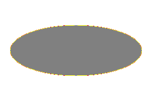](images/psdview/psd-zoo/shape/ellipse_wide_diff.png) |
| [group/nested_groups_blend.psd](https://github.com/signal-slot/psd-zoo/tree/main/group/nested_groups_blend.psd) | 40.5 KB | 0.00%  | ❌ FAILED |  |  |  |
| [effect/stroke_gradient.psd](https://github.com/signal-slot/psd-zoo/tree/main/effect/stroke_gradient.psd) | 40.8 KB | 100.00%  | ✅ PERFECT |  |  |  |
| [mask/clipping_mask_chain.psd](https://github.com/signal-slot/psd-zoo/tree/main/mask/clipping_mask_chain.psd) | 40.8 KB | 50.00%  | ❌ FAILED |  |  |  |
| [effect/color_overlay.psd](https://github.com/signal-slot/psd-zoo/tree/main/effect/color_overlay.psd) | 41.2 KB | 100.00%  | ✅ PERFECT |  |  | [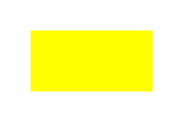](images/psdview/psd-zoo/effect/color_overlay_diff.png) |
| [effect/stroke_outside.psd](https://github.com/signal-slot/psd-zoo/tree/main/effect/stroke_outside.psd) | 41.2 KB | 99.88%  | ✅ PERFECT |  |  |  |
| [filter/twirl.psd](https://github.com/signal-slot/psd-zoo/tree/main/filter/twirl.psd) | 41.3 KB | 100.00%  | ✅ PERFECT |  |  |  |
| [group/deep_nesting_10.psd](https://github.com/signal-slot/psd-zoo/tree/main/group/deep_nesting_10.psd) | 41.3 KB | 100.00%  | ✅ PERFECT |  |  |  |
| [effect/outer_glow.psd](https://github.com/signal-slot/psd-zoo/tree/main/effect/outer_glow.psd) | 41.4 KB | 100.00%  | ✅ PERFECT |  |  |  |
| [shape/ellipse.psd](https://github.com/signal-slot/psd-zoo/tree/main/shape/ellipse.psd) | 41.6 KB | 99.96%  | ✅ PERFECT |  |  | [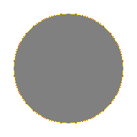](images/psdview/psd-zoo/shape/ellipse_diff.png) |
| [mask/multiple_layer_masks.psd](https://github.com/signal-slot/psd-zoo/tree/main/mask/multiple_layer_masks.psd) | 41.7 KB | 100.00%  | ✅ PERFECT |  |  |  |
| [shape/circle.psd](https://github.com/signal-slot/psd-zoo/tree/main/shape/circle.psd) | 41.7 KB | 99.97%  | ✅ PERFECT |  |  | [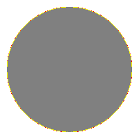](images/psdview/psd-zoo/shape/circle_diff.png) |
| [shape/multiple_on_layer.psd](https://github.com/signal-slot/psd-zoo/tree/main/shape/multiple_on_layer.psd) | 42.2 KB | 100.00%  | ✅ PERFECT |  |  | [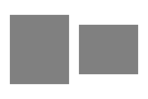](images/psdview/psd-zoo/shape/multiple_on_layer_diff.png) |
| [effect/stroke_inside.psd](https://github.com/signal-slot/psd-zoo/tree/main/effect/stroke_inside.psd) | 42.3 KB | 86.22%  | ⚠️ LOW |  |  |  |
| [shape/no_fill.psd](https://github.com/signal-slot/psd-zoo/tree/main/shape/no_fill.psd) | 42.5 KB | 20.00%  | ❌ FAILED |  |  | [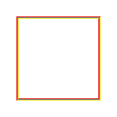](images/psdview/psd-zoo/shape/no_fill_diff.png) |
| [effect/stroke_effect.psd](https://github.com/signal-slot/psd-zoo/tree/main/effect/stroke_effect.psd) | 42.8 KB | 99.95%  | ✅ PERFECT |  |  |  |
| [color_mode/bitmap_1bit.psd](https://github.com/signal-slot/psd-zoo/tree/main/color_mode/bitmap_1bit.psd) | 42.9 KB | 100.00%  | ✅ PERFECT |  |  | [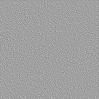](images/psdview/psd-zoo/color_mode/bitmap_1bit_diff.png) |
| [filter/emboss.psd](https://github.com/signal-slot/psd-zoo/tree/main/filter/emboss.psd) | 43.2 KB | 100.00%  | ✅ PERFECT |  |  |  |
| [filter/spherize.psd](https://github.com/signal-slot/psd-zoo/tree/main/filter/spherize.psd) | 43.7 KB | 100.00%  | ✅ PERFECT |  |  |  |
| [document/guides_grid.psd](https://github.com/signal-slot/psd-zoo/tree/main/document/guides_grid.psd) | 44.0 KB | 100.00%  | ✅ PERFECT |  |  |  |
| [effect/knockout_shallow.psd](https://github.com/signal-slot/psd-zoo/tree/main/effect/knockout_shallow.psd) | 44.0 KB | 100.00%  | ✅ PERFECT |  |  |  |
| [effect/knockout_deep.psd](https://github.com/signal-slot/psd-zoo/tree/main/effect/knockout_deep.psd) | 44.0 KB | 100.00%  | ✅ PERFECT |  |  |  |
| [fill/multiple_solid_colors.psd](https://github.com/signal-slot/psd-zoo/tree/main/fill/multiple_solid_colors.psd) | 44.2 KB | 100.00%  | ✅ PERFECT |  |  |  |
| [effect/inner_shadow.psd](https://github.com/signal-slot/psd-zoo/tree/main/effect/inner_shadow.psd) | 44.4 KB | 90.21%  | ✅ GOOD |  |  |  |
| [bevel/emboss.psd](https://github.com/signal-slot/psd-zoo/tree/main/bevel/emboss.psd) | 44.9 KB | 94.09%  | ✅ GOOD |  |  |  |
| [effect/scaled.psd](https://github.com/signal-slot/psd-zoo/tree/main/effect/scaled.psd) | 45.0 KB | 90.49%  | ✅ GOOD |  |  |  |
| [effect/drop_shadow.psd](https://github.com/signal-slot/psd-zoo/tree/main/effect/drop_shadow.psd) | 45.1 KB | 90.49%  | ✅ GOOD |  |  |  |
| [effect/multiple_effects.psd](https://github.com/signal-slot/psd-zoo/tree/main/effect/multiple_effects.psd) | 45.2 KB | 18.79%  | ❌ FAILED |  |  | [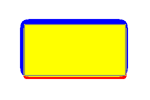](images/psdview/psd-zoo/effect/multiple_effects_diff.png) |
| [effect/stroke_center.psd](https://github.com/signal-slot/psd-zoo/tree/main/effect/stroke_center.psd) | 45.2 KB | 96.04%  | ✅ GOOD |  |  |  |
| [bevel/pillow.psd](https://github.com/signal-slot/psd-zoo/tree/main/bevel/pillow.psd) | 45.3 KB | 98.01%  | ✅ GOOD |  |  |  |
| [layer/order.psd](https://github.com/signal-slot/psd-zoo/tree/main/layer/order.psd) | 45.6 KB | 100.00%  | ✅ PERFECT |  |  |  |
| [bevel/emboss_style.psd](https://github.com/signal-slot/psd-zoo/tree/main/bevel/emboss_style.psd) | 45.6 KB | 97.02%  | ✅ GOOD |  |  |  |
| [filter/radial_blur.psd](https://github.com/signal-slot/psd-zoo/tree/main/filter/radial_blur.psd) | 45.7 KB | 100.00%  | ✅ PERFECT |  |  |  |
| [layer_comp/appearance.psd](https://github.com/signal-slot/psd-zoo/tree/main/layer_comp/appearance.psd) | 46.2 KB | 100.00%  | ✅ PERFECT |  |  |  |
| [layer_comp/visibility.psd](https://github.com/signal-slot/psd-zoo/tree/main/layer_comp/visibility.psd) | 46.2 KB | 100.00%  | ✅ PERFECT |  |  |  |
| [bevel/texture.psd](https://github.com/signal-slot/psd-zoo/tree/main/bevel/texture.psd) | 46.7 KB | 96.52%  | ✅ GOOD |  |  |  |
| [bevel/chisel_hard.psd](https://github.com/signal-slot/psd-zoo/tree/main/bevel/chisel_hard.psd) | 47.0 KB | 96.52%  | ✅ GOOD |  |  |  |
| [bevel/chisel_soft.psd](https://github.com/signal-slot/psd-zoo/tree/main/bevel/chisel_soft.psd) | 47.1 KB | 96.52%  | ✅ GOOD |  |  |  |
| [shape/ellipse_tall.psd](https://github.com/signal-slot/psd-zoo/tree/main/shape/ellipse_tall.psd) | 47.3 KB | 84.42%  | ⚠️ LOW |  |  | [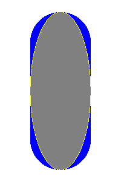](images/psdview/psd-zoo/shape/ellipse_tall_diff.png) |
| [shape/vector_stroke.psd](https://github.com/signal-slot/psd-zoo/tree/main/shape/vector_stroke.psd) | 47.6 KB | 89.42%  | ⚠️ LOW |  |  | [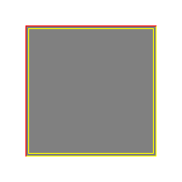](images/psdview/psd-zoo/shape/vector_stroke_diff.png) |
| [layer/50.psd](https://github.com/signal-slot/psd-zoo/tree/main/layer/50.psd) | 48.0 KB | 100.00%  | ✅ PERFECT |  |  |  |
| [blend_mode/blend_interior_effects.psd](https://github.com/signal-slot/psd-zoo/tree/main/blend_mode/blend_interior_effects.psd) | 48.5 KB | 99.06%  | ✅ PERFECT |  |  |  |
| [layer/rotated.psd](https://github.com/signal-slot/psd-zoo/tree/main/layer/rotated.psd) | 48.7 KB | 100.00%  | ✅ PERFECT |  |  |  |
| [layer/transformed.psd](https://github.com/signal-slot/psd-zoo/tree/main/layer/transformed.psd) | 50.4 KB | 100.00%  | ✅ PERFECT |  |  |  |
| [document/artboard.psd](https://github.com/signal-slot/psd-zoo/tree/main/document/artboard.psd) | 51.0 KB | 100.00%  | ✅ PERFECT |  |  |  |
| [text/nobreak.psd](https://github.com/signal-slot/psd-zoo/tree/main/text/nobreak.psd) | 51.9 KB | 100.00%  | ✅ PERFECT |  |  |  |
| [layer/opacity_gradient.psd](https://github.com/signal-slot/psd-zoo/tree/main/layer/opacity_gradient.psd) | 52.0 KB | 95.67%  | ✅ GOOD |  |  |  |
| [effect/inner_glow.psd](https://github.com/signal-slot/psd-zoo/tree/main/effect/inner_glow.psd) | 52.2 KB | 86.47%  | ⚠️ LOW |  |  |  |
| [effect/drop_shadow_knockout.psd](https://github.com/signal-slot/psd-zoo/tree/main/effect/drop_shadow_knockout.psd) | 52.9 KB | 94.43%  | ✅ GOOD |  |  | [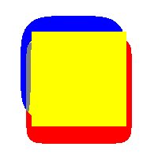](images/psdview/psd-zoo/effect/drop_shadow_knockout_diff.png) |
| [text/small_font.psd](https://github.com/signal-slot/psd-zoo/tree/main/text/small_font.psd) | 54.1 KB | 46.36%  | ❌ FAILED |  |  |  |
| [text/single_text_layer.psd](https://github.com/signal-slot/psd-zoo/tree/main/text/single_text_layer.psd) | 55.6 KB | 24.65%  | ❌ FAILED |  |  |  |
| [group/many_groups.psd](https://github.com/signal-slot/psd-zoo/tree/main/group/many_groups.psd) | 56.0 KB | 100.00%  | ✅ PERFECT |  |  |  |
| [text/with_color.psd](https://github.com/signal-slot/psd-zoo/tree/main/text/with_color.psd) | 56.8 KB | 34.76%  | ❌ FAILED |  |  |  |
| [shape/stroke_gradient.psd](https://github.com/signal-slot/psd-zoo/tree/main/shape/stroke_gradient.psd) | 58.1 KB | 79.80%  | ⚠️ LOW |  |  | [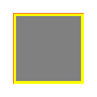](images/psdview/psd-zoo/shape/stroke_gradient_diff.png) |
| [text/anti_alias_none.psd](https://github.com/signal-slot/psd-zoo/tree/main/text/anti_alias_none.psd) | 58.4 KB | 17.17%  | ❌ FAILED |  |  |  |
| [text_warp/vdistort.psd](https://github.com/signal-slot/psd-zoo/tree/main/text_warp/vdistort.psd) | 59.1 KB | 17.62%  | ❌ FAILED |  |  |  |
| [text/bold.psd](https://github.com/signal-slot/psd-zoo/tree/main/text/bold.psd) | 60.0 KB | 31.25%  | ❌ FAILED |  |  |  |
| [text/anti_alias_crisp.psd](https://github.com/signal-slot/psd-zoo/tree/main/text/anti_alias_crisp.psd) | 60.1 KB | 26.39%  | ❌ FAILED |  |  |  |
| [text/align_left.psd](https://github.com/signal-slot/psd-zoo/tree/main/text/align_left.psd) | 60.2 KB | 22.51%  | ❌ FAILED |  |  | [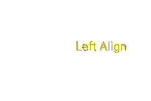](images/psdview/psd-zoo/text/align_left_diff.png) |
| [text_warp/fish.psd](https://github.com/signal-slot/psd-zoo/tree/main/text_warp/fish.psd) | 60.3 KB | 22.66%  | ❌ FAILED |  |  | [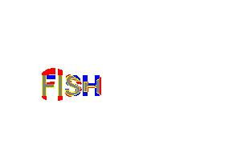](images/psdview/psd-zoo/text_warp/fish_diff.png) |
| [text/italic.psd](https://github.com/signal-slot/psd-zoo/tree/main/text/italic.psd) | 60.3 KB | 24.38%  | ❌ FAILED |  |  |  |
| [text_warp/twist.psd](https://github.com/signal-slot/psd-zoo/tree/main/text_warp/twist.psd) | 60.7 KB | 25.77%  | ❌ FAILED |  |  |  |
| [text_warp/rise.psd](https://github.com/signal-slot/psd-zoo/tree/main/text_warp/rise.psd) | 61.1 KB | 14.29%  | ❌ FAILED |  |  |  |
| [text/anti_alias_sharp.psd](https://github.com/signal-slot/psd-zoo/tree/main/text/anti_alias_sharp.psd) | 61.1 KB | 21.00%  | ❌ FAILED |  |  | [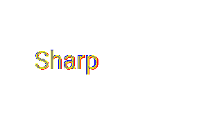](images/psdview/psd-zoo/text/anti_alias_sharp_diff.png) |
| [text/align_right.psd](https://github.com/signal-slot/psd-zoo/tree/main/text/align_right.psd) | 61.5 KB | 20.88%  | ❌ FAILED |  |  |  |
| [text/anti_alias_strong.psd](https://github.com/signal-slot/psd-zoo/tree/main/text/anti_alias_strong.psd) | 61.7 KB | 21.96%  | ❌ FAILED |  |  |  |
| [text/align_center.psd](https://github.com/signal-slot/psd-zoo/tree/main/text/align_center.psd) | 61.8 KB | 27.07%  | ❌ FAILED |  |  |  |
| [mask/feather.psd](https://github.com/signal-slot/psd-zoo/tree/main/mask/feather.psd) | 61.8 KB | 20.23%  | ❌ FAILED |  |  |  |
| [text/anti_alias_smooth.psd](https://github.com/signal-slot/psd-zoo/tree/main/text/anti_alias_smooth.psd) | 62.4 KB | 20.55%  | ❌ FAILED |  |  |  |
| [document/resolution_150dpi.psd](https://github.com/signal-slot/psd-zoo/tree/main/document/resolution_150dpi.psd) | 62.4 KB | 14.40%  | ❌ FAILED |  |  |  |
| [text/baseline_shift.psd](https://github.com/signal-slot/psd-zoo/tree/main/text/baseline_shift.psd) | 62.5 KB | 18.62%  | ❌ FAILED |  |  |  |
| [text_warp/hdistort.psd](https://github.com/signal-slot/psd-zoo/tree/main/text_warp/hdistort.psd) | 62.8 KB | 19.84%  | ❌ FAILED |  |  |  |
| [text/faux_italic.psd](https://github.com/signal-slot/psd-zoo/tree/main/text/faux_italic.psd) | 63.1 KB | 25.59%  | ❌ FAILED |  |  |  |
| [text/faux_bold.psd](https://github.com/signal-slot/psd-zoo/tree/main/text/faux_bold.psd) | 63.2 KB | 23.47%  | ❌ FAILED |  |  |  |
| [text/all_caps.psd](https://github.com/signal-slot/psd-zoo/tree/main/text/all_caps.psd) | 63.2 KB | 20.67%  | ❌ FAILED |  |  |  |
| [text/vertical_scale.psd](https://github.com/signal-slot/psd-zoo/tree/main/text/vertical_scale.psd) | 63.5 KB | 20.71%  | ❌ FAILED |  |  |  |
| [text/vertical.psd](https://github.com/signal-slot/psd-zoo/tree/main/text/vertical.psd) | 63.7 KB | 19.95%  | ❌ FAILED |  |  | [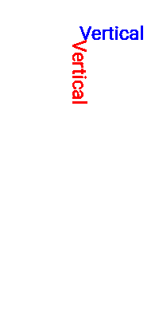](images/psdview/psd-zoo/text/vertical_diff.png) |
| [text/tracking.psd](https://github.com/signal-slot/psd-zoo/tree/main/text/tracking.psd) | 63.8 KB | 19.73%  | ❌ FAILED |  |  |  |
| [text_warp/fisheye.psd](https://github.com/signal-slot/psd-zoo/tree/main/text_warp/fisheye.psd) | 63.9 KB | 25.18%  | ❌ FAILED |  |  | [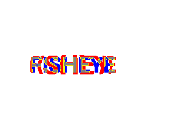](images/psdview/psd-zoo/text_warp/fisheye_diff.png) |
| [text/large_font.psd](https://github.com/signal-slot/psd-zoo/tree/main/text/large_font.psd) | 64.7 KB | 23.56%  | ❌ FAILED |  |  |  |
| [text/underline.psd](https://github.com/signal-slot/psd-zoo/tree/main/text/underline.psd) | 64.8 KB | 18.79%  | ❌ FAILED |  |  |  |
| [text_warp/squeeze.psd](https://github.com/signal-slot/psd-zoo/tree/main/text_warp/squeeze.psd) | 64.8 KB | 26.27%  | ❌ FAILED |  |  | [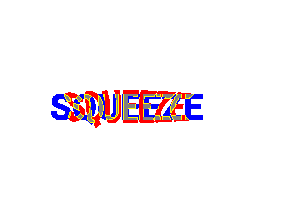](images/psdview/psd-zoo/text_warp/squeeze_diff.png) |
| [text_warp/inflate.psd](https://github.com/signal-slot/psd-zoo/tree/main/text_warp/inflate.psd) | 64.9 KB | 20.94%  | ❌ FAILED |  |  | [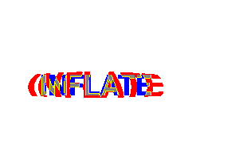](images/psdview/psd-zoo/text_warp/inflate_diff.png) |
| [text/small_caps.psd](https://github.com/signal-slot/psd-zoo/tree/main/text/small_caps.psd) | 65.6 KB | 19.52%  | ❌ FAILED |  |  |  |
| [text_warp/bulge.psd](https://github.com/signal-slot/psd-zoo/tree/main/text_warp/bulge.psd) | 66.1 KB | 19.80%  | ❌ FAILED |  |  |  |
| [effect/satin.psd](https://github.com/signal-slot/psd-zoo/tree/main/effect/satin.psd) | 66.3 KB | 15.98%  | ❌ FAILED |  |  |  |
| [text/strikethrough.psd](https://github.com/signal-slot/psd-zoo/tree/main/text/strikethrough.psd) | 66.5 KB | 25.73%  | ❌ FAILED |  |  | [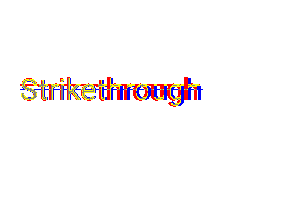](images/psdview/psd-zoo/text/strikethrough_diff.png) |
| [text/mixed_styles.psd](https://github.com/signal-slot/psd-zoo/tree/main/text/mixed_styles.psd) | 67.0 KB | 27.81%  | ❌ FAILED |  |  |  |
| [text/rotated.psd](https://github.com/signal-slot/psd-zoo/tree/main/text/rotated.psd) | 67.6 KB | 15.74%  | ❌ FAILED |  |  | [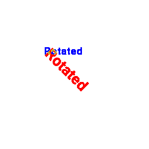](images/psdview/psd-zoo/text/rotated_diff.png) |
| [effect/inner_glow_center.psd](https://github.com/signal-slot/psd-zoo/tree/main/effect/inner_glow_center.psd) | 67.7 KB | 0.02%  | ❌ FAILED |  |  |  |
| [effect/combined_3.psd](https://github.com/signal-slot/psd-zoo/tree/main/effect/combined_3.psd) | 67.8 KB | 86.46%  | ⚠️ LOW |  |  | [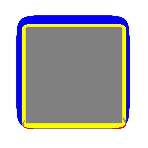](images/psdview/psd-zoo/effect/combined_3_diff.png) |
| [text/horizontal_scale.psd](https://github.com/signal-slot/psd-zoo/tree/main/text/horizontal_scale.psd) | 67.9 KB | 18.53%  | ❌ FAILED |  |  |  |
| [document/high_resolution.psd](https://github.com/signal-slot/psd-zoo/tree/main/document/high_resolution.psd) | 68.5 KB | 17.03%  | ❌ FAILED |  |  |  |
| [text_warp/negative.psd](https://github.com/signal-slot/psd-zoo/tree/main/text_warp/negative.psd) | 68.9 KB | 10.26%  | ❌ FAILED |  |  |  |
| [text/white_on_black.psd](https://github.com/signal-slot/psd-zoo/tree/main/text/white_on_black.psd) | 70.3 KB | 0.36%  | ❌ FAILED |  |  |  |
| [text_warp/flag.psd](https://github.com/signal-slot/psd-zoo/tree/main/text_warp/flag.psd) | 70.8 KB | 18.50%  | ❌ FAILED |  |  | [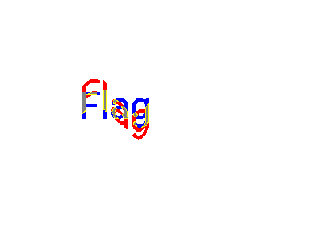](images/psdview/psd-zoo/text_warp/flag_diff.png) |
| [layer/mixed_layers.psd](https://github.com/signal-slot/psd-zoo/tree/main/layer/mixed_layers.psd) | 71.9 KB | 90.72%  | ✅ GOOD |  |  |  |
| [canvas/512.psd](https://github.com/signal-slot/psd-zoo/tree/main/canvas/512.psd) | 72.3 KB | 100.00%  | ✅ PERFECT |  |  |  |
| [filter/gaussian_blur.psd](https://github.com/signal-slot/psd-zoo/tree/main/filter/gaussian_blur.psd) | 72.5 KB | 100.00%  | ✅ PERFECT |  |  |  |
| [text/on_shape.psd](https://github.com/signal-slot/psd-zoo/tree/main/text/on_shape.psd) | 72.7 KB | 97.47%  | ✅ GOOD |  |  |  |
| [text_warp/wave.psd](https://github.com/signal-slot/psd-zoo/tree/main/text_warp/wave.psd) | 73.2 KB | 22.65%  | ❌ FAILED |  |  | [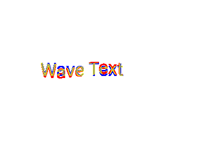](images/psdview/psd-zoo/text_warp/wave_diff.png) |
| [text_warp/arcupper.psd](https://github.com/signal-slot/psd-zoo/tree/main/text_warp/arcupper.psd) | 73.4 KB | 16.14%  | ❌ FAILED |  |  | [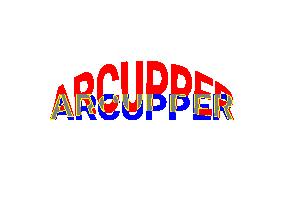](images/psdview/psd-zoo/text_warp/arcupper_diff.png) |
| [text/indent_lr.psd](https://github.com/signal-slot/psd-zoo/tree/main/text/indent_lr.psd) | 73.5 KB | 29.46%  | ❌ FAILED |  |  | [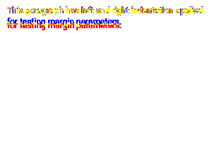](images/psdview/psd-zoo/text/indent_lr_diff.png) |
| [text/leading.psd](https://github.com/signal-slot/psd-zoo/tree/main/text/leading.psd) | 73.8 KB | 20.68%  | ❌ FAILED |  |  | [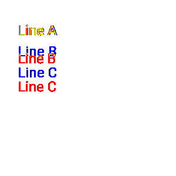](images/psdview/psd-zoo/text/leading_diff.png) |
| [text_warp/arclower.psd](https://github.com/signal-slot/psd-zoo/tree/main/text_warp/arclower.psd) | 74.3 KB | 23.69%  | ❌ FAILED |  |  |  |
| [text/hyphenation.psd](https://github.com/signal-slot/psd-zoo/tree/main/text/hyphenation.psd) | 74.6 KB | 29.80%  | ❌ FAILED |  |  | [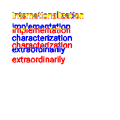](images/psdview/psd-zoo/text/hyphenation_diff.png) |
| [text_warp/shelllower.psd](https://github.com/signal-slot/psd-zoo/tree/main/text_warp/shelllower.psd) | 75.0 KB | 18.99%  | ❌ FAILED |  |  |  |
| [effect/multiple_styled_layers.psd](https://github.com/signal-slot/psd-zoo/tree/main/effect/multiple_styled_layers.psd) | 75.0 KB | 94.22%  | ✅ GOOD |  |  |  |
| [text/justify_all.psd](https://github.com/signal-slot/psd-zoo/tree/main/text/justify_all.psd) | 75.8 KB | 30.26%  | ❌ FAILED |  |  |  |
| [text/align_justify.psd](https://github.com/signal-slot/psd-zoo/tree/main/text/align_justify.psd) | 76.1 KB | 27.07%  | ❌ FAILED |  |  |  |
| [text/mixed_fonts.psd](https://github.com/signal-slot/psd-zoo/tree/main/text/mixed_fonts.psd) | 76.7 KB | 25.25%  | ❌ FAILED |  |  |  |
| [text_warp/arc.psd](https://github.com/signal-slot/psd-zoo/tree/main/text_warp/arc.psd) | 76.9 KB | 14.02%  | ❌ FAILED |  |  | [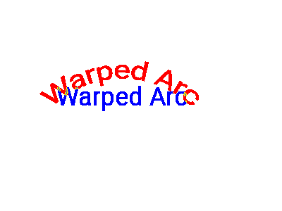](images/psdview/psd-zoo/text_warp/arc_diff.png) |
| [document/resolution_600dpi.psd](https://github.com/signal-slot/psd-zoo/tree/main/document/resolution_600dpi.psd) | 77.0 KB | 35.51%  | ❌ FAILED |  |  |  |
| [text_warp/shellupper.psd](https://github.com/signal-slot/psd-zoo/tree/main/text_warp/shellupper.psd) | 77.6 KB | 19.55%  | ❌ FAILED |  |  |  |
| [text/positioned.psd](https://github.com/signal-slot/psd-zoo/tree/main/text/positioned.psd) | 78.2 KB | 24.40%  | ❌ FAILED |  |  | [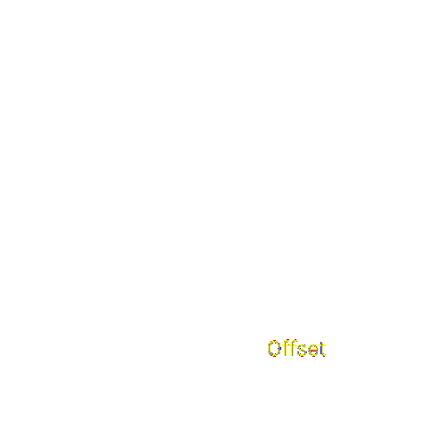](images/psdview/psd-zoo/text/positioned_diff.png) |
| [text/multiline.psd](https://github.com/signal-slot/psd-zoo/tree/main/text/multiline.psd) | 78.4 KB | 20.85%  | ❌ FAILED |  |  | [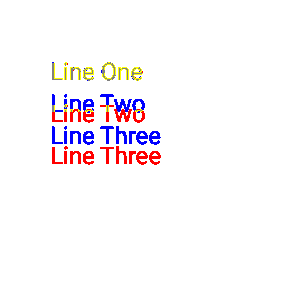](images/psdview/psd-zoo/text/multiline_diff.png) |
| [text/with_effect.psd](https://github.com/signal-slot/psd-zoo/tree/main/text/with_effect.psd) | 81.8 KB | 35.41%  | ❌ FAILED |  |  |  |
| [text/drop_shadow.psd](https://github.com/signal-slot/psd-zoo/tree/main/text/drop_shadow.psd) | 82.4 KB | 97.21%  | ✅ GOOD |  |  |  |
| [mask/vector_mask_feather.psd](https://github.com/signal-slot/psd-zoo/tree/main/mask/vector_mask_feather.psd) | 83.1 KB | 67.88%  | ⚠️ LOW |  |  |  |
| [text/paragraph_spacing.psd](https://github.com/signal-slot/psd-zoo/tree/main/text/paragraph_spacing.psd) | 84.4 KB | 26.30%  | ❌ FAILED |  |  |  |
| [misc/mixed_text_shape_raster.psd](https://github.com/signal-slot/psd-zoo/tree/main/misc/mixed_text_shape_raster.psd) | 85.1 KB | 94.94%  | ✅ GOOD |  |  |  |
| [text/emoji.psd](https://github.com/signal-slot/psd-zoo/tree/main/text/emoji.psd) | 86.5 KB | 14.29%  | ❌ FAILED |  |  | [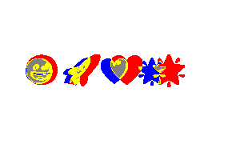](images/psdview/psd-zoo/text/emoji_diff.png) |
| [canvas/wide.psd](https://github.com/signal-slot/psd-zoo/tree/main/canvas/wide.psd) | 88.3 KB | 100.00%  | ✅ PERFECT |  |  |  |
| [text/paragraph_indent.psd](https://github.com/signal-slot/psd-zoo/tree/main/text/paragraph_indent.psd) | 93.6 KB | 27.60%  | ❌ FAILED |  |  |  |
| [text/multiple_text_layers.psd](https://github.com/signal-slot/psd-zoo/tree/main/text/multiple_text_layers.psd) | 94.6 KB | 24.23%  | ❌ FAILED |  |  | [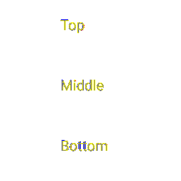](images/psdview/psd-zoo/text/multiple_text_layers_diff.png) |
| [text/paragraph_box.psd](https://github.com/signal-slot/psd-zoo/tree/main/text/paragraph_box.psd) | 95.8 KB | 27.30%  | ❌ FAILED |  |  | [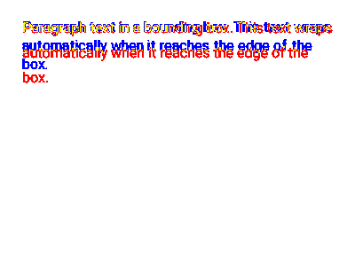](images/psdview/psd-zoo/text/paragraph_box_diff.png) |
| [document/dpi_300.psd](https://github.com/signal-slot/psd-zoo/tree/main/document/dpi_300.psd) | 98.7 KB | 17.45%  | ❌ FAILED |  |  |  |
| [color_mode/grayscale_16bit.psd](https://github.com/signal-slot/psd-zoo/tree/main/color_mode/grayscale_16bit.psd) | 99.5 KB | 100.00%  | ✅ PERFECT |  |  |  |
| [shape/gradient_fill.psd](https://github.com/signal-slot/psd-zoo/tree/main/shape/gradient_fill.psd) | 113.3 KB | 100.00%  | ✅ PERFECT |  |  | [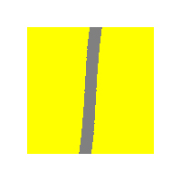](images/psdview/psd-zoo/shape/gradient_fill_diff.png) |
| [blend_mode/dissolve.psd](https://github.com/signal-slot/psd-zoo/tree/main/blend_mode/dissolve.psd) | 117.2 KB | 0.00%  | ❌ FAILED |  |  | [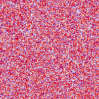](images/psdview/psd-zoo/blend_mode/dissolve_diff.png) |
| [fill/gradient_angle.psd](https://github.com/signal-slot/psd-zoo/tree/main/fill/gradient_angle.psd) | 117.8 KB | 100.00%  | ✅ PERFECT |  |  |  |
| [document/icc_adobe_rgb.psd](https://github.com/signal-slot/psd-zoo/tree/main/document/icc_adobe_rgb.psd) | 119.4 KB | 100.00%  | ✅ PERFECT |  |  |  |
| [misc/complex_layout.psd](https://github.com/signal-slot/psd-zoo/tree/main/misc/complex_layout.psd) | 127.5 KB | 96.06%  | ✅ GOOD |  |  |  |
| [canvas/tall.psd](https://github.com/signal-slot/psd-zoo/tree/main/canvas/tall.psd) | 139.2 KB | 100.00%  | ✅ PERFECT |  |  |  |
| [fill/gradient_radial.psd](https://github.com/signal-slot/psd-zoo/tree/main/fill/gradient_radial.psd) | 151.4 KB | 100.00%  | ✅ PERFECT |  |  |  |
| [fill/gradient_diamond.psd](https://github.com/signal-slot/psd-zoo/tree/main/fill/gradient_diamond.psd) | 154.2 KB | 100.00%  | ✅ PERFECT |  |  |  |
| [fill/gradient_dither.psd](https://github.com/signal-slot/psd-zoo/tree/main/fill/gradient_dither.psd) | 184.6 KB | 100.00%  | ✅ PERFECT |  |  |  |
| [layer/many_layers.psd](https://github.com/signal-slot/psd-zoo/tree/main/layer/many_layers.psd) | 189.2 KB | 22.37%  | ❌ FAILED |  |  | [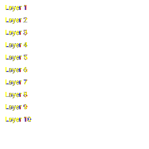](images/psdview/psd-zoo/layer/many_layers_diff.png) |
| [layer/100.psd](https://github.com/signal-slot/psd-zoo/tree/main/layer/100.psd) | 191.6 KB | 100.00%  | ✅ PERFECT |  |  |  |
| [canvas/1024.psd](https://github.com/signal-slot/psd-zoo/tree/main/canvas/1024.psd) | 202.3 KB | 100.00%  | ✅ PERFECT |  |  |  |
| [text/long_content.psd](https://github.com/signal-slot/psd-zoo/tree/main/text/long_content.psd) | 256.2 KB | 29.36%  | ❌ FAILED |  |  | [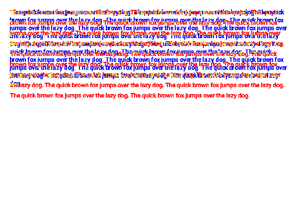](images/psdview/psd-zoo/text/long_content_diff.png) |
| [color_mode/depth_16bit.psd](https://github.com/signal-slot/psd-zoo/tree/main/color_mode/depth_16bit.psd) | 258.1 KB | 100.00%  | ✅ PERFECT |  |  |  |
| [color_mode/depth_16bit_layers.psd](https://github.com/signal-slot/psd-zoo/tree/main/color_mode/depth_16bit_layers.psd) | 262.0 KB | 100.00%  | ✅ PERFECT |  |  |  |
| [canvas/landscape.psd](https://github.com/signal-slot/psd-zoo/tree/main/canvas/landscape.psd) | 262.0 KB | 20.54%  | ❌ FAILED |  |  | [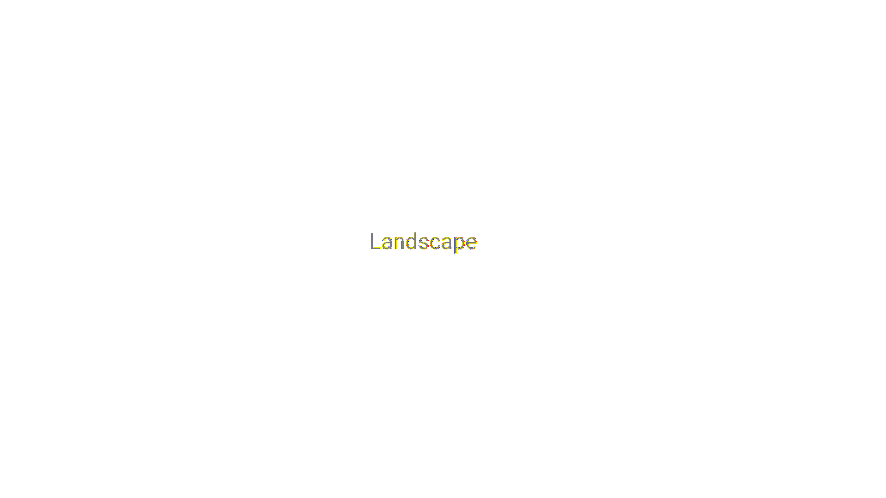](images/psdview/psd-zoo/canvas/landscape_diff.png) |
| [fill/gradient_reflected.psd](https://github.com/signal-slot/psd-zoo/tree/main/fill/gradient_reflected.psd) | 262.9 KB | 100.00%  | ✅ PERFECT |  |  |  |
| [fill/gradient_opacity_stops.psd](https://github.com/signal-slot/psd-zoo/tree/main/fill/gradient_opacity_stops.psd) | 266.8 KB | 95.44%  | ✅ GOOD |  |  |  |
| [fill/gradient_three_stops.psd](https://github.com/signal-slot/psd-zoo/tree/main/fill/gradient_three_stops.psd) | 269.1 KB | 100.00%  | ✅ PERFECT |  |  | [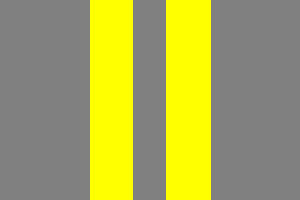](images/psdview/psd-zoo/fill/gradient_three_stops_diff.png) |
| [canvas/portrait.psd](https://github.com/signal-slot/psd-zoo/tree/main/canvas/portrait.psd) | 279.9 KB | 21.93%  | ❌ FAILED |  |  | [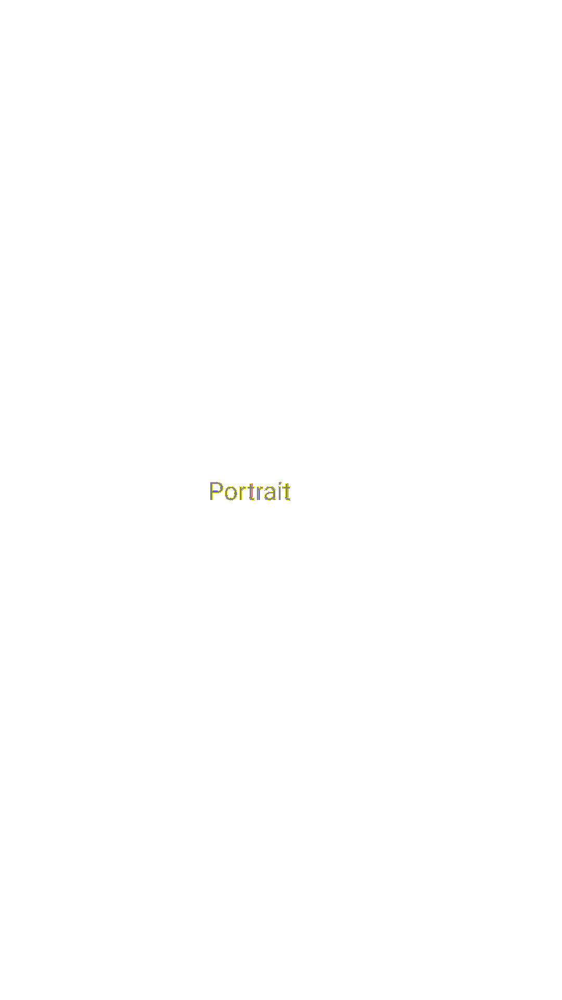](images/psdview/psd-zoo/canvas/portrait_diff.png) |
| [filter/add_noise.psd](https://github.com/signal-slot/psd-zoo/tree/main/filter/add_noise.psd) | 279.9 KB | 100.00%  | ✅ PERFECT |  |  |  |
| [color_mode/depth_32bit.psd](https://github.com/signal-slot/psd-zoo/tree/main/color_mode/depth_32bit.psd) | 487.8 KB | 100.00%  | ✅ PERFECT |  |  |  |
| [color_mode/depth_32bit_layers.psd](https://github.com/signal-slot/psd-zoo/tree/main/color_mode/depth_32bit_layers.psd) | 487.9 KB | 100.00%  | ✅ PERFECT |  |  |  |
| [color_mode/cmyk_with_color.psd](https://github.com/signal-slot/psd-zoo/tree/main/color_mode/cmyk_with_color.psd) | 578.6 KB | 100.00%  | ✅ PERFECT |  |  |  |
| [color_mode/cmyk_mode.psd](https://github.com/signal-slot/psd-zoo/tree/main/color_mode/cmyk_mode.psd) | 578.6 KB | 100.00%  | ✅ PERFECT |  |  |  |
| [fill/pattern.psd](https://github.com/signal-slot/psd-zoo/tree/main/fill/pattern.psd) | 673.4 KB | 100.00%  | ✅ PERFECT |  |  |  |
| [color_mode/cmyk_16bit.psd](https://github.com/signal-slot/psd-zoo/tree/main/color_mode/cmyk_16bit.psd) | 875.1 KB | 100.00%  | ✅ PERFECT |  |  |  |
| [smart/object_linked.psd](https://github.com/signal-slot/psd-zoo/tree/main/smart/object_linked.psd) | 1.0 MB | 100.00%  | ✅ PERFECT |  |  |  |
| [smart/object_embedded.psd](https://github.com/signal-slot/psd-zoo/tree/main/smart/object_embedded.psd) | 1.0 MB | 100.00%  | ✅ PERFECT |  |  |  |
| [smart/filter_sharpen.psd](https://github.com/signal-slot/psd-zoo/tree/main/smart/filter_sharpen.psd) | 1.0 MB | 100.00%  | ✅ PERFECT |  |  |  |
| [smart/filter_blur.psd](https://github.com/signal-slot/psd-zoo/tree/main/smart/filter_blur.psd) | 1.0 MB | 100.00%  | ✅ PERFECT |  |  |  |
| [smart/filter_multiple.psd](https://github.com/signal-slot/psd-zoo/tree/main/smart/filter_multiple.psd) | 1.0 MB | 100.00%  | ✅ PERFECT |  |  |  |
| [smart/filter_stack.psd](https://github.com/signal-slot/psd-zoo/tree/main/smart/filter_stack.psd) | 1.1 MB | 100.00%  | ✅ PERFECT |  |  |  |
| [smart/filter_motion_blur.psd](https://github.com/signal-slot/psd-zoo/tree/main/smart/filter_motion_blur.psd) | 1.1 MB | 100.00%  | ✅ PERFECT |  |  |  |
| [smart/filter_gaussian_20.psd](https://github.com/signal-slot/psd-zoo/tree/main/smart/filter_gaussian_20.psd) | 1.1 MB | 100.00%  | ✅ PERFECT |  |  |  |
| [smart/filter_noise.psd](https://github.com/signal-slot/psd-zoo/tree/main/smart/filter_noise.psd) | 1.3 MB | 100.00%  | ✅ PERFECT |  |  |  |
| [canvas/large.psd](https://github.com/signal-slot/psd-zoo/tree/main/canvas/large.psd) | 1.6 MB | 19.16%  | ❌ FAILED |  |  |  |
| [canvas/4000x3000.psd](https://github.com/signal-slot/psd-zoo/tree/main/canvas/4000x3000.psd) | 1.9 MB | 100.00%  | ✅ PERFECT |  |  |  |
| [canvas/4000.psd](https://github.com/signal-slot/psd-zoo/tree/main/canvas/4000.psd) | 2.2 MB | 100.00%  | ✅ PERFECT |  |  |  |
