# QtPsd Similarity Test Results (psd-zoo)

Generated on: 2026-02-12T15:47:07

## Summary Statistics

| Metric | Image Data vs QPsdView | Image Data vs QtQuick Export | Image Data vs Slint Export | Image Data vs Flutter Export |
|--------|------------------------|------------------------------|----------------------------|------------------------------|
| Total Tests | 337 | 337 | 337 | 225 |
| Passed Tests (>50%) | 241 (71.5%) | 184 (54.6%) | 182 (54.0%) | 152 (67.6%) |
| Average Similarity | 75.99% | 58.11% | 57.54% | 68.31% |
| Minimum Similarity | 0.00% | 0.00% | 0.00% | 0.00% |
| Maximum Similarity | 100.00% | 100.00% | 100.00% | 100.00% |

## adjustment

| Image Data | QPsdView | QtQuick | Slint | Flutter |
|---:|---:|---:|---:|---:|
| [black_white.psd](https://github.com/signal-slot/psd-zoo/tree/main/adjustment/black_white.psd) | 100.00% | [0.00%](exports/psd-zoo/adjustment/black_white/QtQuick/) | [0.00%](exports/psd-zoo/adjustment/black_white/Slint/) | [0.00%](exports/psd-zoo/adjustment/black_white/Flutter/) |
|  |  |  |  |  |
| [brightness.psd](https://github.com/signal-slot/psd-zoo/tree/main/adjustment/brightness.psd) | 100.00% | [92.31%](exports/psd-zoo/adjustment/brightness/QtQuick/) | [92.31%](exports/psd-zoo/adjustment/brightness/Slint/) | [92.31%](exports/psd-zoo/adjustment/brightness/Flutter/) |
|  |  |  |  |  |
| [brightness_legacy.psd](https://github.com/signal-slot/psd-zoo/tree/main/adjustment/brightness_legacy.psd) | 100.00% | [0.00%](exports/psd-zoo/adjustment/brightness_legacy/QtQuick/) | [0.00%](exports/psd-zoo/adjustment/brightness_legacy/Slint/) | [0.00%](exports/psd-zoo/adjustment/brightness_legacy/Flutter/) |
|  |  |  |  |  |
| [clipped.psd](https://github.com/signal-slot/psd-zoo/tree/main/adjustment/clipped.psd) | 100.00% | [75.00%](exports/psd-zoo/adjustment/clipped/QtQuick/) | [75.00%](exports/psd-zoo/adjustment/clipped/Slint/) | [75.00%](exports/psd-zoo/adjustment/clipped/Flutter/) |
|  |  | [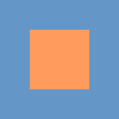](images/qtquick/psd-zoo/adjustment/clipped.png) |  |  |
| [color_balance.psd](https://github.com/signal-slot/psd-zoo/tree/main/adjustment/color_balance.psd) | 100.00% | [100.00%](exports/psd-zoo/adjustment/color_balance/QtQuick/) | [100.00%](exports/psd-zoo/adjustment/color_balance/Slint/) | [100.00%](exports/psd-zoo/adjustment/color_balance/Flutter/) |
|  |  |  |  |  |
| [curves.psd](https://github.com/signal-slot/psd-zoo/tree/main/adjustment/curves.psd) | 100.00% | [100.00%](exports/psd-zoo/adjustment/curves/QtQuick/) | [100.00%](exports/psd-zoo/adjustment/curves/Slint/) | [100.00%](exports/psd-zoo/adjustment/curves/Flutter/) |
|  |  |  |  |  |
| [curves_perchannel.psd](https://github.com/signal-slot/psd-zoo/tree/main/adjustment/curves_perchannel.psd) | 100.00% | [90.02%](exports/psd-zoo/adjustment/curves_perchannel/QtQuick/) | [90.02%](exports/psd-zoo/adjustment/curves_perchannel/Slint/) | [90.02%](exports/psd-zoo/adjustment/curves_perchannel/Flutter/) |
|  |  |  |  |  |
| [disabled.psd](https://github.com/signal-slot/psd-zoo/tree/main/adjustment/disabled.psd) | 100.00% | [100.00%](exports/psd-zoo/adjustment/disabled/QtQuick/) | [100.00%](exports/psd-zoo/adjustment/disabled/Slint/) | [100.00%](exports/psd-zoo/adjustment/disabled/Flutter/) |
|  |  |  |  |  |
| [exposure.psd](https://github.com/signal-slot/psd-zoo/tree/main/adjustment/exposure.psd) | 100.00% | [0.00%](exports/psd-zoo/adjustment/exposure/QtQuick/) | [0.00%](exports/psd-zoo/adjustment/exposure/Slint/) | [0.00%](exports/psd-zoo/adjustment/exposure/Flutter/) |
|  |  |  |  |  |
| [gradient_map.psd](https://github.com/signal-slot/psd-zoo/tree/main/adjustment/gradient_map.psd) | 100.00% | [95.61%](exports/psd-zoo/adjustment/gradient_map/QtQuick/) | [95.61%](exports/psd-zoo/adjustment/gradient_map/Slint/) | [95.61%](exports/psd-zoo/adjustment/gradient_map/Flutter/) |
|  |  |  |  |  |
| [gradient_map_custom.psd](https://github.com/signal-slot/psd-zoo/tree/main/adjustment/gradient_map_custom.psd) | 100.00% | [0.00%](exports/psd-zoo/adjustment/gradient_map_custom/QtQuick/) | [0.00%](exports/psd-zoo/adjustment/gradient_map_custom/Slint/) | [0.00%](exports/psd-zoo/adjustment/gradient_map_custom/Flutter/) |
|  |  |  |  |  |
| [hue_saturation.psd](https://github.com/signal-slot/psd-zoo/tree/main/adjustment/hue_saturation.psd) | 100.00% | [100.00%](exports/psd-zoo/adjustment/hue_saturation/QtQuick/) | [100.00%](exports/psd-zoo/adjustment/hue_saturation/Slint/) | [100.00%](exports/psd-zoo/adjustment/hue_saturation/Flutter/) |
|  |  |  |  |  |
| [invert.psd](https://github.com/signal-slot/psd-zoo/tree/main/adjustment/invert.psd) | 100.00% | [0.00%](exports/psd-zoo/adjustment/invert/QtQuick/) | [0.00%](exports/psd-zoo/adjustment/invert/Slint/) | [0.00%](exports/psd-zoo/adjustment/invert/Flutter/) |
|  |  |  |  |  |
| [levels.psd](https://github.com/signal-slot/psd-zoo/tree/main/adjustment/levels.psd) | 100.00% | [100.00%](exports/psd-zoo/adjustment/levels/QtQuick/) | [100.00%](exports/psd-zoo/adjustment/levels/Slint/) | [100.00%](exports/psd-zoo/adjustment/levels/Flutter/) |
|  |  |  |  |  |
| [levels_perchannel.psd](https://github.com/signal-slot/psd-zoo/tree/main/adjustment/levels_perchannel.psd) | 100.00% | [0.00%](exports/psd-zoo/adjustment/levels_perchannel/QtQuick/) | [0.00%](exports/psd-zoo/adjustment/levels_perchannel/Slint/) | [0.00%](exports/psd-zoo/adjustment/levels_perchannel/Flutter/) |
|  |  |  |  |  |
| [photo_filter.psd](https://github.com/signal-slot/psd-zoo/tree/main/adjustment/photo_filter.psd) | 100.00% | [93.73%](exports/psd-zoo/adjustment/photo_filter/QtQuick/) | [93.73%](exports/psd-zoo/adjustment/photo_filter/Slint/) | [93.73%](exports/psd-zoo/adjustment/photo_filter/Flutter/) |
|  |  |  |  |  |
| [posterize.psd](https://github.com/signal-slot/psd-zoo/tree/main/adjustment/posterize.psd) | 100.00% | [0.00%](exports/psd-zoo/adjustment/posterize/QtQuick/) | [0.00%](exports/psd-zoo/adjustment/posterize/Slint/) | [0.00%](exports/psd-zoo/adjustment/posterize/Flutter/) |
|  |  |  |  |  |
| [selective_color.psd](https://github.com/signal-slot/psd-zoo/tree/main/adjustment/selective_color.psd) | 100.00% | [100.00%](exports/psd-zoo/adjustment/selective_color/QtQuick/) | [100.00%](exports/psd-zoo/adjustment/selective_color/Slint/) | [100.00%](exports/psd-zoo/adjustment/selective_color/Flutter/) |
|  |  |  |  |  |
| [selective_perchannel.psd](https://github.com/signal-slot/psd-zoo/tree/main/adjustment/selective_perchannel.psd) | 100.00% | [100.00%](exports/psd-zoo/adjustment/selective_perchannel/QtQuick/) | [100.00%](exports/psd-zoo/adjustment/selective_perchannel/Slint/) | [100.00%](exports/psd-zoo/adjustment/selective_perchannel/Flutter/) |
|  |  |  |  |  |
| [threshold.psd](https://github.com/signal-slot/psd-zoo/tree/main/adjustment/threshold.psd) | 100.00% | [0.00%](exports/psd-zoo/adjustment/threshold/QtQuick/) | [0.00%](exports/psd-zoo/adjustment/threshold/Slint/) | [0.00%](exports/psd-zoo/adjustment/threshold/Flutter/) |
|  |  |  |  |  |
| [vibrance.psd](https://github.com/signal-slot/psd-zoo/tree/main/adjustment/vibrance.psd) | 100.00% | [92.41%](exports/psd-zoo/adjustment/vibrance/QtQuick/) | [92.41%](exports/psd-zoo/adjustment/vibrance/Slint/) | [92.41%](exports/psd-zoo/adjustment/vibrance/Flutter/) |
|  |  |  |  |  |
| [with_mask.psd](https://github.com/signal-slot/psd-zoo/tree/main/adjustment/with_mask.psd) | 100.00% | [50.00%](exports/psd-zoo/adjustment/with_mask/QtQuick/) | [50.00%](exports/psd-zoo/adjustment/with_mask/Slint/) | [50.00%](exports/psd-zoo/adjustment/with_mask/Flutter/) |
|  |  |  |  |  |

## bevel

| Image Data | QPsdView | QtQuick | Slint | Flutter |
|---:|---:|---:|---:|---:|
| [chisel_hard.psd](https://github.com/signal-slot/psd-zoo/tree/main/bevel/chisel_hard.psd) | 96.52% | [96.52%](exports/psd-zoo/bevel/chisel_hard/QtQuick/) | [96.52%](exports/psd-zoo/bevel/chisel_hard/Slint/) | MISSING |
|  |  |  |  | - |
| [chisel_soft.psd](https://github.com/signal-slot/psd-zoo/tree/main/bevel/chisel_soft.psd) | 96.52% | [96.52%](exports/psd-zoo/bevel/chisel_soft/QtQuick/) | [96.52%](exports/psd-zoo/bevel/chisel_soft/Slint/) | MISSING |
|  |  |  |  | - |
| [emboss.psd](https://github.com/signal-slot/psd-zoo/tree/main/bevel/emboss.psd) | 94.09% | [94.09%](exports/psd-zoo/bevel/emboss/QtQuick/) | [94.09%](exports/psd-zoo/bevel/emboss/Slint/) | MISSING |
|  |  |  |  | - |
| [emboss_style.psd](https://github.com/signal-slot/psd-zoo/tree/main/bevel/emboss_style.psd) | 97.02% | [97.02%](exports/psd-zoo/bevel/emboss_style/QtQuick/) | [97.02%](exports/psd-zoo/bevel/emboss_style/Slint/) | MISSING |
|  |  |  |  | - |
| [outer.psd](https://github.com/signal-slot/psd-zoo/tree/main/bevel/outer.psd) | 100.00% | [100.00%](exports/psd-zoo/bevel/outer/QtQuick/) | [100.00%](exports/psd-zoo/bevel/outer/Slint/) | MISSING |
|  |  |  |  | - |
| [pillow.psd](https://github.com/signal-slot/psd-zoo/tree/main/bevel/pillow.psd) | 98.01% | [98.01%](exports/psd-zoo/bevel/pillow/QtQuick/) | [98.01%](exports/psd-zoo/bevel/pillow/Slint/) | MISSING |
|  |  |  |  | - |
| [stroke_emboss.psd](https://github.com/signal-slot/psd-zoo/tree/main/bevel/stroke_emboss.psd) | 100.00% | [100.00%](exports/psd-zoo/bevel/stroke_emboss/QtQuick/) | [100.00%](exports/psd-zoo/bevel/stroke_emboss/Slint/) | MISSING |
|  |  |  |  | - |
| [texture.psd](https://github.com/signal-slot/psd-zoo/tree/main/bevel/texture.psd) | 96.52% | [96.52%](exports/psd-zoo/bevel/texture/QtQuick/) | [96.52%](exports/psd-zoo/bevel/texture/Slint/) | MISSING |
|  |  |  |  | - |

## blend_mode

| Image Data | QPsdView | QtQuick | Slint | Flutter |
|---:|---:|---:|---:|---:|
| [blend_interior_effects.psd](https://github.com/signal-slot/psd-zoo/tree/main/blend_mode/blend_interior_effects.psd) | 99.06% | [99.06%](exports/psd-zoo/blend_mode/blend_interior_effects/QtQuick/) | [99.06%](exports/psd-zoo/blend_mode/blend_interior_effects/Slint/) | MISSING |
|  |  |  |  | - |
| [color.psd](https://github.com/signal-slot/psd-zoo/tree/main/blend_mode/color.psd) | 0.00% | [0.00%](exports/psd-zoo/blend_mode/color/QtQuick/) | [0.00%](exports/psd-zoo/blend_mode/color/Slint/) | [0.00%](exports/psd-zoo/blend_mode/color/Flutter/) |
|  |  |  |  |  |
| [colorburn.psd](https://github.com/signal-slot/psd-zoo/tree/main/blend_mode/colorburn.psd) | 100.00% | [0.00%](exports/psd-zoo/blend_mode/colorburn/QtQuick/) | [0.00%](exports/psd-zoo/blend_mode/colorburn/Slint/) | [0.00%](exports/psd-zoo/blend_mode/colorburn/Flutter/) |
|  |  |  |  |  |
| [colordodge.psd](https://github.com/signal-slot/psd-zoo/tree/main/blend_mode/colordodge.psd) | 100.00% | [0.00%](exports/psd-zoo/blend_mode/colordodge/QtQuick/) | [0.00%](exports/psd-zoo/blend_mode/colordodge/Slint/) | [0.00%](exports/psd-zoo/blend_mode/colordodge/Flutter/) |
|  |  |  |  |  |
| [darken.psd](https://github.com/signal-slot/psd-zoo/tree/main/blend_mode/darken.psd) | 100.00% | [100.00%](exports/psd-zoo/blend_mode/darken/QtQuick/) | [100.00%](exports/psd-zoo/blend_mode/darken/Slint/) | [100.00%](exports/psd-zoo/blend_mode/darken/Flutter/) |
|  |  |  |  |  |
| [darkercolor.psd](https://github.com/signal-slot/psd-zoo/tree/main/blend_mode/darkercolor.psd) | 100.00% | [100.00%](exports/psd-zoo/blend_mode/darkercolor/QtQuick/) | [100.00%](exports/psd-zoo/blend_mode/darkercolor/Slint/) | [100.00%](exports/psd-zoo/blend_mode/darkercolor/Flutter/) |
|  |  |  |  |  |
| [difference.psd](https://github.com/signal-slot/psd-zoo/tree/main/blend_mode/difference.psd) | 100.00% | [0.00%](exports/psd-zoo/blend_mode/difference/QtQuick/) | [0.00%](exports/psd-zoo/blend_mode/difference/Slint/) | [0.00%](exports/psd-zoo/blend_mode/difference/Flutter/) |
|  |  |  |  |  |
| [dissolve.psd](https://github.com/signal-slot/psd-zoo/tree/main/blend_mode/dissolve.psd) | 0.00% | [0.00%](exports/psd-zoo/blend_mode/dissolve/QtQuick/) | [0.00%](exports/psd-zoo/blend_mode/dissolve/Slint/) | [0.00%](exports/psd-zoo/blend_mode/dissolve/Flutter/) |
|  | [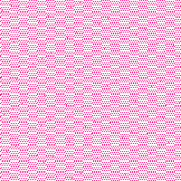](images/psdview/psd-zoo/blend_mode/dissolve.png) | [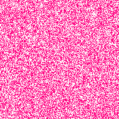](images/qtquick/psd-zoo/blend_mode/dissolve.png) |  |  |
| [divide.psd](https://github.com/signal-slot/psd-zoo/tree/main/blend_mode/divide.psd) | 91.37% | [91.37%](exports/psd-zoo/blend_mode/divide/QtQuick/) | [91.37%](exports/psd-zoo/blend_mode/divide/Slint/) | [91.37%](exports/psd-zoo/blend_mode/divide/Flutter/) |
|  |  |  |  |  |
| [exclusion.psd](https://github.com/signal-slot/psd-zoo/tree/main/blend_mode/exclusion.psd) | 100.00% | [0.00%](exports/psd-zoo/blend_mode/exclusion/QtQuick/) | [0.00%](exports/psd-zoo/blend_mode/exclusion/Slint/) | [0.00%](exports/psd-zoo/blend_mode/exclusion/Flutter/) |
|  |  |  |  |  |
| [hardlight.psd](https://github.com/signal-slot/psd-zoo/tree/main/blend_mode/hardlight.psd) | 100.00% | [0.00%](exports/psd-zoo/blend_mode/hardlight/QtQuick/) | [0.00%](exports/psd-zoo/blend_mode/hardlight/Slint/) | [0.00%](exports/psd-zoo/blend_mode/hardlight/Flutter/) |
|  |  |  |  |  |
| [hardmix.psd](https://github.com/signal-slot/psd-zoo/tree/main/blend_mode/hardmix.psd) | 0.00% | [0.00%](exports/psd-zoo/blend_mode/hardmix/QtQuick/) | [0.00%](exports/psd-zoo/blend_mode/hardmix/Slint/) | [0.00%](exports/psd-zoo/blend_mode/hardmix/Flutter/) |
|  |  |  |  |  |
| [hue.psd](https://github.com/signal-slot/psd-zoo/tree/main/blend_mode/hue.psd) | 0.00% | [0.00%](exports/psd-zoo/blend_mode/hue/QtQuick/) | [0.00%](exports/psd-zoo/blend_mode/hue/Slint/) | [0.00%](exports/psd-zoo/blend_mode/hue/Flutter/) |
|  |  |  |  |  |
| [lighten.psd](https://github.com/signal-slot/psd-zoo/tree/main/blend_mode/lighten.psd) | 100.00% | [0.00%](exports/psd-zoo/blend_mode/lighten/QtQuick/) | [0.00%](exports/psd-zoo/blend_mode/lighten/Slint/) | [0.00%](exports/psd-zoo/blend_mode/lighten/Flutter/) |
|  |  |  |  |  |
| [lightercolor.psd](https://github.com/signal-slot/psd-zoo/tree/main/blend_mode/lightercolor.psd) | 0.00% | [0.00%](exports/psd-zoo/blend_mode/lightercolor/QtQuick/) | [0.00%](exports/psd-zoo/blend_mode/lightercolor/Slint/) | [0.00%](exports/psd-zoo/blend_mode/lightercolor/Flutter/) |
|  |  |  |  |  |
| [linearburn.psd](https://github.com/signal-slot/psd-zoo/tree/main/blend_mode/linearburn.psd) | 100.00% | [100.00%](exports/psd-zoo/blend_mode/linearburn/QtQuick/) | [100.00%](exports/psd-zoo/blend_mode/linearburn/Slint/) | [100.00%](exports/psd-zoo/blend_mode/linearburn/Flutter/) |
|  |  |  |  |  |
| [lineardodge.psd](https://github.com/signal-slot/psd-zoo/tree/main/blend_mode/lineardodge.psd) | 0.00% | [0.00%](exports/psd-zoo/blend_mode/lineardodge/QtQuick/) | [0.00%](exports/psd-zoo/blend_mode/lineardodge/Slint/) | [0.00%](exports/psd-zoo/blend_mode/lineardodge/Flutter/) |
|  |  |  |  |  |
| [linearlight.psd](https://github.com/signal-slot/psd-zoo/tree/main/blend_mode/linearlight.psd) | 0.00% | [0.00%](exports/psd-zoo/blend_mode/linearlight/QtQuick/) | [0.00%](exports/psd-zoo/blend_mode/linearlight/Slint/) | [0.00%](exports/psd-zoo/blend_mode/linearlight/Flutter/) |
|  |  |  |  |  |
| [luminosity.psd](https://github.com/signal-slot/psd-zoo/tree/main/blend_mode/luminosity.psd) | 0.00% | [0.00%](exports/psd-zoo/blend_mode/luminosity/QtQuick/) | [0.00%](exports/psd-zoo/blend_mode/luminosity/Slint/) | [0.00%](exports/psd-zoo/blend_mode/luminosity/Flutter/) |
|  |  |  |  |  |
| [multiply.psd](https://github.com/signal-slot/psd-zoo/tree/main/blend_mode/multiply.psd) | 100.00% | [100.00%](exports/psd-zoo/blend_mode/multiply/QtQuick/) | [100.00%](exports/psd-zoo/blend_mode/multiply/Slint/) | [100.00%](exports/psd-zoo/blend_mode/multiply/Flutter/) |
|  |  |  |  |  |
| [opacity_fill_blend_combined.psd](https://github.com/signal-slot/psd-zoo/tree/main/blend_mode/opacity_fill_blend_combined.psd) | 98.64% | [0.00%](exports/psd-zoo/blend_mode/opacity_fill_blend_combined/QtQuick/) | [0.00%](exports/psd-zoo/blend_mode/opacity_fill_blend_combined/Slint/) | [0.00%](exports/psd-zoo/blend_mode/opacity_fill_blend_combined/Flutter/) |
|  |  |  |  |  |
| [overlay.psd](https://github.com/signal-slot/psd-zoo/tree/main/blend_mode/overlay.psd) | 100.00% | [0.00%](exports/psd-zoo/blend_mode/overlay/QtQuick/) | [0.00%](exports/psd-zoo/blend_mode/overlay/Slint/) | [0.00%](exports/psd-zoo/blend_mode/overlay/Flutter/) |
|  |  |  |  |  |
| [pinlight.psd](https://github.com/signal-slot/psd-zoo/tree/main/blend_mode/pinlight.psd) | 0.00% | [0.00%](exports/psd-zoo/blend_mode/pinlight/QtQuick/) | [0.00%](exports/psd-zoo/blend_mode/pinlight/Slint/) | [0.00%](exports/psd-zoo/blend_mode/pinlight/Flutter/) |
|  |  |  |  |  |
| [saturation.psd](https://github.com/signal-slot/psd-zoo/tree/main/blend_mode/saturation.psd) | 0.00% | [0.00%](exports/psd-zoo/blend_mode/saturation/QtQuick/) | [0.00%](exports/psd-zoo/blend_mode/saturation/Slint/) | [0.00%](exports/psd-zoo/blend_mode/saturation/Flutter/) |
|  |  |  |  |  |
| [screen.psd](https://github.com/signal-slot/psd-zoo/tree/main/blend_mode/screen.psd) | 100.00% | [0.00%](exports/psd-zoo/blend_mode/screen/QtQuick/) | [0.00%](exports/psd-zoo/blend_mode/screen/Slint/) | [0.00%](exports/psd-zoo/blend_mode/screen/Flutter/) |
|  |  |  |  |  |
| [softlight.psd](https://github.com/signal-slot/psd-zoo/tree/main/blend_mode/softlight.psd) | 100.00% | [0.00%](exports/psd-zoo/blend_mode/softlight/QtQuick/) | [0.00%](exports/psd-zoo/blend_mode/softlight/Slint/) | [0.00%](exports/psd-zoo/blend_mode/softlight/Flutter/) |
|  |  |  |  |  |
| [subtract.psd](https://github.com/signal-slot/psd-zoo/tree/main/blend_mode/subtract.psd) | 0.00% | [0.00%](exports/psd-zoo/blend_mode/subtract/QtQuick/) | [0.00%](exports/psd-zoo/blend_mode/subtract/Slint/) | [0.00%](exports/psd-zoo/blend_mode/subtract/Flutter/) |
|  |  |  |  |  |
| [vividlight.psd](https://github.com/signal-slot/psd-zoo/tree/main/blend_mode/vividlight.psd) | 0.00% | [0.00%](exports/psd-zoo/blend_mode/vividlight/QtQuick/) | [0.00%](exports/psd-zoo/blend_mode/vividlight/Slint/) | [0.00%](exports/psd-zoo/blend_mode/vividlight/Flutter/) |
|  |  |  |  |  |

## canvas

| Image Data | QPsdView | QtQuick | Slint | Flutter |
|---:|---:|---:|---:|---:|
| [1024.psd](https://github.com/signal-slot/psd-zoo/tree/main/canvas/1024.psd) | 100.00% | [100.00%](exports/psd-zoo/canvas/1024/QtQuick/) | [100.00%](exports/psd-zoo/canvas/1024/Slint/) | [100.00%](exports/psd-zoo/canvas/1024/Flutter/) |
|  |  |  |  |  |
| [1x1.psd](https://github.com/signal-slot/psd-zoo/tree/main/canvas/1x1.psd) | 100.00% | [100.00%](exports/psd-zoo/canvas/1x1/QtQuick/) | [97.49%](exports/psd-zoo/canvas/1x1/Slint/) | [100.00%](exports/psd-zoo/canvas/1x1/Flutter/) |
|  |  |  |  |  |
| [1x1_rgb.psd](https://github.com/signal-slot/psd-zoo/tree/main/canvas/1x1_rgb.psd) | 100.00% | [100.00%](exports/psd-zoo/canvas/1x1_rgb/QtQuick/) | [100.00%](exports/psd-zoo/canvas/1x1_rgb/Slint/) | [100.00%](exports/psd-zoo/canvas/1x1_rgb/Flutter/) |
|  |  |  |  |  |
| [4000.psd](https://github.com/signal-slot/psd-zoo/tree/main/canvas/4000.psd) | 100.00% | [0.00%](exports/psd-zoo/canvas/4000/QtQuick/) | [0.00%](exports/psd-zoo/canvas/4000/Slint/) | [100.00%](exports/psd-zoo/canvas/4000/Flutter/) |
|  |  |  |  |  |
| [4000x3000.psd](https://github.com/signal-slot/psd-zoo/tree/main/canvas/4000x3000.psd) | 100.00% | [0.00%](exports/psd-zoo/canvas/4000x3000/QtQuick/) | [0.00%](exports/psd-zoo/canvas/4000x3000/Slint/) | [100.00%](exports/psd-zoo/canvas/4000x3000/Flutter/) |
|  |  |  |  |  |
| [512.psd](https://github.com/signal-slot/psd-zoo/tree/main/canvas/512.psd) | 100.00% | [100.00%](exports/psd-zoo/canvas/512/QtQuick/) | [100.00%](exports/psd-zoo/canvas/512/Slint/) | [100.00%](exports/psd-zoo/canvas/512/Flutter/) |
|  |  |  |  |  |
| [landscape.psd](https://github.com/signal-slot/psd-zoo/tree/main/canvas/landscape.psd) | 20.54% | [0.00%](exports/psd-zoo/canvas/landscape/QtQuick/) | [0.00%](exports/psd-zoo/canvas/landscape/Slint/) | MISSING |
|  | [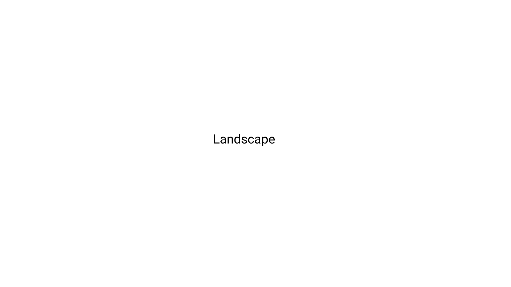](images/psdview/psd-zoo/canvas/landscape.png) | [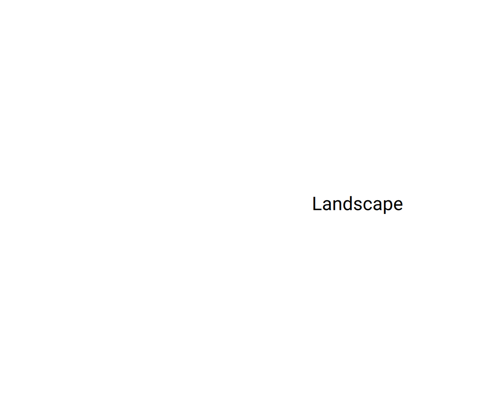](images/qtquick/psd-zoo/canvas/landscape.png) | [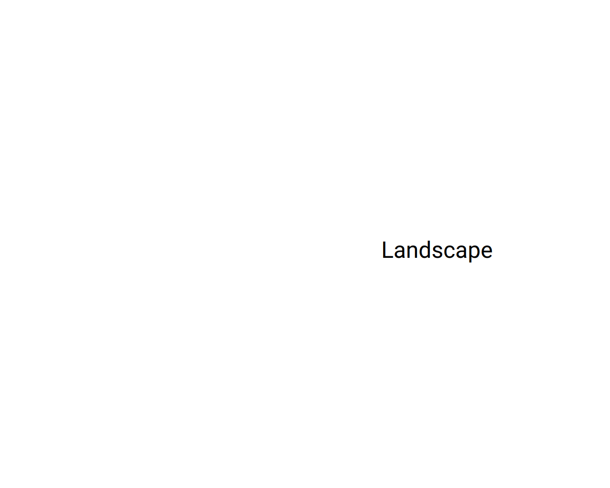](images/slint/psd-zoo/canvas/landscape.png) | - |
| [large.psd](https://github.com/signal-slot/psd-zoo/tree/main/canvas/large.psd) | 19.16% | [0.00%](exports/psd-zoo/canvas/large/QtQuick/) | [0.00%](exports/psd-zoo/canvas/large/Slint/) | MISSING |
|  |  | [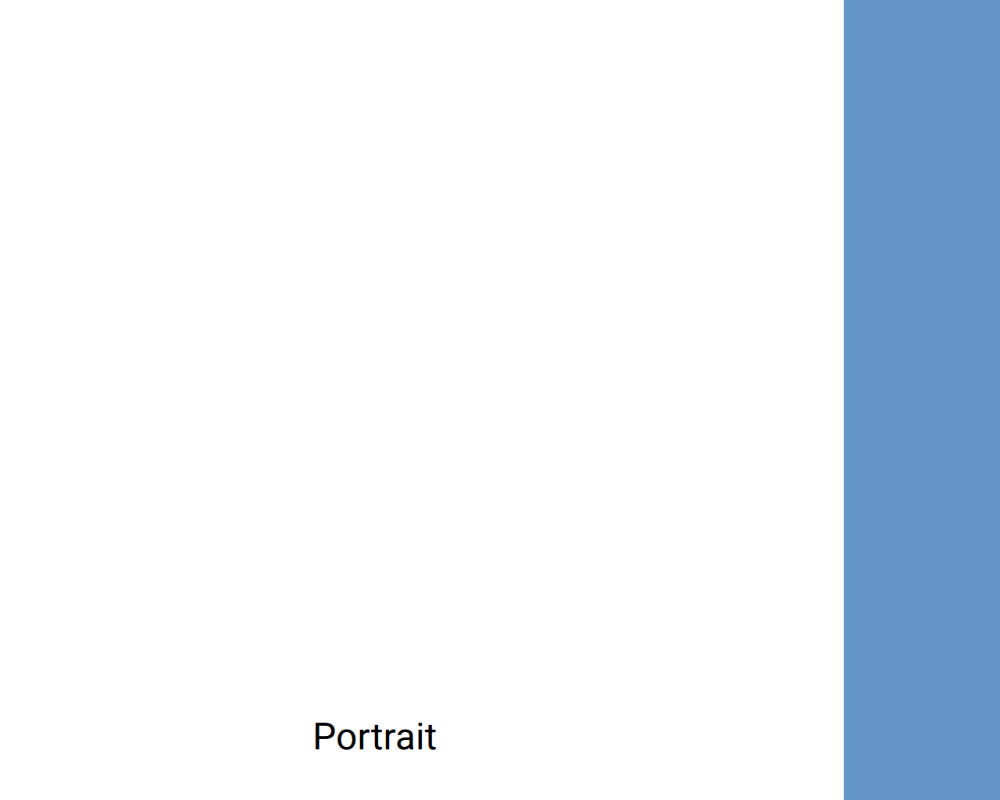](images/qtquick/psd-zoo/canvas/large.png) |  | - |
| [no_background.psd](https://github.com/signal-slot/psd-zoo/tree/main/canvas/no_background.psd) | 100.00% | [100.00%](exports/psd-zoo/canvas/no_background/QtQuick/) | [100.00%](exports/psd-zoo/canvas/no_background/Slint/) | [100.00%](exports/psd-zoo/canvas/no_background/Flutter/) |
|  |  |  |  |  |
| [portrait.psd](https://github.com/signal-slot/psd-zoo/tree/main/canvas/portrait.psd) | 21.93% | [0.00%](exports/psd-zoo/canvas/portrait/QtQuick/) | [0.00%](exports/psd-zoo/canvas/portrait/Slint/) | MISSING |
|  |  | [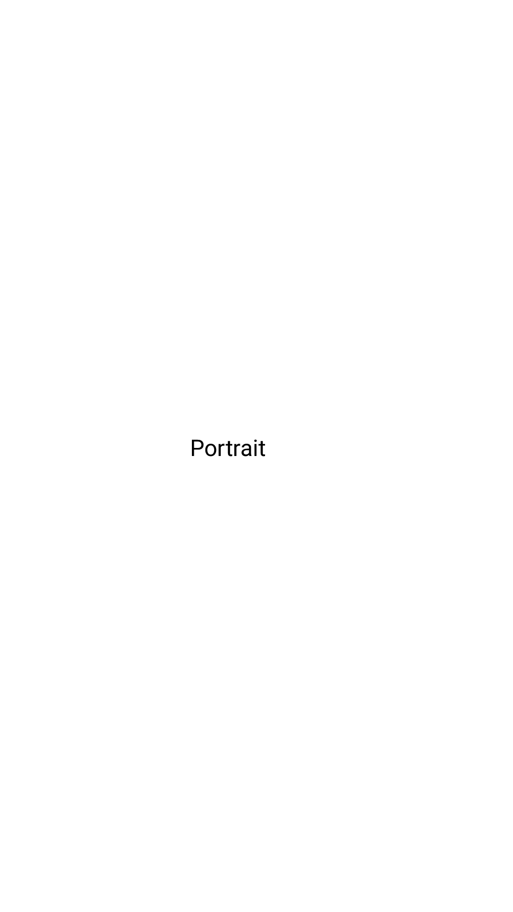](images/qtquick/psd-zoo/canvas/portrait.png) | [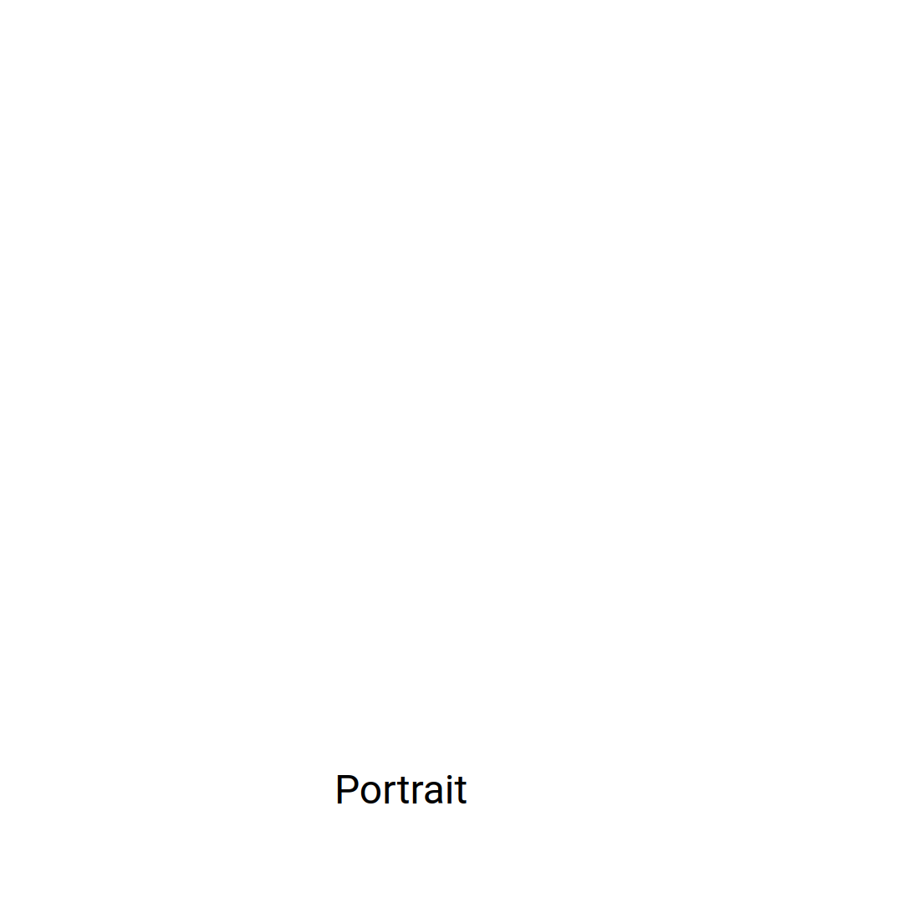](images/slint/psd-zoo/canvas/portrait.png) | - |
| [purple_bg.psd](https://github.com/signal-slot/psd-zoo/tree/main/canvas/purple_bg.psd) | 100.00% | [100.00%](exports/psd-zoo/canvas/purple_bg/QtQuick/) | [100.00%](exports/psd-zoo/canvas/purple_bg/Slint/) | [100.00%](exports/psd-zoo/canvas/purple_bg/Flutter/) |
|  |  |  |  |  |
| [tall.psd](https://github.com/signal-slot/psd-zoo/tree/main/canvas/tall.psd) | 100.00% | [0.00%](exports/psd-zoo/canvas/tall/QtQuick/) | [0.00%](exports/psd-zoo/canvas/tall/Slint/) | [100.00%](exports/psd-zoo/canvas/tall/Flutter/) |
|  |  |  |  |  |
| [transparent.psd](https://github.com/signal-slot/psd-zoo/tree/main/canvas/transparent.psd) | 100.00% | [100.00%](exports/psd-zoo/canvas/transparent/QtQuick/) | [100.00%](exports/psd-zoo/canvas/transparent/Slint/) | [100.00%](exports/psd-zoo/canvas/transparent/Flutter/) |
|  |  |  |  |  |
| [transparent_background.psd](https://github.com/signal-slot/psd-zoo/tree/main/canvas/transparent_background.psd) | 100.00% | [100.00%](exports/psd-zoo/canvas/transparent_background/QtQuick/) | [98.12%](exports/psd-zoo/canvas/transparent_background/Slint/) | [100.00%](exports/psd-zoo/canvas/transparent_background/Flutter/) |
|  |  |  | [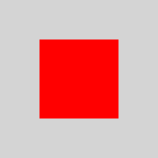](images/slint/psd-zoo/canvas/transparent_background.png) | [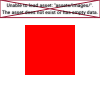](images/flutter/psd-zoo/canvas/transparent_background.png) |
| [wide.psd](https://github.com/signal-slot/psd-zoo/tree/main/canvas/wide.psd) | 100.00% | [0.00%](exports/psd-zoo/canvas/wide/QtQuick/) | [0.00%](exports/psd-zoo/canvas/wide/Slint/) | [100.00%](exports/psd-zoo/canvas/wide/Flutter/) |
|  |  |  |  |  |

## channel

| Image Data | QPsdView | QtQuick | Slint | Flutter |
|---:|---:|---:|---:|---:|
| [alpha.psd](https://github.com/signal-slot/psd-zoo/tree/main/channel/alpha.psd) | 25.00% | [25.00%](exports/psd-zoo/channel/alpha/QtQuick/) | [25.00%](exports/psd-zoo/channel/alpha/Slint/) | [25.00%](exports/psd-zoo/channel/alpha/Flutter/) |
|  |  |  |  |  |
| [multiple_alpha.psd](https://github.com/signal-slot/psd-zoo/tree/main/channel/multiple_alpha.psd) | 0.00% | [0.00%](exports/psd-zoo/channel/multiple_alpha/QtQuick/) | [0.00%](exports/psd-zoo/channel/multiple_alpha/Slint/) | [0.00%](exports/psd-zoo/channel/multiple_alpha/Flutter/) |
|  |  |  |  |  |
| [selection.psd](https://github.com/signal-slot/psd-zoo/tree/main/channel/selection.psd) | 25.00% | [25.00%](exports/psd-zoo/channel/selection/QtQuick/) | [25.00%](exports/psd-zoo/channel/selection/Slint/) | [25.00%](exports/psd-zoo/channel/selection/Flutter/) |
|  |  |  |  |  |
| [spot_color.psd](https://github.com/signal-slot/psd-zoo/tree/main/channel/spot_color.psd) | 0.00% | [0.00%](exports/psd-zoo/channel/spot_color/QtQuick/) | [0.00%](exports/psd-zoo/channel/spot_color/Slint/) | [0.00%](exports/psd-zoo/channel/spot_color/Flutter/) |
|  |  |  |  |  |

## color_mode

| Image Data | QPsdView | QtQuick | Slint | Flutter |
|---:|---:|---:|---:|---:|
| [bitmap_1bit.psd](https://github.com/signal-slot/psd-zoo/tree/main/color_mode/bitmap_1bit.psd) | 100.00% | [0.00%](exports/psd-zoo/color_mode/bitmap_1bit/QtQuick/) | [25.38%](exports/psd-zoo/color_mode/bitmap_1bit/Slint/) | [0.00%](exports/psd-zoo/color_mode/bitmap_1bit/Flutter/) |
|  |  |  | [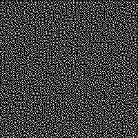](images/slint/psd-zoo/color_mode/bitmap_1bit.png) |  |
| [bitmap_mode.psd](https://github.com/signal-slot/psd-zoo/tree/main/color_mode/bitmap_mode.psd) | 100.00% | [100.00%](exports/psd-zoo/color_mode/bitmap_mode/QtQuick/) | [97.49%](exports/psd-zoo/color_mode/bitmap_mode/Slint/) | [100.00%](exports/psd-zoo/color_mode/bitmap_mode/Flutter/) |
|  |  |  |  |  |
| [cmyk_16bit.psd](https://github.com/signal-slot/psd-zoo/tree/main/color_mode/cmyk_16bit.psd) | 100.00% | [100.00%](exports/psd-zoo/color_mode/cmyk_16bit/QtQuick/) | [97.49%](exports/psd-zoo/color_mode/cmyk_16bit/Slint/) | [100.00%](exports/psd-zoo/color_mode/cmyk_16bit/Flutter/) |
|  |  |  |  |  |
| [cmyk_mode.psd](https://github.com/signal-slot/psd-zoo/tree/main/color_mode/cmyk_mode.psd) | 100.00% | [100.00%](exports/psd-zoo/color_mode/cmyk_mode/QtQuick/) | [100.00%](exports/psd-zoo/color_mode/cmyk_mode/Slint/) | [100.00%](exports/psd-zoo/color_mode/cmyk_mode/Flutter/) |
|  |  |  |  |  |
| [cmyk_with_color.psd](https://github.com/signal-slot/psd-zoo/tree/main/color_mode/cmyk_with_color.psd) | 100.00% | [100.00%](exports/psd-zoo/color_mode/cmyk_with_color/QtQuick/) | [100.00%](exports/psd-zoo/color_mode/cmyk_with_color/Slint/) | [100.00%](exports/psd-zoo/color_mode/cmyk_with_color/Flutter/) |
|  |  |  |  |  |
| [depth_16bit.psd](https://github.com/signal-slot/psd-zoo/tree/main/color_mode/depth_16bit.psd) | 100.00% | [100.00%](exports/psd-zoo/color_mode/depth_16bit/QtQuick/) | [97.49%](exports/psd-zoo/color_mode/depth_16bit/Slint/) | [100.00%](exports/psd-zoo/color_mode/depth_16bit/Flutter/) |
|  |  |  |  |  |
| [depth_16bit_layers.psd](https://github.com/signal-slot/psd-zoo/tree/main/color_mode/depth_16bit_layers.psd) | 100.00% | [0.00%](exports/psd-zoo/color_mode/depth_16bit_layers/QtQuick/) | [0.00%](exports/psd-zoo/color_mode/depth_16bit_layers/Slint/) | [0.00%](exports/psd-zoo/color_mode/depth_16bit_layers/Flutter/) |
|  |  |  |  |  |
| [depth_32bit.psd](https://github.com/signal-slot/psd-zoo/tree/main/color_mode/depth_32bit.psd) | 100.00% | [100.00%](exports/psd-zoo/color_mode/depth_32bit/QtQuick/) | [97.49%](exports/psd-zoo/color_mode/depth_32bit/Slint/) | [100.00%](exports/psd-zoo/color_mode/depth_32bit/Flutter/) |
|  |  |  |  |  |
| [depth_32bit_layers.psd](https://github.com/signal-slot/psd-zoo/tree/main/color_mode/depth_32bit_layers.psd) | 100.00% | [0.00%](exports/psd-zoo/color_mode/depth_32bit_layers/QtQuick/) | [0.00%](exports/psd-zoo/color_mode/depth_32bit_layers/Slint/) | [0.00%](exports/psd-zoo/color_mode/depth_32bit_layers/Flutter/) |
|  |  |  |  |  |
| [grayscale_16bit.psd](https://github.com/signal-slot/psd-zoo/tree/main/color_mode/grayscale_16bit.psd) | 100.00% | [0.00%](exports/psd-zoo/color_mode/grayscale_16bit/QtQuick/) | [0.00%](exports/psd-zoo/color_mode/grayscale_16bit/Slint/) | [0.00%](exports/psd-zoo/color_mode/grayscale_16bit/Flutter/) |
|  |  |  |  |  |
| [grayscale_alpha.psd](https://github.com/signal-slot/psd-zoo/tree/main/color_mode/grayscale_alpha.psd) | 100.00% | [100.00%](exports/psd-zoo/color_mode/grayscale_alpha/QtQuick/) | [100.00%](exports/psd-zoo/color_mode/grayscale_alpha/Slint/) | [100.00%](exports/psd-zoo/color_mode/grayscale_alpha/Flutter/) |
|  |  |  |  |  |
| [grayscale_mode.psd](https://github.com/signal-slot/psd-zoo/tree/main/color_mode/grayscale_mode.psd) | 100.00% | [100.00%](exports/psd-zoo/color_mode/grayscale_mode/QtQuick/) | [100.00%](exports/psd-zoo/color_mode/grayscale_mode/Slint/) | [100.00%](exports/psd-zoo/color_mode/grayscale_mode/Flutter/) |
|  |  |  |  |  |
| [indexed_color.psd](https://github.com/signal-slot/psd-zoo/tree/main/color_mode/indexed_color.psd) | 100.00% | [0.00%](exports/psd-zoo/color_mode/indexed_color/QtQuick/) | [0.00%](exports/psd-zoo/color_mode/indexed_color/Slint/) | [0.00%](exports/psd-zoo/color_mode/indexed_color/Flutter/) |
|  |  |  |  |  |
| [lab_mode.psd](https://github.com/signal-slot/psd-zoo/tree/main/color_mode/lab_mode.psd) | 100.00% | [100.00%](exports/psd-zoo/color_mode/lab_mode/QtQuick/) | [100.00%](exports/psd-zoo/color_mode/lab_mode/Slint/) | [100.00%](exports/psd-zoo/color_mode/lab_mode/Flutter/) |
|  |  |  |  |  |
| [lab_with_layers.psd](https://github.com/signal-slot/psd-zoo/tree/main/color_mode/lab_with_layers.psd) | 100.00% | [100.00%](exports/psd-zoo/color_mode/lab_with_layers/QtQuick/) | [100.00%](exports/psd-zoo/color_mode/lab_with_layers/Slint/) | [100.00%](exports/psd-zoo/color_mode/lab_with_layers/Flutter/) |
|  |  |  |  |  |
| [multichannel_mode.psd](https://github.com/signal-slot/psd-zoo/tree/main/color_mode/multichannel_mode.psd) | 100.00% | [0.00%](exports/psd-zoo/color_mode/multichannel_mode/QtQuick/) | [0.00%](exports/psd-zoo/color_mode/multichannel_mode/Slint/) | [0.00%](exports/psd-zoo/color_mode/multichannel_mode/Flutter/) |
|  |  |  |  |  |

## document

| Image Data | QPsdView | QtQuick | Slint | Flutter |
|---:|---:|---:|---:|---:|
| [artboard.psd](https://github.com/signal-slot/psd-zoo/tree/main/document/artboard.psd) | 100.00% | [100.00%](exports/psd-zoo/document/artboard/QtQuick/) | [97.49%](exports/psd-zoo/document/artboard/Slint/) | [100.00%](exports/psd-zoo/document/artboard/Flutter/) |
|  |  |  |  |  |
| [blank_document.psd](https://github.com/signal-slot/psd-zoo/tree/main/document/blank_document.psd) | 100.00% | [100.00%](exports/psd-zoo/document/blank_document/QtQuick/) | [97.49%](exports/psd-zoo/document/blank_document/Slint/) | [100.00%](exports/psd-zoo/document/blank_document/Flutter/) |
|  |  |  |  |  |
| [dpi_300.psd](https://github.com/signal-slot/psd-zoo/tree/main/document/dpi_300.psd) | 17.45% | [12.71%](exports/psd-zoo/document/dpi_300/QtQuick/) | [12.71%](exports/psd-zoo/document/dpi_300/Slint/) | MISSING |
|  | [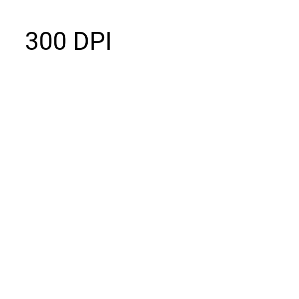](images/psdview/psd-zoo/document/dpi_300.png) |  | [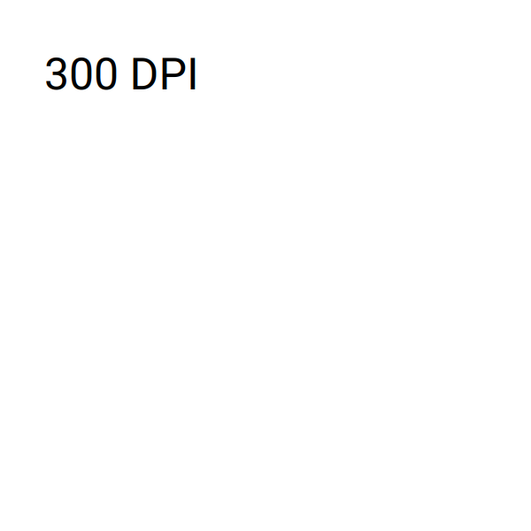](images/slint/psd-zoo/document/dpi_300.png) | - |
| [flattened.psd](https://github.com/signal-slot/psd-zoo/tree/main/document/flattened.psd) | 100.00% | [0.00%](exports/psd-zoo/document/flattened/QtQuick/) | [0.00%](exports/psd-zoo/document/flattened/Slint/) | [0.00%](exports/psd-zoo/document/flattened/Flutter/) |
|  |  |  |  |  |
| [flattened_bg.psd](https://github.com/signal-slot/psd-zoo/tree/main/document/flattened_bg.psd) | 100.00% | [0.00%](exports/psd-zoo/document/flattened_bg/QtQuick/) | [0.00%](exports/psd-zoo/document/flattened_bg/Slint/) | [0.00%](exports/psd-zoo/document/flattened_bg/Flutter/) |
|  |  |  |  |  |
| [foreground_background_color.psd](https://github.com/signal-slot/psd-zoo/tree/main/document/foreground_background_color.psd) | 100.00% | [100.00%](exports/psd-zoo/document/foreground_background_color/QtQuick/) | [100.00%](exports/psd-zoo/document/foreground_background_color/Slint/) | [100.00%](exports/psd-zoo/document/foreground_background_color/Flutter/) |
|  |  |  |  |  |
| [guides.psd](https://github.com/signal-slot/psd-zoo/tree/main/document/guides.psd) | 100.00% | [100.00%](exports/psd-zoo/document/guides/QtQuick/) | [97.49%](exports/psd-zoo/document/guides/Slint/) | [100.00%](exports/psd-zoo/document/guides/Flutter/) |
|  |  |  |  |  |
| [guides_grid.psd](https://github.com/signal-slot/psd-zoo/tree/main/document/guides_grid.psd) | 100.00% | [100.00%](exports/psd-zoo/document/guides_grid/QtQuick/) | [97.49%](exports/psd-zoo/document/guides_grid/Slint/) | [100.00%](exports/psd-zoo/document/guides_grid/Flutter/) |
|  |  |  |  |  |
| [guides_hv.psd](https://github.com/signal-slot/psd-zoo/tree/main/document/guides_hv.psd) | 100.00% | [100.00%](exports/psd-zoo/document/guides_hv/QtQuick/) | [100.00%](exports/psd-zoo/document/guides_hv/Slint/) | [100.00%](exports/psd-zoo/document/guides_hv/Flutter/) |
|  |  |  |  |  |
| [guides_multiple.psd](https://github.com/signal-slot/psd-zoo/tree/main/document/guides_multiple.psd) | 100.00% | [100.00%](exports/psd-zoo/document/guides_multiple/QtQuick/) | [97.49%](exports/psd-zoo/document/guides_multiple/Slint/) | [100.00%](exports/psd-zoo/document/guides_multiple/Flutter/) |
|  |  |  |  |  |
| [high_resolution.psd](https://github.com/signal-slot/psd-zoo/tree/main/document/high_resolution.psd) | 17.03% | [5.72%](exports/psd-zoo/document/high_resolution/QtQuick/) | [5.72%](exports/psd-zoo/document/high_resolution/Slint/) | MISSING |
|  |  | [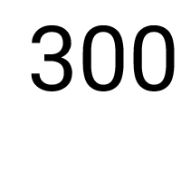](images/qtquick/psd-zoo/document/high_resolution.png) |  | - |
| [icc_adobe_rgb.psd](https://github.com/signal-slot/psd-zoo/tree/main/document/icc_adobe_rgb.psd) | 100.00% | [100.00%](exports/psd-zoo/document/icc_adobe_rgb/QtQuick/) | [100.00%](exports/psd-zoo/document/icc_adobe_rgb/Slint/) | [100.00%](exports/psd-zoo/document/icc_adobe_rgb/Flutter/) |
|  |  |  |  |  |
| [icc_none.psd](https://github.com/signal-slot/psd-zoo/tree/main/document/icc_none.psd) | 100.00% | [100.00%](exports/psd-zoo/document/icc_none/QtQuick/) | [100.00%](exports/psd-zoo/document/icc_none/Slint/) | [100.00%](exports/psd-zoo/document/icc_none/Flutter/) |
|  |  |  |  |  |
| [icc_prophoto_rgb.psd](https://github.com/signal-slot/psd-zoo/tree/main/document/icc_prophoto_rgb.psd) | 100.00% | [100.00%](exports/psd-zoo/document/icc_prophoto_rgb/QtQuick/) | [100.00%](exports/psd-zoo/document/icc_prophoto_rgb/Slint/) | [100.00%](exports/psd-zoo/document/icc_prophoto_rgb/Flutter/) |
|  |  |  |  |  |
| [icc_srgb.psd](https://github.com/signal-slot/psd-zoo/tree/main/document/icc_srgb.psd) | 100.00% | [100.00%](exports/psd-zoo/document/icc_srgb/QtQuick/) | [100.00%](exports/psd-zoo/document/icc_srgb/Slint/) | [100.00%](exports/psd-zoo/document/icc_srgb/Flutter/) |
|  |  |  |  |  |
| [pixel_aspect_nonsquare.psd](https://github.com/signal-slot/psd-zoo/tree/main/document/pixel_aspect_nonsquare.psd) | 100.00% | [100.00%](exports/psd-zoo/document/pixel_aspect_nonsquare/QtQuick/) | [100.00%](exports/psd-zoo/document/pixel_aspect_nonsquare/Slint/) | [100.00%](exports/psd-zoo/document/pixel_aspect_nonsquare/Flutter/) |
|  |  |  |  |  |
| [resolution_150dpi.psd](https://github.com/signal-slot/psd-zoo/tree/main/document/resolution_150dpi.psd) | 14.40% | [8.78%](exports/psd-zoo/document/resolution_150dpi/QtQuick/) | [8.78%](exports/psd-zoo/document/resolution_150dpi/Slint/) | MISSING |
|  |  | [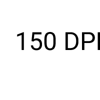](images/qtquick/psd-zoo/document/resolution_150dpi.png) | [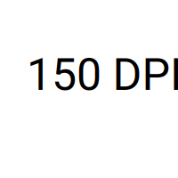](images/slint/psd-zoo/document/resolution_150dpi.png) | - |
| [resolution_600dpi.psd](https://github.com/signal-slot/psd-zoo/tree/main/document/resolution_600dpi.psd) | 35.51% | [3.32%](exports/psd-zoo/document/resolution_600dpi/QtQuick/) | [3.32%](exports/psd-zoo/document/resolution_600dpi/Slint/) | MISSING |
|  |  | [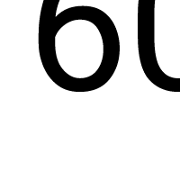](images/qtquick/psd-zoo/document/resolution_600dpi.png) |  | - |
| [resolution_96dpi.psd](https://github.com/signal-slot/psd-zoo/tree/main/document/resolution_96dpi.psd) | 100.00% | [100.00%](exports/psd-zoo/document/resolution_96dpi/QtQuick/) | [100.00%](exports/psd-zoo/document/resolution_96dpi/Slint/) | [100.00%](exports/psd-zoo/document/resolution_96dpi/Flutter/) |
|  |  |  |  |  |

## effect

| Image Data | QPsdView | QtQuick | Slint | Flutter |
|---:|---:|---:|---:|---:|
| [color_overlay.psd](https://github.com/signal-slot/psd-zoo/tree/main/effect/color_overlay.psd) | 100.00% | [0.00%](exports/psd-zoo/effect/color_overlay/QtQuick/) | [0.00%](exports/psd-zoo/effect/color_overlay/Slint/) | MISSING |
|  |  |  |  | - |
| [color_overlay_blendmode.psd](https://github.com/signal-slot/psd-zoo/tree/main/effect/color_overlay_blendmode.psd) | 0.00% | [0.00%](exports/psd-zoo/effect/color_overlay_blendmode/QtQuick/) | [0.00%](exports/psd-zoo/effect/color_overlay_blendmode/Slint/) | MISSING |
|  |  |  |  | - |
| [combined_3.psd](https://github.com/signal-slot/psd-zoo/tree/main/effect/combined_3.psd) | 86.46% | [87.02%](exports/psd-zoo/effect/combined_3/QtQuick/) | [87.02%](exports/psd-zoo/effect/combined_3/Slint/) | MISSING |
|  | [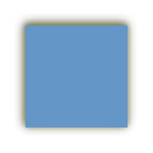](images/psdview/psd-zoo/effect/combined_3.png) |  |  | - |
| [disabled.psd](https://github.com/signal-slot/psd-zoo/tree/main/effect/disabled.psd) | 100.00% | [100.00%](exports/psd-zoo/effect/disabled/QtQuick/) | [100.00%](exports/psd-zoo/effect/disabled/Slint/) | MISSING |
|  |  |  |  | - |
| [drop_shadow.psd](https://github.com/signal-slot/psd-zoo/tree/main/effect/drop_shadow.psd) | 90.49% | [93.86%](exports/psd-zoo/effect/drop_shadow/QtQuick/) | [93.86%](exports/psd-zoo/effect/drop_shadow/Slint/) | MISSING |
|  |  |  |  | - |
| [drop_shadow_knockout.psd](https://github.com/signal-slot/psd-zoo/tree/main/effect/drop_shadow_knockout.psd) | 94.43% | [92.78%](exports/psd-zoo/effect/drop_shadow_knockout/QtQuick/) | [92.87%](exports/psd-zoo/effect/drop_shadow_knockout/Slint/) | MISSING |
| [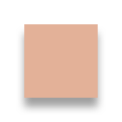](images/imagedata/psd-zoo/effect/drop_shadow_knockout.png) |  |  |  | - |
| [drop_shadow_noise.psd](https://github.com/signal-slot/psd-zoo/tree/main/effect/drop_shadow_noise.psd) | 100.00% | [100.00%](exports/psd-zoo/effect/drop_shadow_noise/QtQuick/) | [100.00%](exports/psd-zoo/effect/drop_shadow_noise/Slint/) | MISSING |
|  |  |  |  | - |
| [drop_shadow_spread.psd](https://github.com/signal-slot/psd-zoo/tree/main/effect/drop_shadow_spread.psd) | 100.00% | [100.00%](exports/psd-zoo/effect/drop_shadow_spread/QtQuick/) | [100.00%](exports/psd-zoo/effect/drop_shadow_spread/Slint/) | MISSING |
|  |  |  |  | - |
| [global_light.psd](https://github.com/signal-slot/psd-zoo/tree/main/effect/global_light.psd) | 100.00% | [100.00%](exports/psd-zoo/effect/global_light/QtQuick/) | [100.00%](exports/psd-zoo/effect/global_light/Slint/) | MISSING |
|  |  |  |  | - |
| [gradient_overlay.psd](https://github.com/signal-slot/psd-zoo/tree/main/effect/gradient_overlay.psd) | 98.21% | [0.00%](exports/psd-zoo/effect/gradient_overlay/QtQuick/) | [0.00%](exports/psd-zoo/effect/gradient_overlay/Slint/) | MISSING |
|  |  |  |  | - |
| [gradient_overlay2.psd](https://github.com/signal-slot/psd-zoo/tree/main/effect/gradient_overlay2.psd) | 98.21% | [0.00%](exports/psd-zoo/effect/gradient_overlay2/QtQuick/) | [0.00%](exports/psd-zoo/effect/gradient_overlay2/Slint/) | MISSING |
|  |  | [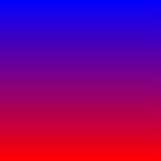](images/qtquick/psd-zoo/effect/gradient_overlay2.png) |  | - |
| [inner_glow.psd](https://github.com/signal-slot/psd-zoo/tree/main/effect/inner_glow.psd) | 86.47% | [86.47%](exports/psd-zoo/effect/inner_glow/QtQuick/) | [86.47%](exports/psd-zoo/effect/inner_glow/Slint/) | MISSING |
|  |  |  |  | - |
| [inner_glow_center.psd](https://github.com/signal-slot/psd-zoo/tree/main/effect/inner_glow_center.psd) | 0.02% | [0.02%](exports/psd-zoo/effect/inner_glow_center/QtQuick/) | [0.02%](exports/psd-zoo/effect/inner_glow_center/Slint/) | MISSING |
|  |  |  |  | - |
| [inner_shadow.psd](https://github.com/signal-slot/psd-zoo/tree/main/effect/inner_shadow.psd) | 90.21% | [94.92%](exports/psd-zoo/effect/inner_shadow/QtQuick/) | [94.92%](exports/psd-zoo/effect/inner_shadow/Slint/) | MISSING |
|  |  |  |  | - |
| [knockout_deep.psd](https://github.com/signal-slot/psd-zoo/tree/main/effect/knockout_deep.psd) | 100.00% | [100.00%](exports/psd-zoo/effect/knockout_deep/QtQuick/) | [100.00%](exports/psd-zoo/effect/knockout_deep/Slint/) | MISSING |
|  |  | [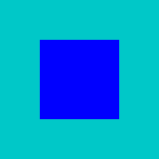](images/qtquick/psd-zoo/effect/knockout_deep.png) |  | - |
| [knockout_shallow.psd](https://github.com/signal-slot/psd-zoo/tree/main/effect/knockout_shallow.psd) | 100.00% | [100.00%](exports/psd-zoo/effect/knockout_shallow/QtQuick/) | [100.00%](exports/psd-zoo/effect/knockout_shallow/Slint/) | MISSING |
| [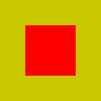](images/imagedata/psd-zoo/effect/knockout_shallow.png) |  |  |  | - |
| [multiple_effects.psd](https://github.com/signal-slot/psd-zoo/tree/main/effect/multiple_effects.psd) | 18.79% | [4.44%](exports/psd-zoo/effect/multiple_effects/QtQuick/) | [4.44%](exports/psd-zoo/effect/multiple_effects/Slint/) | MISSING |
|  |  |  | [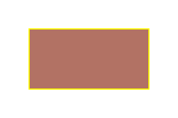](images/slint/psd-zoo/effect/multiple_effects.png) | - |
| [multiple_styled_layers.psd](https://github.com/signal-slot/psd-zoo/tree/main/effect/multiple_styled_layers.psd) | 94.22% | [95.47%](exports/psd-zoo/effect/multiple_styled_layers/QtQuick/) | [95.47%](exports/psd-zoo/effect/multiple_styled_layers/Slint/) | MISSING |
|  |  |  |  | - |
| [outer_glow.psd](https://github.com/signal-slot/psd-zoo/tree/main/effect/outer_glow.psd) | 100.00% | [100.00%](exports/psd-zoo/effect/outer_glow/QtQuick/) | [100.00%](exports/psd-zoo/effect/outer_glow/Slint/) | MISSING |
|  |  |  |  | - |
| [outer_glow_spread.psd](https://github.com/signal-slot/psd-zoo/tree/main/effect/outer_glow_spread.psd) | 100.00% | [100.00%](exports/psd-zoo/effect/outer_glow_spread/QtQuick/) | [100.00%](exports/psd-zoo/effect/outer_glow_spread/Slint/) | MISSING |
|  |  |  |  | - |
| [satin.psd](https://github.com/signal-slot/psd-zoo/tree/main/effect/satin.psd) | 15.98% | [15.98%](exports/psd-zoo/effect/satin/QtQuick/) | [15.98%](exports/psd-zoo/effect/satin/Slint/) | MISSING |
|  |  |  |  | - |
| [scaled.psd](https://github.com/signal-slot/psd-zoo/tree/main/effect/scaled.psd) | 90.49% | [93.86%](exports/psd-zoo/effect/scaled/QtQuick/) | [93.86%](exports/psd-zoo/effect/scaled/Slint/) | MISSING |
|  |  |  |  | - |
| [stroke_center.psd](https://github.com/signal-slot/psd-zoo/tree/main/effect/stroke_center.psd) | 96.04% | [96.04%](exports/psd-zoo/effect/stroke_center/QtQuick/) | [96.04%](exports/psd-zoo/effect/stroke_center/Slint/) | MISSING |
|  |  |  |  | - |
| [stroke_effect.psd](https://github.com/signal-slot/psd-zoo/tree/main/effect/stroke_effect.psd) | 99.95% | [91.61%](exports/psd-zoo/effect/stroke_effect/QtQuick/) | [91.61%](exports/psd-zoo/effect/stroke_effect/Slint/) | MISSING |
|  | [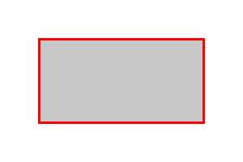](images/psdview/psd-zoo/effect/stroke_effect.png) |  |  | - |
| [stroke_gradient.psd](https://github.com/signal-slot/psd-zoo/tree/main/effect/stroke_gradient.psd) | 100.00% | [100.00%](exports/psd-zoo/effect/stroke_gradient/QtQuick/) | [100.00%](exports/psd-zoo/effect/stroke_gradient/Slint/) | MISSING |
|  |  |  |  | - |
| [stroke_inside.psd](https://github.com/signal-slot/psd-zoo/tree/main/effect/stroke_inside.psd) | 86.22% | [86.22%](exports/psd-zoo/effect/stroke_inside/QtQuick/) | [86.22%](exports/psd-zoo/effect/stroke_inside/Slint/) | MISSING |
|  |  |  | [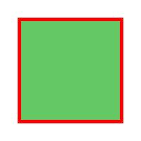](images/slint/psd-zoo/effect/stroke_inside.png) | - |
| [stroke_outside.psd](https://github.com/signal-slot/psd-zoo/tree/main/effect/stroke_outside.psd) | 99.88% | [87.96%](exports/psd-zoo/effect/stroke_outside/QtQuick/) | [87.96%](exports/psd-zoo/effect/stroke_outside/Slint/) | MISSING |
|  |  | [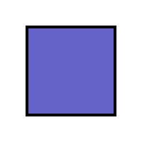](images/qtquick/psd-zoo/effect/stroke_outside.png) |  | - |

## fill

| Image Data | QPsdView | QtQuick | Slint | Flutter |
|---:|---:|---:|---:|---:|
| [gradient_angle.psd](https://github.com/signal-slot/psd-zoo/tree/main/fill/gradient_angle.psd) | 100.00% | [100.00%](exports/psd-zoo/fill/gradient_angle/QtQuick/) | [100.00%](exports/psd-zoo/fill/gradient_angle/Slint/) | [100.00%](exports/psd-zoo/fill/gradient_angle/Flutter/) |
|  | [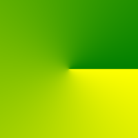](images/psdview/psd-zoo/fill/gradient_angle.png) | [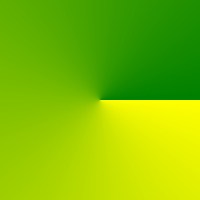](images/qtquick/psd-zoo/fill/gradient_angle.png) | [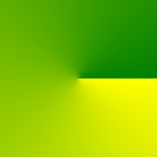](images/slint/psd-zoo/fill/gradient_angle.png) | [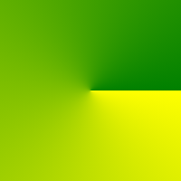](images/flutter/psd-zoo/fill/gradient_angle.png) |
| [gradient_diamond.psd](https://github.com/signal-slot/psd-zoo/tree/main/fill/gradient_diamond.psd) | 100.00% | [100.00%](exports/psd-zoo/fill/gradient_diamond/QtQuick/) | [100.00%](exports/psd-zoo/fill/gradient_diamond/Slint/) | [100.00%](exports/psd-zoo/fill/gradient_diamond/Flutter/) |
|  | [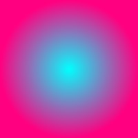](images/psdview/psd-zoo/fill/gradient_diamond.png) |  |  | [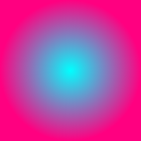](images/flutter/psd-zoo/fill/gradient_diamond.png) |
| [gradient_dither.psd](https://github.com/signal-slot/psd-zoo/tree/main/fill/gradient_dither.psd) | 100.00% | [100.00%](exports/psd-zoo/fill/gradient_dither/QtQuick/) | [100.00%](exports/psd-zoo/fill/gradient_dither/Slint/) | [100.00%](exports/psd-zoo/fill/gradient_dither/Flutter/) |
|  | [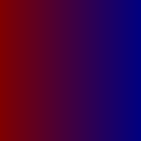](images/psdview/psd-zoo/fill/gradient_dither.png) |  |  | [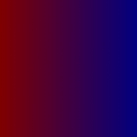](images/flutter/psd-zoo/fill/gradient_dither.png) |
| [gradient_linear.psd](https://github.com/signal-slot/psd-zoo/tree/main/fill/gradient_linear.psd) | 100.00% | [100.00%](exports/psd-zoo/fill/gradient_linear/QtQuick/) | [100.00%](exports/psd-zoo/fill/gradient_linear/Slint/) | [100.00%](exports/psd-zoo/fill/gradient_linear/Flutter/) |
|  |  |  |  | [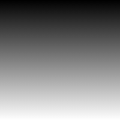](images/flutter/psd-zoo/fill/gradient_linear.png) |
| [gradient_opacity_stops.psd](https://github.com/signal-slot/psd-zoo/tree/main/fill/gradient_opacity_stops.psd) | 95.44% | [95.44%](exports/psd-zoo/fill/gradient_opacity_stops/QtQuick/) | [94.06%](exports/psd-zoo/fill/gradient_opacity_stops/Slint/) | [95.44%](exports/psd-zoo/fill/gradient_opacity_stops/Flutter/) |
|  |  |  |  |  |
| [gradient_radial.psd](https://github.com/signal-slot/psd-zoo/tree/main/fill/gradient_radial.psd) | 100.00% | [100.00%](exports/psd-zoo/fill/gradient_radial/QtQuick/) | [100.00%](exports/psd-zoo/fill/gradient_radial/Slint/) | [100.00%](exports/psd-zoo/fill/gradient_radial/Flutter/) |
|  |  | [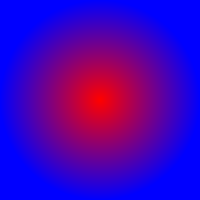](images/qtquick/psd-zoo/fill/gradient_radial.png) | [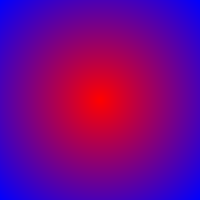](images/slint/psd-zoo/fill/gradient_radial.png) |  |
| [gradient_reflected.psd](https://github.com/signal-slot/psd-zoo/tree/main/fill/gradient_reflected.psd) | 100.00% | [100.00%](exports/psd-zoo/fill/gradient_reflected/QtQuick/) | [100.00%](exports/psd-zoo/fill/gradient_reflected/Slint/) | [100.00%](exports/psd-zoo/fill/gradient_reflected/Flutter/) |
|  | [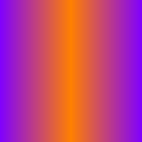](images/psdview/psd-zoo/fill/gradient_reflected.png) |  |  | [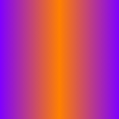](images/flutter/psd-zoo/fill/gradient_reflected.png) |
| [gradient_three_stops.psd](https://github.com/signal-slot/psd-zoo/tree/main/fill/gradient_three_stops.psd) | 100.00% | [100.00%](exports/psd-zoo/fill/gradient_three_stops/QtQuick/) | [100.00%](exports/psd-zoo/fill/gradient_three_stops/Slint/) | [100.00%](exports/psd-zoo/fill/gradient_three_stops/Flutter/) |
|  | [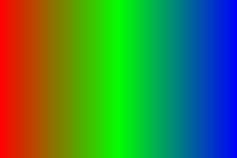](images/psdview/psd-zoo/fill/gradient_three_stops.png) | [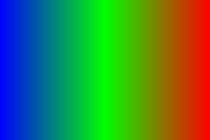](images/qtquick/psd-zoo/fill/gradient_three_stops.png) |  | [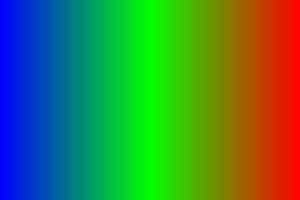](images/flutter/psd-zoo/fill/gradient_three_stops.png) |
| [multiple_solid_colors.psd](https://github.com/signal-slot/psd-zoo/tree/main/fill/multiple_solid_colors.psd) | 100.00% | [100.00%](exports/psd-zoo/fill/multiple_solid_colors/QtQuick/) | [100.00%](exports/psd-zoo/fill/multiple_solid_colors/Slint/) | [100.00%](exports/psd-zoo/fill/multiple_solid_colors/Flutter/) |
|  |  |  |  |  |
| [opacity.psd](https://github.com/signal-slot/psd-zoo/tree/main/fill/opacity.psd) | 99.88% | [100.00%](exports/psd-zoo/fill/opacity/QtQuick/) | [99.88%](exports/psd-zoo/fill/opacity/Slint/) | [100.00%](exports/psd-zoo/fill/opacity/Flutter/) |
|  |  |  |  |  |
| [opacity_1.psd](https://github.com/signal-slot/psd-zoo/tree/main/fill/opacity_1.psd) | 100.00% | [100.00%](exports/psd-zoo/fill/opacity_1/QtQuick/) | [100.00%](exports/psd-zoo/fill/opacity_1/Slint/) | [100.00%](exports/psd-zoo/fill/opacity_1/Flutter/) |
|  |  |  |  |  |
| [pattern.psd](https://github.com/signal-slot/psd-zoo/tree/main/fill/pattern.psd) | 100.00% | [100.00%](exports/psd-zoo/fill/pattern/QtQuick/) | [100.00%](exports/psd-zoo/fill/pattern/Slint/) | [100.00%](exports/psd-zoo/fill/pattern/Flutter/) |
|  |  |  |  | [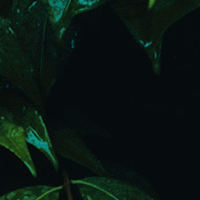](images/flutter/psd-zoo/fill/pattern.png) |
| [solid_color_fill.psd](https://github.com/signal-slot/psd-zoo/tree/main/fill/solid_color_fill.psd) | 100.00% | [100.00%](exports/psd-zoo/fill/solid_color_fill/QtQuick/) | [100.00%](exports/psd-zoo/fill/solid_color_fill/Slint/) | [100.00%](exports/psd-zoo/fill/solid_color_fill/Flutter/) |
|  |  |  |  |  |
| [vs_opacity.psd](https://github.com/signal-slot/psd-zoo/tree/main/fill/vs_opacity.psd) | 98.35% | [98.47%](exports/psd-zoo/fill/vs_opacity/QtQuick/) | [98.35%](exports/psd-zoo/fill/vs_opacity/Slint/) | [98.59%](exports/psd-zoo/fill/vs_opacity/Flutter/) |
|  |  |  |  |  |

## filter

| Image Data | QPsdView | QtQuick | Slint | Flutter |
|---:|---:|---:|---:|---:|
| [add_noise.psd](https://github.com/signal-slot/psd-zoo/tree/main/filter/add_noise.psd) | 100.00% | [100.00%](exports/psd-zoo/filter/add_noise/QtQuick/) | [100.00%](exports/psd-zoo/filter/add_noise/Slint/) | [100.00%](exports/psd-zoo/filter/add_noise/Flutter/) |
|  | [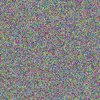](images/psdview/psd-zoo/filter/add_noise.png) |  |  |  |
| [emboss.psd](https://github.com/signal-slot/psd-zoo/tree/main/filter/emboss.psd) | 100.00% | [100.00%](exports/psd-zoo/filter/emboss/QtQuick/) | [100.00%](exports/psd-zoo/filter/emboss/Slint/) | [100.00%](exports/psd-zoo/filter/emboss/Flutter/) |
| [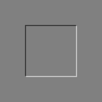](images/imagedata/psd-zoo/filter/emboss.png) |  | [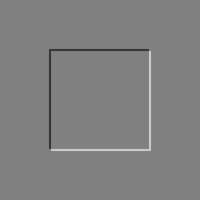](images/qtquick/psd-zoo/filter/emboss.png) |  |  |
| [gaussian_blur.psd](https://github.com/signal-slot/psd-zoo/tree/main/filter/gaussian_blur.psd) | 100.00% | [100.00%](exports/psd-zoo/filter/gaussian_blur/QtQuick/) | [100.00%](exports/psd-zoo/filter/gaussian_blur/Slint/) | [100.00%](exports/psd-zoo/filter/gaussian_blur/Flutter/) |
|  |  | [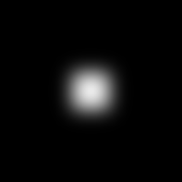](images/qtquick/psd-zoo/filter/gaussian_blur.png) |  |  |
| [median.psd](https://github.com/signal-slot/psd-zoo/tree/main/filter/median.psd) | 100.00% | [100.00%](exports/psd-zoo/filter/median/QtQuick/) | [100.00%](exports/psd-zoo/filter/median/Slint/) | [100.00%](exports/psd-zoo/filter/median/Flutter/) |
|  |  |  |  |  |
| [motion_blur.psd](https://github.com/signal-slot/psd-zoo/tree/main/filter/motion_blur.psd) | 100.00% | [100.00%](exports/psd-zoo/filter/motion_blur/QtQuick/) | [100.00%](exports/psd-zoo/filter/motion_blur/Slint/) | [100.00%](exports/psd-zoo/filter/motion_blur/Flutter/) |
|  |  |  |  |  |
| [radial_blur.psd](https://github.com/signal-slot/psd-zoo/tree/main/filter/radial_blur.psd) | 100.00% | [100.00%](exports/psd-zoo/filter/radial_blur/QtQuick/) | [100.00%](exports/psd-zoo/filter/radial_blur/Slint/) | [100.00%](exports/psd-zoo/filter/radial_blur/Flutter/) |
|  |  | [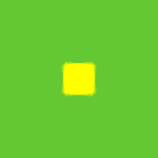](images/qtquick/psd-zoo/filter/radial_blur.png) |  |  |
| [spherize.psd](https://github.com/signal-slot/psd-zoo/tree/main/filter/spherize.psd) | 100.00% | [100.00%](exports/psd-zoo/filter/spherize/QtQuick/) | [100.00%](exports/psd-zoo/filter/spherize/Slint/) | [100.00%](exports/psd-zoo/filter/spherize/Flutter/) |
|  |  |  |  |  |
| [twirl.psd](https://github.com/signal-slot/psd-zoo/tree/main/filter/twirl.psd) | 100.00% | [100.00%](exports/psd-zoo/filter/twirl/QtQuick/) | [100.00%](exports/psd-zoo/filter/twirl/Slint/) | [100.00%](exports/psd-zoo/filter/twirl/Flutter/) |
|  |  |  |  | [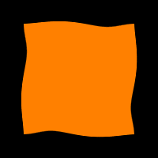](images/flutter/psd-zoo/filter/twirl.png) |
| [unsharp_mask.psd](https://github.com/signal-slot/psd-zoo/tree/main/filter/unsharp_mask.psd) | 100.00% | [100.00%](exports/psd-zoo/filter/unsharp_mask/QtQuick/) | [100.00%](exports/psd-zoo/filter/unsharp_mask/Slint/) | [100.00%](exports/psd-zoo/filter/unsharp_mask/Flutter/) |
|  |  |  |  |  |

## group

| Image Data | QPsdView | QtQuick | Slint | Flutter |
|---:|---:|---:|---:|---:|
| [blend_clipped.psd](https://github.com/signal-slot/psd-zoo/tree/main/group/blend_clipped.psd) | 100.00% | [100.00%](exports/psd-zoo/group/blend_clipped/QtQuick/) | [100.00%](exports/psd-zoo/group/blend_clipped/Slint/) | [100.00%](exports/psd-zoo/group/blend_clipped/Flutter/) |
|  |  |  |  |  |
| [blend_mode.psd](https://github.com/signal-slot/psd-zoo/tree/main/group/blend_mode.psd) | 94.00% | [92.02%](exports/psd-zoo/group/blend_mode/QtQuick/) | [0.00%](exports/psd-zoo/group/blend_mode/Slint/) | [0.00%](exports/psd-zoo/group/blend_mode/Flutter/) |
|  |  |  |  |  |
| [blend_multiply.psd](https://github.com/signal-slot/psd-zoo/tree/main/group/blend_multiply.psd) | 100.00% | [0.00%](exports/psd-zoo/group/blend_multiply/QtQuick/) | [0.00%](exports/psd-zoo/group/blend_multiply/Slint/) | [0.00%](exports/psd-zoo/group/blend_multiply/Flutter/) |
|  |  |  |  |  |
| [blend_normal.psd](https://github.com/signal-slot/psd-zoo/tree/main/group/blend_normal.psd) | 100.00% | [100.00%](exports/psd-zoo/group/blend_normal/QtQuick/) | [100.00%](exports/psd-zoo/group/blend_normal/Slint/) | [100.00%](exports/psd-zoo/group/blend_normal/Flutter/) |
|  |  |  |  |  |
| [deep_nesting_10.psd](https://github.com/signal-slot/psd-zoo/tree/main/group/deep_nesting_10.psd) | 100.00% | [100.00%](exports/psd-zoo/group/deep_nesting_10/QtQuick/) | [100.00%](exports/psd-zoo/group/deep_nesting_10/Slint/) | [100.00%](exports/psd-zoo/group/deep_nesting_10/Flutter/) |
|  |  |  |  |  |
| [empty_group.psd](https://github.com/signal-slot/psd-zoo/tree/main/group/empty_group.psd) | 100.00% | [100.00%](exports/psd-zoo/group/empty_group/QtQuick/) | [100.00%](exports/psd-zoo/group/empty_group/Slint/) | [100.00%](exports/psd-zoo/group/empty_group/Flutter/) |
|  |  |  |  |  |
| [group.psd](https://github.com/signal-slot/psd-zoo/tree/main/group/group.psd) | 100.00% | [100.00%](exports/psd-zoo/group/group/QtQuick/) | [100.00%](exports/psd-zoo/group/group/Slint/) | [100.00%](exports/psd-zoo/group/group/Flutter/) |
|  |  |  |  |  |
| [group_closed.psd](https://github.com/signal-slot/psd-zoo/tree/main/group/group_closed.psd) | 100.00% | [100.00%](exports/psd-zoo/group/group_closed/QtQuick/) | [100.00%](exports/psd-zoo/group/group_closed/Slint/) | [100.00%](exports/psd-zoo/group/group_closed/Flutter/) |
|  |  |  |  |  |
| [many_groups.psd](https://github.com/signal-slot/psd-zoo/tree/main/group/many_groups.psd) | 100.00% | [100.00%](exports/psd-zoo/group/many_groups/QtQuick/) | [100.00%](exports/psd-zoo/group/many_groups/Slint/) | [100.00%](exports/psd-zoo/group/many_groups/Flutter/) |
|  |  |  |  |  |
| [nested_groups.psd](https://github.com/signal-slot/psd-zoo/tree/main/group/nested_groups.psd) | 100.00% | [100.00%](exports/psd-zoo/group/nested_groups/QtQuick/) | [100.00%](exports/psd-zoo/group/nested_groups/Slint/) | [100.00%](exports/psd-zoo/group/nested_groups/Flutter/) |
|  |  |  |  |  |
| [nested_groups_blend.psd](https://github.com/signal-slot/psd-zoo/tree/main/group/nested_groups_blend.psd) | 0.00% | [0.00%](exports/psd-zoo/group/nested_groups_blend/QtQuick/) | [0.00%](exports/psd-zoo/group/nested_groups_blend/Slint/) | [0.00%](exports/psd-zoo/group/nested_groups_blend/Flutter/) |
|  |  |  |  |  |
| [nesting_5_levels.psd](https://github.com/signal-slot/psd-zoo/tree/main/group/nesting_5_levels.psd) | 100.00% | [100.00%](exports/psd-zoo/group/nesting_5_levels/QtQuick/) | [100.00%](exports/psd-zoo/group/nesting_5_levels/Slint/) | [100.00%](exports/psd-zoo/group/nesting_5_levels/Flutter/) |
|  |  |  |  |  |
| [opacity.psd](https://github.com/signal-slot/psd-zoo/tree/main/group/opacity.psd) | 0.00% | [100.00%](exports/psd-zoo/group/opacity/QtQuick/) | [0.00%](exports/psd-zoo/group/opacity/Slint/) | [0.00%](exports/psd-zoo/group/opacity/Flutter/) |
|  |  |  |  |  |
| [pass_through_group.psd](https://github.com/signal-slot/psd-zoo/tree/main/group/pass_through_group.psd) | 100.00% | [100.00%](exports/psd-zoo/group/pass_through_group/QtQuick/) | [100.00%](exports/psd-zoo/group/pass_through_group/Slint/) | [100.00%](exports/psd-zoo/group/pass_through_group/Flutter/) |
|  |  |  |  |  |
| [passthrough.psd](https://github.com/signal-slot/psd-zoo/tree/main/group/passthrough.psd) | 100.00% | [51.00%](exports/psd-zoo/group/passthrough/QtQuick/) | [51.00%](exports/psd-zoo/group/passthrough/Slint/) | [51.00%](exports/psd-zoo/group/passthrough/Flutter/) |
|  |  |  |  |  |
| [siblings.psd](https://github.com/signal-slot/psd-zoo/tree/main/group/siblings.psd) | 100.00% | [100.00%](exports/psd-zoo/group/siblings/QtQuick/) | [100.00%](exports/psd-zoo/group/siblings/Slint/) | [100.00%](exports/psd-zoo/group/siblings/Flutter/) |
|  |  |  |  |  |
| [with_vector_mask.psd](https://github.com/signal-slot/psd-zoo/tree/main/group/with_vector_mask.psd) | 100.00% | [100.00%](exports/psd-zoo/group/with_vector_mask/QtQuick/) | [100.00%](exports/psd-zoo/group/with_vector_mask/Slint/) | [100.00%](exports/psd-zoo/group/with_vector_mask/Flutter/) |
|  |  |  |  |  |

## layer

| Image Data | QPsdView | QtQuick | Slint | Flutter |
|---:|---:|---:|---:|---:|
| [100.psd](https://github.com/signal-slot/psd-zoo/tree/main/layer/100.psd) | 100.00% | [100.00%](exports/psd-zoo/layer/100/QtQuick/) | [100.00%](exports/psd-zoo/layer/100/Slint/) | [100.00%](exports/psd-zoo/layer/100/Flutter/) |
|  |  |  |  |  |
| [50.psd](https://github.com/signal-slot/psd-zoo/tree/main/layer/50.psd) | 100.00% | [100.00%](exports/psd-zoo/layer/50/QtQuick/) | [100.00%](exports/psd-zoo/layer/50/Slint/) | [100.00%](exports/psd-zoo/layer/50/Flutter/) |
|  |  |  |  |  |
| [background_layer.psd](https://github.com/signal-slot/psd-zoo/tree/main/layer/background_layer.psd) | 100.00% | [100.00%](exports/psd-zoo/layer/background_layer/QtQuick/) | [100.00%](exports/psd-zoo/layer/background_layer/Slint/) | [100.00%](exports/psd-zoo/layer/background_layer/Flutter/) |
|  |  |  |  |  |
| [background_locked.psd](https://github.com/signal-slot/psd-zoo/tree/main/layer/background_locked.psd) | 91.57% | [91.78%](exports/psd-zoo/layer/background_locked/QtQuick/) | [91.57%](exports/psd-zoo/layer/background_locked/Slint/) | [91.78%](exports/psd-zoo/layer/background_locked/Flutter/) |
|  |  |  |  |  |
| [color_blue.psd](https://github.com/signal-slot/psd-zoo/tree/main/layer/color_blue.psd) | 100.00% | [100.00%](exports/psd-zoo/layer/color_blue/QtQuick/) | [100.00%](exports/psd-zoo/layer/color_blue/Slint/) | [100.00%](exports/psd-zoo/layer/color_blue/Flutter/) |
|  |  |  |  |  |
| [color_gray.psd](https://github.com/signal-slot/psd-zoo/tree/main/layer/color_gray.psd) | 100.00% | [100.00%](exports/psd-zoo/layer/color_gray/QtQuick/) | [100.00%](exports/psd-zoo/layer/color_gray/Slint/) | [100.00%](exports/psd-zoo/layer/color_gray/Flutter/) |
|  |  |  |  |  |
| [color_green.psd](https://github.com/signal-slot/psd-zoo/tree/main/layer/color_green.psd) | 100.00% | [100.00%](exports/psd-zoo/layer/color_green/QtQuick/) | [100.00%](exports/psd-zoo/layer/color_green/Slint/) | [100.00%](exports/psd-zoo/layer/color_green/Flutter/) |
|  |  |  |  |  |
| [color_orange.psd](https://github.com/signal-slot/psd-zoo/tree/main/layer/color_orange.psd) | 100.00% | [100.00%](exports/psd-zoo/layer/color_orange/QtQuick/) | [100.00%](exports/psd-zoo/layer/color_orange/Slint/) | [100.00%](exports/psd-zoo/layer/color_orange/Flutter/) |
|  |  |  |  |  |
| [color_red.psd](https://github.com/signal-slot/psd-zoo/tree/main/layer/color_red.psd) | 100.00% | [100.00%](exports/psd-zoo/layer/color_red/QtQuick/) | [100.00%](exports/psd-zoo/layer/color_red/Slint/) | [100.00%](exports/psd-zoo/layer/color_red/Flutter/) |
|  |  |  |  |  |
| [color_tag.psd](https://github.com/signal-slot/psd-zoo/tree/main/layer/color_tag.psd) | 100.00% | [100.00%](exports/psd-zoo/layer/color_tag/QtQuick/) | [100.00%](exports/psd-zoo/layer/color_tag/Slint/) | [100.00%](exports/psd-zoo/layer/color_tag/Flutter/) |
|  |  |  |  |  |
| [color_violet.psd](https://github.com/signal-slot/psd-zoo/tree/main/layer/color_violet.psd) | 100.00% | [100.00%](exports/psd-zoo/layer/color_violet/QtQuick/) | [100.00%](exports/psd-zoo/layer/color_violet/Slint/) | [100.00%](exports/psd-zoo/layer/color_violet/Flutter/) |
|  |  |  |  |  |
| [color_yellow.psd](https://github.com/signal-slot/psd-zoo/tree/main/layer/color_yellow.psd) | 100.00% | [100.00%](exports/psd-zoo/layer/color_yellow/QtQuick/) | [100.00%](exports/psd-zoo/layer/color_yellow/Slint/) | [100.00%](exports/psd-zoo/layer/color_yellow/Flutter/) |
|  |  |  |  |  |
| [empty.psd](https://github.com/signal-slot/psd-zoo/tree/main/layer/empty.psd) | 100.00% | [100.00%](exports/psd-zoo/layer/empty/QtQuick/) | [100.00%](exports/psd-zoo/layer/empty/Slint/) | [100.00%](exports/psd-zoo/layer/empty/Flutter/) |
|  |  |  |  |  |
| [empty_layer.psd](https://github.com/signal-slot/psd-zoo/tree/main/layer/empty_layer.psd) | 100.00% | [100.00%](exports/psd-zoo/layer/empty_layer/QtQuick/) | [100.00%](exports/psd-zoo/layer/empty_layer/Slint/) | [100.00%](exports/psd-zoo/layer/empty_layer/Flutter/) |
|  |  |  |  |  |
| [flipped_horizontal.psd](https://github.com/signal-slot/psd-zoo/tree/main/layer/flipped_horizontal.psd) | 100.00% | [100.00%](exports/psd-zoo/layer/flipped_horizontal/QtQuick/) | [100.00%](exports/psd-zoo/layer/flipped_horizontal/Slint/) | [100.00%](exports/psd-zoo/layer/flipped_horizontal/Flutter/) |
|  |  |  |  |  |
| [flipped_vertical.psd](https://github.com/signal-slot/psd-zoo/tree/main/layer/flipped_vertical.psd) | 100.00% | [100.00%](exports/psd-zoo/layer/flipped_vertical/QtQuick/) | [100.00%](exports/psd-zoo/layer/flipped_vertical/Slint/) | [100.00%](exports/psd-zoo/layer/flipped_vertical/Flutter/) |
|  |  |  |  |  |
| [hidden.psd](https://github.com/signal-slot/psd-zoo/tree/main/layer/hidden.psd) | 100.00% | [0.00%](exports/psd-zoo/layer/hidden/QtQuick/) | [0.00%](exports/psd-zoo/layer/hidden/Slint/) | [0.00%](exports/psd-zoo/layer/hidden/Flutter/) |
|  |  |  |  |  |
| [linked_layers.psd](https://github.com/signal-slot/psd-zoo/tree/main/layer/linked_layers.psd) | 100.00% | [100.00%](exports/psd-zoo/layer/linked_layers/QtQuick/) | [100.00%](exports/psd-zoo/layer/linked_layers/Slint/) | [100.00%](exports/psd-zoo/layer/linked_layers/Flutter/) |
|  |  |  |  |  |
| [locked_all.psd](https://github.com/signal-slot/psd-zoo/tree/main/layer/locked_all.psd) | 100.00% | [100.00%](exports/psd-zoo/layer/locked_all/QtQuick/) | [100.00%](exports/psd-zoo/layer/locked_all/Slint/) | [100.00%](exports/psd-zoo/layer/locked_all/Flutter/) |
|  |  |  |  |  |
| [locked_layer.psd](https://github.com/signal-slot/psd-zoo/tree/main/layer/locked_layer.psd) | 100.00% | [100.00%](exports/psd-zoo/layer/locked_layer/QtQuick/) | [100.00%](exports/psd-zoo/layer/locked_layer/Slint/) | [100.00%](exports/psd-zoo/layer/locked_layer/Flutter/) |
|  |  |  |  |  |
| [locked_pixels.psd](https://github.com/signal-slot/psd-zoo/tree/main/layer/locked_pixels.psd) | 100.00% | [100.00%](exports/psd-zoo/layer/locked_pixels/QtQuick/) | [100.00%](exports/psd-zoo/layer/locked_pixels/Slint/) | [100.00%](exports/psd-zoo/layer/locked_pixels/Flutter/) |
|  |  |  |  |  |
| [locked_position.psd](https://github.com/signal-slot/psd-zoo/tree/main/layer/locked_position.psd) | 100.00% | [100.00%](exports/psd-zoo/layer/locked_position/QtQuick/) | [100.00%](exports/psd-zoo/layer/locked_position/Slint/) | [100.00%](exports/psd-zoo/layer/locked_position/Flutter/) |
|  |  |  |  |  |
| [locked_transparent.psd](https://github.com/signal-slot/psd-zoo/tree/main/layer/locked_transparent.psd) | 100.00% | [100.00%](exports/psd-zoo/layer/locked_transparent/QtQuick/) | [100.00%](exports/psd-zoo/layer/locked_transparent/Slint/) | [100.00%](exports/psd-zoo/layer/locked_transparent/Flutter/) |
|  |  |  |  |  |
| [long_name.psd](https://github.com/signal-slot/psd-zoo/tree/main/layer/long_name.psd) | 100.00% | [100.00%](exports/psd-zoo/layer/long_name/QtQuick/) | [100.00%](exports/psd-zoo/layer/long_name/Slint/) | [100.00%](exports/psd-zoo/layer/long_name/Flutter/) |
|  |  |  |  |  |
| [many_layers.psd](https://github.com/signal-slot/psd-zoo/tree/main/layer/many_layers.psd) | 22.37% | [9.89%](exports/psd-zoo/layer/many_layers/QtQuick/) | [9.89%](exports/psd-zoo/layer/many_layers/Slint/) | MISSING |
|  |  |  |  | - |
| [mixed_layers.psd](https://github.com/signal-slot/psd-zoo/tree/main/layer/mixed_layers.psd) | 90.72% | [90.75%](exports/psd-zoo/layer/mixed_layers/QtQuick/) | [93.26%](exports/psd-zoo/layer/mixed_layers/Slint/) | MISSING |
|  |  |  |  | - |
| [moved.psd](https://github.com/signal-slot/psd-zoo/tree/main/layer/moved.psd) | 100.00% | [100.00%](exports/psd-zoo/layer/moved/QtQuick/) | [100.00%](exports/psd-zoo/layer/moved/Slint/) | [100.00%](exports/psd-zoo/layer/moved/Flutter/) |
|  |  |  |  |  |
| [name_empty.psd](https://github.com/signal-slot/psd-zoo/tree/main/layer/name_empty.psd) | 100.00% | [100.00%](exports/psd-zoo/layer/name_empty/QtQuick/) | [100.00%](exports/psd-zoo/layer/name_empty/Slint/) | [100.00%](exports/psd-zoo/layer/name_empty/Flutter/) |
|  |  |  |  |  |
| [name_special.psd](https://github.com/signal-slot/psd-zoo/tree/main/layer/name_special.psd) | 100.00% | [100.00%](exports/psd-zoo/layer/name_special/QtQuick/) | [100.00%](exports/psd-zoo/layer/name_special/Slint/) | [100.00%](exports/psd-zoo/layer/name_special/Flutter/) |
|  |  |  |  |  |
| [name_special_chars.psd](https://github.com/signal-slot/psd-zoo/tree/main/layer/name_special_chars.psd) | 100.00% | [100.00%](exports/psd-zoo/layer/name_special_chars/QtQuick/) | [100.00%](exports/psd-zoo/layer/name_special_chars/Slint/) | [100.00%](exports/psd-zoo/layer/name_special_chars/Flutter/) |
|  |  |  |  |  |
| [name_unicode.psd](https://github.com/signal-slot/psd-zoo/tree/main/layer/name_unicode.psd) | 100.00% | [100.00%](exports/psd-zoo/layer/name_unicode/QtQuick/) | [100.00%](exports/psd-zoo/layer/name_unicode/Slint/) | [100.00%](exports/psd-zoo/layer/name_unicode/Flutter/) |
|  |  |  |  |  |
| [negative_bounds.psd](https://github.com/signal-slot/psd-zoo/tree/main/layer/negative_bounds.psd) | 100.00% | [100.00%](exports/psd-zoo/layer/negative_bounds/QtQuick/) | [100.00%](exports/psd-zoo/layer/negative_bounds/Slint/) | [100.00%](exports/psd-zoo/layer/negative_bounds/Flutter/) |
|  |  |  |  |  |
| [opacity.psd](https://github.com/signal-slot/psd-zoo/tree/main/layer/opacity.psd) | 92.47% | [92.47%](exports/psd-zoo/layer/opacity/QtQuick/) | [92.47%](exports/psd-zoo/layer/opacity/Slint/) | [92.59%](exports/psd-zoo/layer/opacity/Flutter/) |
|  |  |  |  |  |
| [opacity_1.psd](https://github.com/signal-slot/psd-zoo/tree/main/layer/opacity_1.psd) | 100.00% | [100.00%](exports/psd-zoo/layer/opacity_1/QtQuick/) | [100.00%](exports/psd-zoo/layer/opacity_1/Slint/) | [100.00%](exports/psd-zoo/layer/opacity_1/Flutter/) |
|  |  |  |  |  |
| [opacity_99.psd](https://github.com/signal-slot/psd-zoo/tree/main/layer/opacity_99.psd) | 99.53% | [99.65%](exports/psd-zoo/layer/opacity_99/QtQuick/) | [99.53%](exports/psd-zoo/layer/opacity_99/Slint/) | [99.76%](exports/psd-zoo/layer/opacity_99/Flutter/) |
|  |  |  |  |  |
| [opacity_gradient.psd](https://github.com/signal-slot/psd-zoo/tree/main/layer/opacity_gradient.psd) | 95.67% | [95.69%](exports/psd-zoo/layer/opacity_gradient/QtQuick/) | [95.67%](exports/psd-zoo/layer/opacity_gradient/Slint/) | [95.76%](exports/psd-zoo/layer/opacity_gradient/Flutter/) |
|  |  |  |  |  |
| [order.psd](https://github.com/signal-slot/psd-zoo/tree/main/layer/order.psd) | 100.00% | [100.00%](exports/psd-zoo/layer/order/QtQuick/) | [100.00%](exports/psd-zoo/layer/order/Slint/) | [100.00%](exports/psd-zoo/layer/order/Flutter/) |
|  |  |  |  |  |
| [order_rgb.psd](https://github.com/signal-slot/psd-zoo/tree/main/layer/order_rgb.psd) | 100.00% | [100.00%](exports/psd-zoo/layer/order_rgb/QtQuick/) | [100.00%](exports/psd-zoo/layer/order_rgb/Slint/) | [100.00%](exports/psd-zoo/layer/order_rgb/Flutter/) |
|  |  |  |  |  |
| [outside_canvas.psd](https://github.com/signal-slot/psd-zoo/tree/main/layer/outside_canvas.psd) | 100.00% | [100.00%](exports/psd-zoo/layer/outside_canvas/QtQuick/) | [100.00%](exports/psd-zoo/layer/outside_canvas/Slint/) | [100.00%](exports/psd-zoo/layer/outside_canvas/Flutter/) |
|  |  |  |  |  |
| [raster_transparency.psd](https://github.com/signal-slot/psd-zoo/tree/main/layer/raster_transparency.psd) | 100.00% | [100.00%](exports/psd-zoo/layer/raster_transparency/QtQuick/) | [98.90%](exports/psd-zoo/layer/raster_transparency/Slint/) | [100.00%](exports/psd-zoo/layer/raster_transparency/Flutter/) |
|  |  |  |  |  |
| [rotated.psd](https://github.com/signal-slot/psd-zoo/tree/main/layer/rotated.psd) | 100.00% | [100.00%](exports/psd-zoo/layer/rotated/QtQuick/) | [100.00%](exports/psd-zoo/layer/rotated/Slint/) | [100.00%](exports/psd-zoo/layer/rotated/Flutter/) |
|  |  |  |  |  |
| [scaled.psd](https://github.com/signal-slot/psd-zoo/tree/main/layer/scaled.psd) | 100.00% | [100.00%](exports/psd-zoo/layer/scaled/QtQuick/) | [100.00%](exports/psd-zoo/layer/scaled/Slint/) | [100.00%](exports/psd-zoo/layer/scaled/Flutter/) |
|  |  |  |  |  |
| [transformed.psd](https://github.com/signal-slot/psd-zoo/tree/main/layer/transformed.psd) | 100.00% | [100.00%](exports/psd-zoo/layer/transformed/QtQuick/) | [100.00%](exports/psd-zoo/layer/transformed/Slint/) | [100.00%](exports/psd-zoo/layer/transformed/Flutter/) |
|  |  |  |  |  |
| [transparency_shapes_layer.psd](https://github.com/signal-slot/psd-zoo/tree/main/layer/transparency_shapes_layer.psd) | 94.70% | [100.00%](exports/psd-zoo/layer/transparency_shapes_layer/QtQuick/) | [100.00%](exports/psd-zoo/layer/transparency_shapes_layer/Slint/) | MISSING |
|  |  |  |  | - |

## layer_comp

| Image Data | QPsdView | QtQuick | Slint | Flutter |
|---:|---:|---:|---:|---:|
| [appearance.psd](https://github.com/signal-slot/psd-zoo/tree/main/layer_comp/appearance.psd) | 100.00% | [100.00%](exports/psd-zoo/layer_comp/appearance/QtQuick/) | [100.00%](exports/psd-zoo/layer_comp/appearance/Slint/) | MISSING |
|  |  |  |  | - |
| [comp.psd](https://github.com/signal-slot/psd-zoo/tree/main/layer_comp/comp.psd) | 100.00% | [100.00%](exports/psd-zoo/layer_comp/comp/QtQuick/) | [100.00%](exports/psd-zoo/layer_comp/comp/Slint/) | [100.00%](exports/psd-zoo/layer_comp/comp/Flutter/) |
|  |  |  |  |  |
| [comps.psd](https://github.com/signal-slot/psd-zoo/tree/main/layer_comp/comps.psd) | 100.00% | [100.00%](exports/psd-zoo/layer_comp/comps/QtQuick/) | [100.00%](exports/psd-zoo/layer_comp/comps/Slint/) | [100.00%](exports/psd-zoo/layer_comp/comps/Flutter/) |
|  |  |  |  |  |
| [position.psd](https://github.com/signal-slot/psd-zoo/tree/main/layer_comp/position.psd) | 100.00% | [100.00%](exports/psd-zoo/layer_comp/position/QtQuick/) | [100.00%](exports/psd-zoo/layer_comp/position/Slint/) | [100.00%](exports/psd-zoo/layer_comp/position/Flutter/) |
|  |  |  |  |  |
| [visibility.psd](https://github.com/signal-slot/psd-zoo/tree/main/layer_comp/visibility.psd) | 100.00% | [100.00%](exports/psd-zoo/layer_comp/visibility/QtQuick/) | [100.00%](exports/psd-zoo/layer_comp/visibility/Slint/) | [100.00%](exports/psd-zoo/layer_comp/visibility/Flutter/) |
|  |  |  |  |  |

## mask

| Image Data | QPsdView | QtQuick | Slint | Flutter |
|---:|---:|---:|---:|---:|
| [clipping_chain.psd](https://github.com/signal-slot/psd-zoo/tree/main/mask/clipping_chain.psd) | 100.00% | [36.00%](exports/psd-zoo/mask/clipping_chain/QtQuick/) | [36.00%](exports/psd-zoo/mask/clipping_chain/Slint/) | [36.00%](exports/psd-zoo/mask/clipping_chain/Flutter/) |
|  |  |  |  |  |
| [clipping_mask.psd](https://github.com/signal-slot/psd-zoo/tree/main/mask/clipping_mask.psd) | 100.00% | [25.00%](exports/psd-zoo/mask/clipping_mask/QtQuick/) | [25.00%](exports/psd-zoo/mask/clipping_mask/Slint/) | [25.00%](exports/psd-zoo/mask/clipping_mask/Flutter/) |
|  |  |  |  |  |
| [clipping_mask_chain.psd](https://github.com/signal-slot/psd-zoo/tree/main/mask/clipping_mask_chain.psd) | 50.00% | [24.50%](exports/psd-zoo/mask/clipping_mask_chain/QtQuick/) | [24.50%](exports/psd-zoo/mask/clipping_mask_chain/Slint/) | [24.50%](exports/psd-zoo/mask/clipping_mask_chain/Flutter/) |
|  |  |  |  |  |
| [density.psd](https://github.com/signal-slot/psd-zoo/tree/main/mask/density.psd) | 49.00% | [49.00%](exports/psd-zoo/mask/density/QtQuick/) | [49.00%](exports/psd-zoo/mask/density/Slint/) | [49.00%](exports/psd-zoo/mask/density/Flutter/) |
|  |  |  |  |  |
| [disabled.psd](https://github.com/signal-slot/psd-zoo/tree/main/mask/disabled.psd) | 100.00% | [100.00%](exports/psd-zoo/mask/disabled/QtQuick/) | [100.00%](exports/psd-zoo/mask/disabled/Slint/) | [100.00%](exports/psd-zoo/mask/disabled/Flutter/) |
|  |  |  |  |  |
| [feather.psd](https://github.com/signal-slot/psd-zoo/tree/main/mask/feather.psd) | 20.23% | [20.23%](exports/psd-zoo/mask/feather/QtQuick/) | [20.23%](exports/psd-zoo/mask/feather/Slint/) | [20.23%](exports/psd-zoo/mask/feather/Flutter/) |
|  |  |  |  |  |
| [mask.psd](https://github.com/signal-slot/psd-zoo/tree/main/mask/mask.psd) | 100.00% | [25.00%](exports/psd-zoo/mask/mask/QtQuick/) | [25.00%](exports/psd-zoo/mask/mask/Slint/) | [25.00%](exports/psd-zoo/mask/mask/Flutter/) |
|  |  |  |  |  |
| [mask_disabled.psd](https://github.com/signal-slot/psd-zoo/tree/main/mask/mask_disabled.psd) | 100.00% | [100.00%](exports/psd-zoo/mask/mask_disabled/QtQuick/) | [100.00%](exports/psd-zoo/mask/mask_disabled/Slint/) | [100.00%](exports/psd-zoo/mask/mask_disabled/Flutter/) |
|  |  |  |  |  |
| [mask_inverted.psd](https://github.com/signal-slot/psd-zoo/tree/main/mask/mask_inverted.psd) | 0.00% | [0.00%](exports/psd-zoo/mask/mask_inverted/QtQuick/) | [0.00%](exports/psd-zoo/mask/mask_inverted/Slint/) | [0.00%](exports/psd-zoo/mask/mask_inverted/Flutter/) |
|  |  |  |  |  |
| [multiple_layer_masks.psd](https://github.com/signal-slot/psd-zoo/tree/main/mask/multiple_layer_masks.psd) | 100.00% | [20.25%](exports/psd-zoo/mask/multiple_layer_masks/QtQuick/) | [20.25%](exports/psd-zoo/mask/multiple_layer_masks/Slint/) | [20.25%](exports/psd-zoo/mask/multiple_layer_masks/Flutter/) |
|  |  |  |  |  |
| [multiple_masks.psd](https://github.com/signal-slot/psd-zoo/tree/main/mask/multiple_masks.psd) | 100.00% | [0.00%](exports/psd-zoo/mask/multiple_masks/QtQuick/) | [0.00%](exports/psd-zoo/mask/multiple_masks/Slint/) | [0.00%](exports/psd-zoo/mask/multiple_masks/Flutter/) |
|  |  |  |  |  |
| [vector_mask_combined.psd](https://github.com/signal-slot/psd-zoo/tree/main/mask/vector_mask_combined.psd) | 100.00% | [0.00%](exports/psd-zoo/mask/vector_mask_combined/QtQuick/) | [0.00%](exports/psd-zoo/mask/vector_mask_combined/Slint/) | [0.00%](exports/psd-zoo/mask/vector_mask_combined/Flutter/) |
|  |  |  |  |  |
| [vector_mask_density.psd](https://github.com/signal-slot/psd-zoo/tree/main/mask/vector_mask_density.psd) | 64.00% | [0.00%](exports/psd-zoo/mask/vector_mask_density/QtQuick/) | [0.00%](exports/psd-zoo/mask/vector_mask_density/Slint/) | [0.00%](exports/psd-zoo/mask/vector_mask_density/Flutter/) |
|  |  |  |  |  |
| [vector_mask_disabled.psd](https://github.com/signal-slot/psd-zoo/tree/main/mask/vector_mask_disabled.psd) | 49.00% | [0.00%](exports/psd-zoo/mask/vector_mask_disabled/QtQuick/) | [0.00%](exports/psd-zoo/mask/vector_mask_disabled/Slint/) | [0.00%](exports/psd-zoo/mask/vector_mask_disabled/Flutter/) |
|  |  |  |  |  |
| [vector_mask_ellipse.psd](https://github.com/signal-slot/psd-zoo/tree/main/mask/vector_mask_ellipse.psd) | 99.96% | [0.18%](exports/psd-zoo/mask/vector_mask_ellipse/QtQuick/) | [0.24%](exports/psd-zoo/mask/vector_mask_ellipse/Slint/) | [0.51%](exports/psd-zoo/mask/vector_mask_ellipse/Flutter/) |
|  |  |  |  |  |
| [vector_mask_feather.psd](https://github.com/signal-slot/psd-zoo/tree/main/mask/vector_mask_feather.psd) | 67.88% | [27.38%](exports/psd-zoo/mask/vector_mask_feather/QtQuick/) | [27.38%](exports/psd-zoo/mask/vector_mask_feather/Slint/) | [27.38%](exports/psd-zoo/mask/vector_mask_feather/Flutter/) |
|  |  |  |  |  |
| [vector_mask_rectangle.psd](https://github.com/signal-slot/psd-zoo/tree/main/mask/vector_mask_rectangle.psd) | 100.00% | [0.00%](exports/psd-zoo/mask/vector_mask_rectangle/QtQuick/) | [0.00%](exports/psd-zoo/mask/vector_mask_rectangle/Slint/) | [0.00%](exports/psd-zoo/mask/vector_mask_rectangle/Flutter/) |
|  |  |  |  |  |
| [vector_mask_triangle.psd](https://github.com/signal-slot/psd-zoo/tree/main/mask/vector_mask_triangle.psd) | 100.00% | [100.00%](exports/psd-zoo/mask/vector_mask_triangle/QtQuick/) | [100.00%](exports/psd-zoo/mask/vector_mask_triangle/Slint/) | [100.00%](exports/psd-zoo/mask/vector_mask_triangle/Flutter/) |
|  |  |  |  |  |

## misc

| Image Data | QPsdView | QtQuick | Slint | Flutter |
|---:|---:|---:|---:|---:|
| [complex_layout.psd](https://github.com/signal-slot/psd-zoo/tree/main/misc/complex_layout.psd) | 96.06% | [40.31%](exports/psd-zoo/misc/complex_layout/QtQuick/) | [40.31%](exports/psd-zoo/misc/complex_layout/Slint/) | MISSING |
|  |  |  |  | - |
| [mixed_text_shape_raster.psd](https://github.com/signal-slot/psd-zoo/tree/main/misc/mixed_text_shape_raster.psd) | 94.94% | [27.42%](exports/psd-zoo/misc/mixed_text_shape_raster/QtQuick/) | [27.42%](exports/psd-zoo/misc/mixed_text_shape_raster/Slint/) | MISSING |
|  |  |  |  | - |
| [normal_content.psd](https://github.com/signal-slot/psd-zoo/tree/main/misc/normal_content.psd) | 100.00% | [100.00%](exports/psd-zoo/misc/normal_content/QtQuick/) | [100.00%](exports/psd-zoo/misc/normal_content/Slint/) | [100.00%](exports/psd-zoo/misc/normal_content/Flutter/) |
|  |  |  |  |  |

## shape

| Image Data | QPsdView | QtQuick | Slint | Flutter |
|---:|---:|---:|---:|---:|
| [circle.psd](https://github.com/signal-slot/psd-zoo/tree/main/shape/circle.psd) | 99.97% | [0.00%](exports/psd-zoo/shape/circle/QtQuick/) | [0.00%](exports/psd-zoo/shape/circle/Slint/) | [0.00%](exports/psd-zoo/shape/circle/Flutter/) |
|  |  |  |  |  |
| [ellipse.psd](https://github.com/signal-slot/psd-zoo/tree/main/shape/ellipse.psd) | 99.96% | [0.27%](exports/psd-zoo/shape/ellipse/QtQuick/) | [0.49%](exports/psd-zoo/shape/ellipse/Slint/) | [0.67%](exports/psd-zoo/shape/ellipse/Flutter/) |
|  |  |  |  |  |
| [ellipse_tall.psd](https://github.com/signal-slot/psd-zoo/tree/main/shape/ellipse_tall.psd) | 84.42% | [0.27%](exports/psd-zoo/shape/ellipse_tall/QtQuick/) | [0.44%](exports/psd-zoo/shape/ellipse_tall/Slint/) | [0.00%](exports/psd-zoo/shape/ellipse_tall/Flutter/) |
|  |  |  |  |  |
| [ellipse_wide.psd](https://github.com/signal-slot/psd-zoo/tree/main/shape/ellipse_wide.psd) | 99.95% | [0.27%](exports/psd-zoo/shape/ellipse_wide/QtQuick/) | [0.28%](exports/psd-zoo/shape/ellipse_wide/Slint/) | [0.47%](exports/psd-zoo/shape/ellipse_wide/Flutter/) |
|  |  |  |  |  |
| [gradient_fill.psd](https://github.com/signal-slot/psd-zoo/tree/main/shape/gradient_fill.psd) | 100.00% | [100.00%](exports/psd-zoo/shape/gradient_fill/QtQuick/) | [100.00%](exports/psd-zoo/shape/gradient_fill/Slint/) | [100.00%](exports/psd-zoo/shape/gradient_fill/Flutter/) |
|  |  |  |  |  |
| [multiple_on_layer.psd](https://github.com/signal-slot/psd-zoo/tree/main/shape/multiple_on_layer.psd) | 100.00% | [0.00%](exports/psd-zoo/shape/multiple_on_layer/QtQuick/) | [0.00%](exports/psd-zoo/shape/multiple_on_layer/Slint/) | [0.00%](exports/psd-zoo/shape/multiple_on_layer/Flutter/) |
|  |  |  |  |  |
| [multiple_paths.psd](https://github.com/signal-slot/psd-zoo/tree/main/shape/multiple_paths.psd) | 100.00% | [100.00%](exports/psd-zoo/shape/multiple_paths/QtQuick/) | [100.00%](exports/psd-zoo/shape/multiple_paths/Slint/) | [100.00%](exports/psd-zoo/shape/multiple_paths/Flutter/) |
|  |  |  |  |  |
| [no_fill.psd](https://github.com/signal-slot/psd-zoo/tree/main/shape/no_fill.psd) | 20.00% | [0.18%](exports/psd-zoo/shape/no_fill/QtQuick/) | [0.18%](exports/psd-zoo/shape/no_fill/Slint/) | [0.18%](exports/psd-zoo/shape/no_fill/Flutter/) |
|  |  |  |  |  |
| [path_bezier.psd](https://github.com/signal-slot/psd-zoo/tree/main/shape/path_bezier.psd) | 100.00% | [100.00%](exports/psd-zoo/shape/path_bezier/QtQuick/) | [100.00%](exports/psd-zoo/shape/path_bezier/Slint/) | [100.00%](exports/psd-zoo/shape/path_bezier/Flutter/) |
|  |  |  |  |  |
| [rect_full.psd](https://github.com/signal-slot/psd-zoo/tree/main/shape/rect_full.psd) | 100.00% | [0.00%](exports/psd-zoo/shape/rect_full/QtQuick/) | [0.00%](exports/psd-zoo/shape/rect_full/Slint/) | [0.00%](exports/psd-zoo/shape/rect_full/Flutter/) |
|  |  |  |  |  |
| [rect_small.psd](https://github.com/signal-slot/psd-zoo/tree/main/shape/rect_small.psd) | 100.00% | [0.00%](exports/psd-zoo/shape/rect_small/QtQuick/) | [0.00%](exports/psd-zoo/shape/rect_small/Slint/) | [0.00%](exports/psd-zoo/shape/rect_small/Flutter/) |
|  |  |  |  |  |
| [saved_path.psd](https://github.com/signal-slot/psd-zoo/tree/main/shape/saved_path.psd) | 100.00% | [100.00%](exports/psd-zoo/shape/saved_path/QtQuick/) | [100.00%](exports/psd-zoo/shape/saved_path/Slint/) | [100.00%](exports/psd-zoo/shape/saved_path/Flutter/) |
|  |  |  |  |  |
| [square.psd](https://github.com/signal-slot/psd-zoo/tree/main/shape/square.psd) | 100.00% | [0.00%](exports/psd-zoo/shape/square/QtQuick/) | [0.00%](exports/psd-zoo/shape/square/Slint/) | [0.00%](exports/psd-zoo/shape/square/Flutter/) |
|  |  |  |  |  |
| [stroke_gradient.psd](https://github.com/signal-slot/psd-zoo/tree/main/shape/stroke_gradient.psd) | 79.80% | [84.25%](exports/psd-zoo/shape/stroke_gradient/QtQuick/) | [84.25%](exports/psd-zoo/shape/stroke_gradient/Slint/) | [84.25%](exports/psd-zoo/shape/stroke_gradient/Flutter/) |
|  |  |  |  |  |
| [vector_stroke.psd](https://github.com/signal-slot/psd-zoo/tree/main/shape/vector_stroke.psd) | 89.42% | [0.02%](exports/psd-zoo/shape/vector_stroke/QtQuick/) | [0.02%](exports/psd-zoo/shape/vector_stroke/Slint/) | [0.02%](exports/psd-zoo/shape/vector_stroke/Flutter/) |
|  |  |  |  |  |

## smart

| Image Data | QPsdView | QtQuick | Slint | Flutter |
|---:|---:|---:|---:|---:|
| [filter_blur.psd](https://github.com/signal-slot/psd-zoo/tree/main/smart/filter_blur.psd) | 100.00% | [100.00%](exports/psd-zoo/smart/filter_blur/QtQuick/) | [100.00%](exports/psd-zoo/smart/filter_blur/Slint/) | [100.00%](exports/psd-zoo/smart/filter_blur/Flutter/) |
|  |  |  |  |  |
| [filter_gaussian_20.psd](https://github.com/signal-slot/psd-zoo/tree/main/smart/filter_gaussian_20.psd) | 100.00% | [100.00%](exports/psd-zoo/smart/filter_gaussian_20/QtQuick/) | [100.00%](exports/psd-zoo/smart/filter_gaussian_20/Slint/) | [100.00%](exports/psd-zoo/smart/filter_gaussian_20/Flutter/) |
|  |  |  |  |  |
| [filter_motion_blur.psd](https://github.com/signal-slot/psd-zoo/tree/main/smart/filter_motion_blur.psd) | 100.00% | [100.00%](exports/psd-zoo/smart/filter_motion_blur/QtQuick/) | [100.00%](exports/psd-zoo/smart/filter_motion_blur/Slint/) | [100.00%](exports/psd-zoo/smart/filter_motion_blur/Flutter/) |
|  |  |  |  |  |
| [filter_multiple.psd](https://github.com/signal-slot/psd-zoo/tree/main/smart/filter_multiple.psd) | 100.00% | [100.00%](exports/psd-zoo/smart/filter_multiple/QtQuick/) | [100.00%](exports/psd-zoo/smart/filter_multiple/Slint/) | [100.00%](exports/psd-zoo/smart/filter_multiple/Flutter/) |
|  |  |  |  |  |
| [filter_noise.psd](https://github.com/signal-slot/psd-zoo/tree/main/smart/filter_noise.psd) | 100.00% | [100.00%](exports/psd-zoo/smart/filter_noise/QtQuick/) | [100.00%](exports/psd-zoo/smart/filter_noise/Slint/) | [100.00%](exports/psd-zoo/smart/filter_noise/Flutter/) |
|  |  |  |  |  |
| [filter_sharpen.psd](https://github.com/signal-slot/psd-zoo/tree/main/smart/filter_sharpen.psd) | 100.00% | [100.00%](exports/psd-zoo/smart/filter_sharpen/QtQuick/) | [100.00%](exports/psd-zoo/smart/filter_sharpen/Slint/) | [100.00%](exports/psd-zoo/smart/filter_sharpen/Flutter/) |
|  |  |  |  |  |
| [filter_stack.psd](https://github.com/signal-slot/psd-zoo/tree/main/smart/filter_stack.psd) | 100.00% | [100.00%](exports/psd-zoo/smart/filter_stack/QtQuick/) | [100.00%](exports/psd-zoo/smart/filter_stack/Slint/) | [100.00%](exports/psd-zoo/smart/filter_stack/Flutter/) |
|  |  |  |  |  |
| [object_embedded.psd](https://github.com/signal-slot/psd-zoo/tree/main/smart/object_embedded.psd) | 100.00% | [100.00%](exports/psd-zoo/smart/object_embedded/QtQuick/) | [100.00%](exports/psd-zoo/smart/object_embedded/Slint/) | [100.00%](exports/psd-zoo/smart/object_embedded/Flutter/) |
|  |  |  |  |  |
| [object_linked.psd](https://github.com/signal-slot/psd-zoo/tree/main/smart/object_linked.psd) | 100.00% | [100.00%](exports/psd-zoo/smart/object_linked/QtQuick/) | [100.00%](exports/psd-zoo/smart/object_linked/Slint/) | [100.00%](exports/psd-zoo/smart/object_linked/Flutter/) |
|  |  |  |  |  |

## text

| Image Data | QPsdView | QtQuick | Slint | Flutter |
|---:|---:|---:|---:|---:|
| [align_center.psd](https://github.com/signal-slot/psd-zoo/tree/main/text/align_center.psd) | 27.07% | [23.23%](exports/psd-zoo/text/align_center/QtQuick/) | [23.23%](exports/psd-zoo/text/align_center/Slint/) | MISSING |
|  |  |  |  | - |
| [align_justify.psd](https://github.com/signal-slot/psd-zoo/tree/main/text/align_justify.psd) | 27.07% | [26.30%](exports/psd-zoo/text/align_justify/QtQuick/) | [26.30%](exports/psd-zoo/text/align_justify/Slint/) | MISSING |
|  |  |  |  | - |
| [align_left.psd](https://github.com/signal-slot/psd-zoo/tree/main/text/align_left.psd) | 22.51% | [17.27%](exports/psd-zoo/text/align_left/QtQuick/) | [17.27%](exports/psd-zoo/text/align_left/Slint/) | MISSING |
|  |  |  |  | - |
| [align_right.psd](https://github.com/signal-slot/psd-zoo/tree/main/text/align_right.psd) | 20.88% | [20.17%](exports/psd-zoo/text/align_right/QtQuick/) | [20.17%](exports/psd-zoo/text/align_right/Slint/) | MISSING |
|  |  |  |  | - |
| [all_caps.psd](https://github.com/signal-slot/psd-zoo/tree/main/text/all_caps.psd) | 20.67% | [15.93%](exports/psd-zoo/text/all_caps/QtQuick/) | [15.93%](exports/psd-zoo/text/all_caps/Slint/) | MISSING |
|  |  |  |  | - |
| [anti_alias_crisp.psd](https://github.com/signal-slot/psd-zoo/tree/main/text/anti_alias_crisp.psd) | 26.39% | [16.51%](exports/psd-zoo/text/anti_alias_crisp/QtQuick/) | [16.51%](exports/psd-zoo/text/anti_alias_crisp/Slint/) | MISSING |
|  |  |  |  | - |
| [anti_alias_none.psd](https://github.com/signal-slot/psd-zoo/tree/main/text/anti_alias_none.psd) | 17.17% | [0.00%](exports/psd-zoo/text/anti_alias_none/QtQuick/) | [0.00%](exports/psd-zoo/text/anti_alias_none/Slint/) | MISSING |
|  |  |  |  | - |
| [anti_alias_sharp.psd](https://github.com/signal-slot/psd-zoo/tree/main/text/anti_alias_sharp.psd) | 21.00% | [12.45%](exports/psd-zoo/text/anti_alias_sharp/QtQuick/) | [12.45%](exports/psd-zoo/text/anti_alias_sharp/Slint/) | MISSING |
|  |  |  |  | - |
| [anti_alias_smooth.psd](https://github.com/signal-slot/psd-zoo/tree/main/text/anti_alias_smooth.psd) | 20.55% | [16.22%](exports/psd-zoo/text/anti_alias_smooth/QtQuick/) | [16.22%](exports/psd-zoo/text/anti_alias_smooth/Slint/) | MISSING |
|  |  |  |  | - |
| [anti_alias_strong.psd](https://github.com/signal-slot/psd-zoo/tree/main/text/anti_alias_strong.psd) | 21.96% | [13.76%](exports/psd-zoo/text/anti_alias_strong/QtQuick/) | [13.76%](exports/psd-zoo/text/anti_alias_strong/Slint/) | MISSING |
|  |  |  |  | - |
| [baseline_shift.psd](https://github.com/signal-slot/psd-zoo/tree/main/text/baseline_shift.psd) | 18.62% | [16.53%](exports/psd-zoo/text/baseline_shift/QtQuick/) | [16.53%](exports/psd-zoo/text/baseline_shift/Slint/) | MISSING |
|  |  |  |  | - |
| [bold.psd](https://github.com/signal-slot/psd-zoo/tree/main/text/bold.psd) | 31.25% | [11.08%](exports/psd-zoo/text/bold/QtQuick/) | [11.08%](exports/psd-zoo/text/bold/Slint/) | MISSING |
|  |  |  |  | - |
| [drop_shadow.psd](https://github.com/signal-slot/psd-zoo/tree/main/text/drop_shadow.psd) | 97.21% | [97.09%](exports/psd-zoo/text/drop_shadow/QtQuick/) | [97.09%](exports/psd-zoo/text/drop_shadow/Slint/) | MISSING |
|  |  |  |  | - |
| [emoji.psd](https://github.com/signal-slot/psd-zoo/tree/main/text/emoji.psd) | 14.29% | [3.78%](exports/psd-zoo/text/emoji/QtQuick/) | [3.78%](exports/psd-zoo/text/emoji/Slint/) | MISSING |
|  |  |  |  | - |
| [faux_bold.psd](https://github.com/signal-slot/psd-zoo/tree/main/text/faux_bold.psd) | 23.47% | [13.71%](exports/psd-zoo/text/faux_bold/QtQuick/) | [13.71%](exports/psd-zoo/text/faux_bold/Slint/) | MISSING |
|  |  |  |  | - |
| [faux_italic.psd](https://github.com/signal-slot/psd-zoo/tree/main/text/faux_italic.psd) | 25.59% | [20.20%](exports/psd-zoo/text/faux_italic/QtQuick/) | [20.20%](exports/psd-zoo/text/faux_italic/Slint/) | MISSING |
|  |  |  |  | - |
| [horizontal_scale.psd](https://github.com/signal-slot/psd-zoo/tree/main/text/horizontal_scale.psd) | 18.53% | [16.10%](exports/psd-zoo/text/horizontal_scale/QtQuick/) | [16.10%](exports/psd-zoo/text/horizontal_scale/Slint/) | MISSING |
|  |  |  |  | - |
| [hyphenation.psd](https://github.com/signal-slot/psd-zoo/tree/main/text/hyphenation.psd) | 29.80% | [26.90%](exports/psd-zoo/text/hyphenation/QtQuick/) | [26.90%](exports/psd-zoo/text/hyphenation/Slint/) | MISSING |
|  |  |  |  | - |
| [indent_lr.psd](https://github.com/signal-slot/psd-zoo/tree/main/text/indent_lr.psd) | 29.46% | [32.58%](exports/psd-zoo/text/indent_lr/QtQuick/) | [32.58%](exports/psd-zoo/text/indent_lr/Slint/) | MISSING |
|  |  |  |  | - |
| [italic.psd](https://github.com/signal-slot/psd-zoo/tree/main/text/italic.psd) | 24.38% | [16.14%](exports/psd-zoo/text/italic/QtQuick/) | [16.14%](exports/psd-zoo/text/italic/Slint/) | MISSING |
|  |  |  |  | - |
| [justify_all.psd](https://github.com/signal-slot/psd-zoo/tree/main/text/justify_all.psd) | 30.26% | [29.28%](exports/psd-zoo/text/justify_all/QtQuick/) | [29.28%](exports/psd-zoo/text/justify_all/Slint/) | MISSING |
|  |  |  |  | - |
| [large_font.psd](https://github.com/signal-slot/psd-zoo/tree/main/text/large_font.psd) | 23.56% | [5.91%](exports/psd-zoo/text/large_font/QtQuick/) | [5.91%](exports/psd-zoo/text/large_font/Slint/) | MISSING |
|  |  |  |  | - |
| [leading.psd](https://github.com/signal-slot/psd-zoo/tree/main/text/leading.psd) | 20.68% | [23.05%](exports/psd-zoo/text/leading/QtQuick/) | [23.05%](exports/psd-zoo/text/leading/Slint/) | MISSING |
|  |  |  |  | - |
| [long_content.psd](https://github.com/signal-slot/psd-zoo/tree/main/text/long_content.psd) | 29.36% | [31.60%](exports/psd-zoo/text/long_content/QtQuick/) | [31.60%](exports/psd-zoo/text/long_content/Slint/) | MISSING |
|  |  |  |  | - |
| [mixed_fonts.psd](https://github.com/signal-slot/psd-zoo/tree/main/text/mixed_fonts.psd) | 25.25% | [16.37%](exports/psd-zoo/text/mixed_fonts/QtQuick/) | [16.37%](exports/psd-zoo/text/mixed_fonts/Slint/) | MISSING |
|  |  |  |  | - |
| [mixed_styles.psd](https://github.com/signal-slot/psd-zoo/tree/main/text/mixed_styles.psd) | 27.81% | [21.46%](exports/psd-zoo/text/mixed_styles/QtQuick/) | [21.46%](exports/psd-zoo/text/mixed_styles/Slint/) | MISSING |
|  |  |  |  | - |
| [multiline.psd](https://github.com/signal-slot/psd-zoo/tree/main/text/multiline.psd) | 20.85% | [24.85%](exports/psd-zoo/text/multiline/QtQuick/) | [24.85%](exports/psd-zoo/text/multiline/Slint/) | MISSING |
|  |  |  |  | - |
| [multiple_text_layers.psd](https://github.com/signal-slot/psd-zoo/tree/main/text/multiple_text_layers.psd) | 24.23% | [22.40%](exports/psd-zoo/text/multiple_text_layers/QtQuick/) | [22.40%](exports/psd-zoo/text/multiple_text_layers/Slint/) | MISSING |
|  |  |  |  | - |
| [nobreak.psd](https://github.com/signal-slot/psd-zoo/tree/main/text/nobreak.psd) | 100.00% | [100.00%](exports/psd-zoo/text/nobreak/QtQuick/) | [100.00%](exports/psd-zoo/text/nobreak/Slint/) | MISSING |
|  |  |  |  | - |
| [on_shape.psd](https://github.com/signal-slot/psd-zoo/tree/main/text/on_shape.psd) | 97.47% | [0.00%](exports/psd-zoo/text/on_shape/QtQuick/) | [0.00%](exports/psd-zoo/text/on_shape/Slint/) | MISSING |
|  |  |  |  | - |
| [paragraph_box.psd](https://github.com/signal-slot/psd-zoo/tree/main/text/paragraph_box.psd) | 27.30% | [26.87%](exports/psd-zoo/text/paragraph_box/QtQuick/) | [26.87%](exports/psd-zoo/text/paragraph_box/Slint/) | MISSING |
|  |  |  |  | - |
| [paragraph_indent.psd](https://github.com/signal-slot/psd-zoo/tree/main/text/paragraph_indent.psd) | 27.60% | [26.01%](exports/psd-zoo/text/paragraph_indent/QtQuick/) | [26.01%](exports/psd-zoo/text/paragraph_indent/Slint/) | MISSING |
|  |  |  |  | - |
| [paragraph_spacing.psd](https://github.com/signal-slot/psd-zoo/tree/main/text/paragraph_spacing.psd) | 26.30% | [26.15%](exports/psd-zoo/text/paragraph_spacing/QtQuick/) | [26.15%](exports/psd-zoo/text/paragraph_spacing/Slint/) | MISSING |
|  |  |  |  | - |
| [positioned.psd](https://github.com/signal-slot/psd-zoo/tree/main/text/positioned.psd) | 24.40% | [21.99%](exports/psd-zoo/text/positioned/QtQuick/) | [21.99%](exports/psd-zoo/text/positioned/Slint/) | MISSING |
|  |  |  |  | - |
| [rasterized.psd](https://github.com/signal-slot/psd-zoo/tree/main/text/rasterized.psd) | 100.00% | [100.00%](exports/psd-zoo/text/rasterized/QtQuick/) | [100.00%](exports/psd-zoo/text/rasterized/Slint/) | [100.00%](exports/psd-zoo/text/rasterized/Flutter/) |
|  |  |  |  |  |
| [rotated.psd](https://github.com/signal-slot/psd-zoo/tree/main/text/rotated.psd) | 15.74% | [15.16%](exports/psd-zoo/text/rotated/QtQuick/) | [15.16%](exports/psd-zoo/text/rotated/Slint/) | MISSING |
|  |  |  |  | - |
| [single_text_layer.psd](https://github.com/signal-slot/psd-zoo/tree/main/text/single_text_layer.psd) | 24.65% | [21.28%](exports/psd-zoo/text/single_text_layer/QtQuick/) | [21.28%](exports/psd-zoo/text/single_text_layer/Slint/) | MISSING |
|  |  |  |  | - |
| [small_caps.psd](https://github.com/signal-slot/psd-zoo/tree/main/text/small_caps.psd) | 19.52% | [11.64%](exports/psd-zoo/text/small_caps/QtQuick/) | [11.64%](exports/psd-zoo/text/small_caps/Slint/) | MISSING |
|  |  |  |  | - |
| [small_font.psd](https://github.com/signal-slot/psd-zoo/tree/main/text/small_font.psd) | 46.36% | [38.78%](exports/psd-zoo/text/small_font/QtQuick/) | [38.78%](exports/psd-zoo/text/small_font/Slint/) | MISSING |
|  |  |  |  | - |
| [strikethrough.psd](https://github.com/signal-slot/psd-zoo/tree/main/text/strikethrough.psd) | 25.73% | [14.18%](exports/psd-zoo/text/strikethrough/QtQuick/) | [14.18%](exports/psd-zoo/text/strikethrough/Slint/) | MISSING |
|  |  |  |  | - |
| [tracking.psd](https://github.com/signal-slot/psd-zoo/tree/main/text/tracking.psd) | 19.73% | [15.02%](exports/psd-zoo/text/tracking/QtQuick/) | [15.02%](exports/psd-zoo/text/tracking/Slint/) | MISSING |
|  |  |  |  | - |
| [underline.psd](https://github.com/signal-slot/psd-zoo/tree/main/text/underline.psd) | 18.79% | [12.75%](exports/psd-zoo/text/underline/QtQuick/) | [12.75%](exports/psd-zoo/text/underline/Slint/) | MISSING |
|  |  |  |  | - |
| [vertical.psd](https://github.com/signal-slot/psd-zoo/tree/main/text/vertical.psd) | 19.95% | [25.67%](exports/psd-zoo/text/vertical/QtQuick/) | [25.67%](exports/psd-zoo/text/vertical/Slint/) | MISSING |
|  |  |  |  | - |
| [vertical_scale.psd](https://github.com/signal-slot/psd-zoo/tree/main/text/vertical_scale.psd) | 20.71% | [16.46%](exports/psd-zoo/text/vertical_scale/QtQuick/) | [16.46%](exports/psd-zoo/text/vertical_scale/Slint/) | MISSING |
|  |  |  |  | - |
| [white_on_black.psd](https://github.com/signal-slot/psd-zoo/tree/main/text/white_on_black.psd) | 0.36% | [0.36%](exports/psd-zoo/text/white_on_black/QtQuick/) | [1.98%](exports/psd-zoo/text/white_on_black/Slint/) | MISSING |
|  |  |  |  | - |
| [with_color.psd](https://github.com/signal-slot/psd-zoo/tree/main/text/with_color.psd) | 34.76% | [32.29%](exports/psd-zoo/text/with_color/QtQuick/) | [32.29%](exports/psd-zoo/text/with_color/Slint/) | MISSING |
|  |  |  |  | - |
| [with_effect.psd](https://github.com/signal-slot/psd-zoo/tree/main/text/with_effect.psd) | 35.41% | [29.86%](exports/psd-zoo/text/with_effect/QtQuick/) | [29.86%](exports/psd-zoo/text/with_effect/Slint/) | MISSING |
|  |  |  |  | - |

## text_warp

| Image Data | QPsdView | QtQuick | Slint | Flutter |
|---:|---:|---:|---:|---:|
| [arc.psd](https://github.com/signal-slot/psd-zoo/tree/main/text_warp/arc.psd) | 14.02% | [14.15%](exports/psd-zoo/text_warp/arc/QtQuick/) | [14.15%](exports/psd-zoo/text_warp/arc/Slint/) | MISSING |
|  |  |  |  | - |
| [arclower.psd](https://github.com/signal-slot/psd-zoo/tree/main/text_warp/arclower.psd) | 23.69% | [9.37%](exports/psd-zoo/text_warp/arclower/QtQuick/) | [9.37%](exports/psd-zoo/text_warp/arclower/Slint/) | MISSING |
|  |  |  |  | - |
| [arcupper.psd](https://github.com/signal-slot/psd-zoo/tree/main/text_warp/arcupper.psd) | 16.14% | [9.10%](exports/psd-zoo/text_warp/arcupper/QtQuick/) | [9.10%](exports/psd-zoo/text_warp/arcupper/Slint/) | MISSING |
|  |  |  |  | - |
| [bulge.psd](https://github.com/signal-slot/psd-zoo/tree/main/text_warp/bulge.psd) | 19.80% | [7.28%](exports/psd-zoo/text_warp/bulge/QtQuick/) | [7.28%](exports/psd-zoo/text_warp/bulge/Slint/) | MISSING |
|  |  |  |  | - |
| [fish.psd](https://github.com/signal-slot/psd-zoo/tree/main/text_warp/fish.psd) | 22.66% | [6.97%](exports/psd-zoo/text_warp/fish/QtQuick/) | [6.97%](exports/psd-zoo/text_warp/fish/Slint/) | MISSING |
|  |  |  |  | - |
| [fisheye.psd](https://github.com/signal-slot/psd-zoo/tree/main/text_warp/fisheye.psd) | 25.18% | [9.61%](exports/psd-zoo/text_warp/fisheye/QtQuick/) | [9.61%](exports/psd-zoo/text_warp/fisheye/Slint/) | MISSING |
|  |  |  |  | - |
| [flag.psd](https://github.com/signal-slot/psd-zoo/tree/main/text_warp/flag.psd) | 18.50% | [12.85%](exports/psd-zoo/text_warp/flag/QtQuick/) | [12.85%](exports/psd-zoo/text_warp/flag/Slint/) | MISSING |
|  |  |  |  | - |
| [hdistort.psd](https://github.com/signal-slot/psd-zoo/tree/main/text_warp/hdistort.psd) | 19.84% | [13.10%](exports/psd-zoo/text_warp/hdistort/QtQuick/) | [13.10%](exports/psd-zoo/text_warp/hdistort/Slint/) | MISSING |
|  |  |  |  | - |
| [inflate.psd](https://github.com/signal-slot/psd-zoo/tree/main/text_warp/inflate.psd) | 20.94% | [9.42%](exports/psd-zoo/text_warp/inflate/QtQuick/) | [9.42%](exports/psd-zoo/text_warp/inflate/Slint/) | MISSING |
|  |  |  |  | - |
| [negative.psd](https://github.com/signal-slot/psd-zoo/tree/main/text_warp/negative.psd) | 10.26% | [10.22%](exports/psd-zoo/text_warp/negative/QtQuick/) | [10.22%](exports/psd-zoo/text_warp/negative/Slint/) | MISSING |
|  |  |  |  | - |
| [rise.psd](https://github.com/signal-slot/psd-zoo/tree/main/text_warp/rise.psd) | 14.29% | [12.74%](exports/psd-zoo/text_warp/rise/QtQuick/) | [12.74%](exports/psd-zoo/text_warp/rise/Slint/) | MISSING |
|  |  |  |  | - |
| [shelllower.psd](https://github.com/signal-slot/psd-zoo/tree/main/text_warp/shelllower.psd) | 18.99% | [8.24%](exports/psd-zoo/text_warp/shelllower/QtQuick/) | [8.24%](exports/psd-zoo/text_warp/shelllower/Slint/) | MISSING |
|  |  |  |  | - |
| [shellupper.psd](https://github.com/signal-slot/psd-zoo/tree/main/text_warp/shellupper.psd) | 19.55% | [8.42%](exports/psd-zoo/text_warp/shellupper/QtQuick/) | [8.42%](exports/psd-zoo/text_warp/shellupper/Slint/) | MISSING |
|  |  |  |  | - |
| [squeeze.psd](https://github.com/signal-slot/psd-zoo/tree/main/text_warp/squeeze.psd) | 26.27% | [11.70%](exports/psd-zoo/text_warp/squeeze/QtQuick/) | [11.70%](exports/psd-zoo/text_warp/squeeze/Slint/) | MISSING |
|  |  |  |  | - |
| [twist.psd](https://github.com/signal-slot/psd-zoo/tree/main/text_warp/twist.psd) | 25.77% | [12.14%](exports/psd-zoo/text_warp/twist/QtQuick/) | [12.14%](exports/psd-zoo/text_warp/twist/Slint/) | MISSING |
|  |  |  |  | - |
| [vdistort.psd](https://github.com/signal-slot/psd-zoo/tree/main/text_warp/vdistort.psd) | 17.62% | [23.49%](exports/psd-zoo/text_warp/vdistort/QtQuick/) | [23.49%](exports/psd-zoo/text_warp/vdistort/Slint/) | MISSING |
|  |  |  |  | - |
| [wave.psd](https://github.com/signal-slot/psd-zoo/tree/main/text_warp/wave.psd) | 22.65% | [14.44%](exports/psd-zoo/text_warp/wave/QtQuick/) | [14.44%](exports/psd-zoo/text_warp/wave/Slint/) | MISSING |
|  |  |  |  | - |

